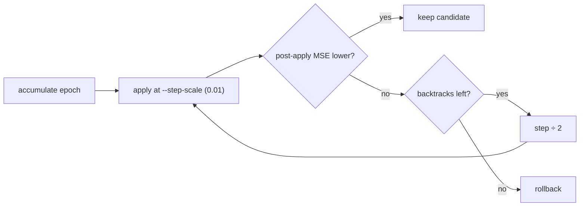
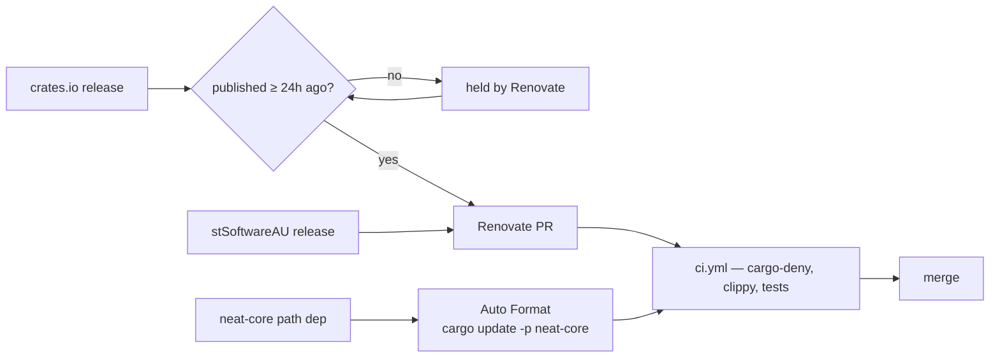
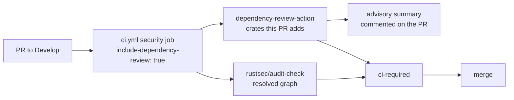
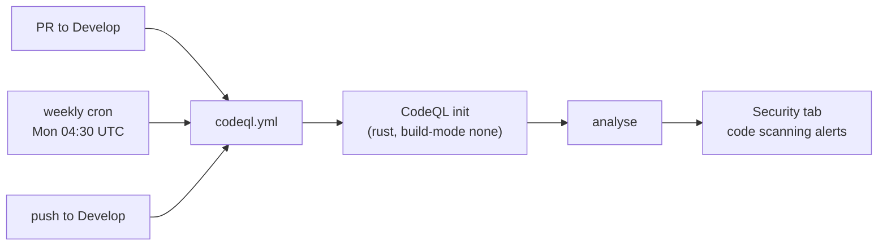
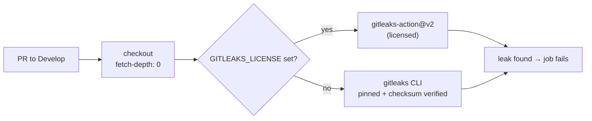
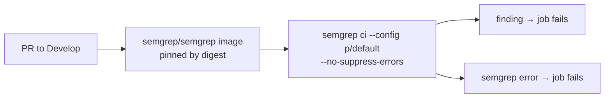
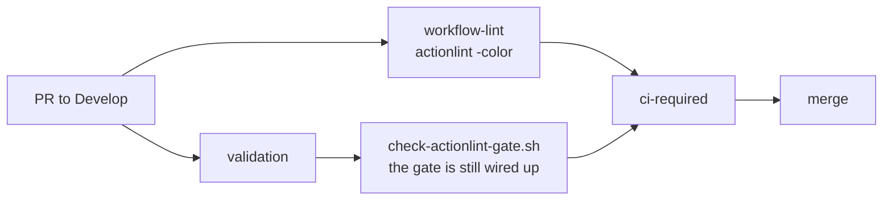
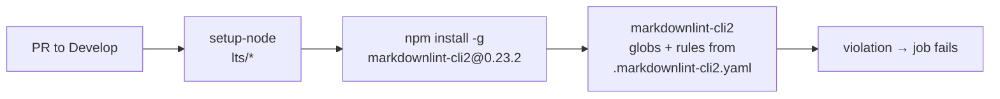

# NEAT-AI-Backpropagation

Experimental standalone Rust backpropagation for **production** NEAT-AI
creatures. The reverse-topological loop lives in sibling
[NEAT-AI-core](https://github.com/stSoftwareAU/NEAT-AI-core). This crate
owns the creature / `.bin` bridge, apply step, and a `trainDir`-style
epoch loop.

TypeScript backpropagation orchestration in
[NEAT-AI](https://github.com/stSoftwareAU/NEAT-AI) stays until this
program proves numerical parity **and** a measured learning win on the
GRQ production creature and corpus. Tiny identity-chain fixtures are
unit regression only — they are not a win.

## Sibling layout

```text
parent/
  NEAT-AI-core/
  NEAT-AI-Backpropagation/
  NEAT-AI/            # optional TypeScript dual-run
  NEAT-AI-scorer/     # optional rust_scorer
```

`neat-core` is an unpinned path dependency
(`../../NEAT-AI-core/neat-core`). Breaking SemVer bumps are gated by
[`neat-core.expected-version`](./neat-core.expected-version).

Toolchain: [`rust-toolchain.toml`](./rust-toolchain.toml) (`1.95.0`).

## CLI

```bash
cargo run -p neat_ai_backpropagation --release -- compare \
  ~/src/GRQ-cluster/network.json \
  /tmp/grq-slice \
  --max-records 256 --seed 1 --out rust-compare.json

cargo run -p neat_ai_backpropagation --release -- diff \
  rust-compare.json ts-compare.json

cargo run -p neat_ai_backpropagation --release -- train \
  ~/src/GRQ-cluster/network.json \
  /tmp/grq-train-slice \
  --epochs 4 --max-records 2048 --seed 1 \
  --scorer ../NEAT-AI-scorer/target/release/rust_scorer \
  --output-dir .backprop

cargo run -p neat_ai_backpropagation --release -- sweep \
  ~/src/GRQ-cluster/network.json \
  ~/src/GRQ/.trainData-binary_116 \
  --skip-mse --step-scales 0.002,0.01 \
  --output-dir .backprop/sweep

cargo run -p neat_ai_backpropagation --release -- gradient-check \
  ~/src/GRQ-cluster/network.json \
  /tmp/grq-train-slice \
  --max-records 512 --sample-biases 20 --sample-weights 40 \
  --output-dir .backprop/grad-check
```

`--version` reports `CARGO_PKG_VERSION`. Train journals that version in
`journal.jsonl`.

`train` measures MSE on the **applied** creature and keeps the apply
only when post-apply MSE is strictly lower than the best so far
(rollback otherwise). `--accept-always` keeps the candidate anyway
(for a later full-corpus `rust_scorer` check). `sweep` accumulates
once and writes one candidate per `--step-scales` entry.

### Train step size (issue #39)

Every gene's proposal is computed as if the other genes hold still, so
moving all of them the whole way at once overshoots on a large creature
(~16.6k parameters move together on the GRQ network). The defaults are
therefore sweep-informed rather than full-jump:

| Flag | Default | Why |
| ---- | ------- | --- |
| `--step-scale` | `0.01` | Top of sweep's own grid; `1.0` raised production MSE 0.6515 → 0.7505 |
| `--max-backtracks` | `6` | Line search (#38) halves further on a rejected apply |
| `--maximum-bias-adjustment-scale` | `1.0` | ±10 (the `BackpropConfig` / TypeScript parity default) is huge per gene |
| `--maximum-weight-adjustment-scale` | `1.0` | as above |

`BackpropConfig::default()` keeps the ±10 clamps because `compare` must
mirror the TypeScript harness byte for byte; only the trainer CLI caps at
±1.



`--learning-rate` is the *initial* rate; `--learning-rate-strategy`
(`fixed`, `decay`, `adaptive`, `warm-restart`) plus `--learning-rate-decay`
schedule it per epoch, and each epoch's resolved rate is journalled as
`learningRate`. `--normalise-gradients` divides multi-path gradients by
`sqrt(path count)` (NEAT-AI #1872) so dense graphs stop multi-counting a
neuron's signal.
`gradient-check` (issue #40) compares per-gene proposal Δ to a
finite-difference ∂MSE/∂θ and reports sign-agreement by gene class.

Recurrent / re-entrant creatures are refused by every subcommand that
drives the accumulate engine — `compare`, `gradient-check`, `sweep`, and
`train` — through the shared
`creature_io::load_forward_only_creature` loader (issue #54).

## Production win protocol

Locked targets:

| Item | Path | Shape |
| ---- | ---- | ----- |
| Creature | `~/src/GRQ-cluster/network.json` | 2511→1, 1605 neurons, 22011 synapses |
| Corpus | `~/src/GRQ/.trainData-binary_116` | ~2.26M records, 10048 bytes/record |

1. Slice the first *N* records of a real production `.bin` into `0.bin`
   (`scripts/extract-bin-slice.sh`) so Rust and TypeScript read identical
   bytes.
2. `compare` on that slice; Deno `scripts/ts-compare.ts` on the same
   slice; `diff` must report no field mismatches (abs `1e-9` / rel
   `1e-6`).
3. Accumulate on the **full** production directory (not one year file)
   **without** `--outputs-only`, so IF/MIN/MAX linearisation can move
   hidden genes. A win is `rust_scorer` on all 2,262,277 records up by
   more than `1e-6`. Saturated full-net applies overfit a slice and
   **lower** the full-corpus score — treat slice MSE as a hint only.

```bash
./scripts/run-production-win.sh
```

Recorded result (see [`docs/production-win.json`](./docs/production-win.json)):

- Parity on 256 records of `A-2007.bin`: forward MSE agrees; the 3
  overlap neurons match at `1e-9`. Rust continues through IF/MIN/MAX
  (TypeScript/WASM does not).
- Full-corpus `rust_scorer` win: 11 hidden weights into IF/MINIMUM
  plus one MAXIMUM bias, signed from a 2,262,277-record accumulate.
  Score `0.347586415202` → `0.347614794359` (Δ `+2.84e-5`). Topology
  and complexity penalty unchanged.

## Dependency updates

External crates.io dependencies are bumped by Renovate
([`renovate.json`](./renovate.json)) under a **24-hour quarantine**
(`minimumReleaseAge`), so a freshly-hijacked release cannot be merged on
publish day. Internal `stSoftwareAU/*` dependencies carry no embargo, and
`neat-core` is disabled outright — it is a sibling path dependency whose
lockfile entry is already synced by the Auto Format workflow's
`cargo update -p neat-core`.



`scripts/check-renovate-config.sh` gates that policy in `quality.sh` and CI:
it fails if the quarantine is missing, shorter than 24 hours, unparsable,
shortened for an external crate, or if the `cargo` manager is switched off.

## Dependency review

[`security.yml`](./.github/workflows/security.yml) runs two complementary
advisory gates on every pull request. `rustsec/audit-check` scans the resolved
graph as a whole; `actions/dependency-review-action` scans the *diff* — the
crates the PR itself adds or upgrades — and comments the summary on the PR.



`scripts/check-dependency-review.sh` gates that policy in `quality.sh` and CI:
it fails if the step is missing or pinned to a movable tag, if the
`include-dependency-review` input stops defaulting to `true`, if any caller
passes `include-dependency-review: false`, or if no caller reaches the
reusable workflow on a `pull_request` event.

## Code scanning

`security.yml` only asks whether a *dependency* carries a known advisory.
[`codeql.yml`](./.github/workflows/codeql.yml) analyses this crate's own
Rust with CodeQL's `security-and-quality` queries, and runs on a weekly
schedule as well as on pull requests — so a newly published query pack is
applied even in a week with no PR.



`scripts/check-codeql-workflow.sh` gates that policy in `quality.sh` and CI:
it fails if the workflow is missing, skips `Develop`, has no schedule (or one
slower than weekly), cannot upload results (`security-events: write`), does
not analyse Rust, is missing either CodeQL step, or pins an action to a
movable tag instead of a commit SHA.

## Secrets detection

CodeQL reads code, not credentials. A secret committed by accident cannot be
undone by a revert — it has to be rotated — so
[`gitleaks.yml`](./.github/workflows/gitleaks.yml) scans the pull request diff
before it reaches `Develop`.

`gitleaks-action@v2` needs an organisation licence (`GITLEAKS_LICENSE`), and
bot-authored pull requests (Renovate, Dependabot) receive no Actions secrets —
the action then exits with a licence error. The workflow branches on whether
the licence is present and falls back to the free, open-source `gitleaks` CLI,
installed from a version-pinned release whose SHA-256 is verified in the job.
Without that fallback a bot PR would report green while scanning nothing.



`scripts/check-gitleaks-workflow.sh` gates that policy in `quality.sh` and CI:
it fails if the workflow is missing, does not run on pull requests to
`Develop`, never invokes a scan, neuters the verdict (`|| true`,
`continue-on-error: true`, `--exit-code 0`), drops the licence-less fallback,
checks out a shallow clone the commit range cannot resolve against, or pulls
either the action or the CLI from an unpinned or unverified source.

## Static analysis (Semgrep)

CodeQL and Semgrep read the same tree with independently maintained rules, so a
pattern one engine misses the other still has a chance of catching.
[`semgrep.yml`](./.github/workflows/semgrep.yml) runs `semgrep ci --config
p/default` on every pull request, inside the official Semgrep image pinned to a
`@sha256:` digest — and unlike the Rust-only CodeQL analysis it also reads the
repository's shell scripts and workflow YAML.

`semgrep ci` suppresses its own errors by default: when Semgrep itself fails it
exits 0, and a crashed scan reads as a clean one. The job passes
`--no-suppress-errors` so that failure blocks the merge like any finding.
`SEMGREP_APP_TOKEN` is optional — with no Semgrep Cloud account the secret is
empty and the scan runs unauthenticated against the explicit rule set, so
bot-authored pull requests (Renovate, Dependabot), which receive no Actions
secrets, are scanned exactly the same.

One `p/default` rule is excluded, named and justified in the workflow:
`renovate-missing-minimum-release-age` demands a ≥ 7-day embargo on every
`packageRules` entry, which contradicts the deliberate 24-hour quarantine (and
no embargo for internal `stSoftwareAU` code) committed in
[`renovate.json`](./renovate.json) — see
[Dependency updates](#dependency-updates). JSON has no comment syntax, so an
inline `nosemgrep` is not available.



`scripts/check-semgrep-workflow.sh` gates that policy in `quality.sh` and CI:
it fails if the workflow is missing, does not run on pull requests to
`Develop`, never invokes a scan, configures no rule set, neuters the verdict
(`|| true`, `continue-on-error: true`, `--suppress-errors`), drops
`--no-suppress-errors`, runs the scan outside strict bash, or pulls the action,
container image, or CLI from an unpinned source.

## Workflow linting

Workflow YAML is the one thing no other gate reads — clippy, shellcheck and
codespell all stop at the repository's own sources, so an invalid expression or
an unknown `runs-on` used to surface only the next time the workflow ran. The
`workflow-lint` job in [`ci.yml`](./.github/workflows/ci.yml) runs
[`actionlint`](https://github.com/rhysd/actionlint) over
`.github/workflows`, and feeds the `ci-required` aggregator so a lint failure
blocks the merge. `actionlint` also pipes every `run:` block through the
runner's shellcheck, which the `shell-checks` job never sees (it only walks
`*.sh` files).



The linter is installed from a version-pinned release whose SHA-256 is
verified in the job, so a hijacked `actionlint` release cannot run unnoticed.
`scripts/check-actionlint-gate.sh` gates the policy itself in `quality.sh` and
CI: it fails if no job invokes `actionlint`, if the invocation is neutered
(`continue-on-error: true`, `|| true`), if the job runs without
`set -euo pipefail`, if no other job lists it in `needs:` (a lint that gates
nothing), or if the linter is pulled from an unpinned or unverified source.

Run it locally with the rest of the gate — `quality.sh` invokes `actionlint`
directly, so install it first (`brew install actionlint`, or see the
[install docs](https://github.com/rhysd/actionlint/blob/main/docs/install.md)).

**Dependabot alerts and security updates** are a repository *setting*, not a
committed file, so they cannot be enabled from the checkout — see
[SECURITY.md](./SECURITY.md#automated-scanning). Renovate's
`osvVulnerabilityAlerts` already raises an advisory-driven PR without them.

## Markdown linting

[`.markdownlint-cli2.yaml`](./.markdownlint-cli2.yaml) has been committed since
the README rewrite, but nothing in CI read it: the structural rules it keeps on
(heading hierarchy, list indentation, fencing) were advisory, so every
hand-written README, CHANGELOG and audit note drifted on its own.
[`markdown-lint.yml`](./.github/workflows/markdown-lint.yml) runs
[`markdownlint-cli2`](https://github.com/DavidAnson/markdownlint-cli2) against
that config on every pull request, and a violation blocks the merge.

The job reports; it never rewrites. `--fix` would edit the runner's throwaway
checkout and exit 0, merging the violation unfixed while the job read green.
`markdownlint-cli2` is installed at an exact version for the same reason the
actions are pinned to commit SHAs — a hijacked release must not run unreviewed
code in CI.



`scripts/check-markdown-lint-workflow.sh` gates that policy in `quality.sh` and
CI: it fails if the workflow is missing, does not run on pull requests to
`Develop`, never invokes a lint (a step merely *named* for one, or an install
with no invocation), rewrites instead of reporting (`--fix`, the action's
`fix: true`), neuters the verdict (`|| true`, `continue-on-error: true`), runs
the CLI outside strict bash, or pulls the action or the linter from an unpinned
source.

## Local quality

```bash
./quality.sh < /dev/null
```

See [CONTRIBUTING.md](./CONTRIBUTING.md) for the version-bump contract
(same as NEAT-AI-Lamarck / GRQ `runlib.sh`).
