# NEAT-AI-Backpropagation

Experimental standalone Rust backpropagation for **production** NEAT-AI
creatures. The reverse-topological loop lives in sibling
[NEAT-AI-core](https://github.com/stSoftwareAU/NEAT-AI-core). This crate
owns the creature / `.bin` bridge, apply step, and a `trainDir`-style
epoch loop.

TypeScript backpropagation orchestration in
[NEAT-AI](https://github.com/stSoftwareAU/NEAT-AI) stays until this
program proves numerical parity **and** a measured learning win on the
GRQ production creature and corpus. Tiny identity-chain fixtures are
unit regression only — they are not a win.

## Sibling layout

```text
parent/
  NEAT-AI-core/
  NEAT-AI-Backpropagation/
  NEAT-AI/            # optional TypeScript dual-run
  NEAT-AI-scorer/     # optional rust_scorer
```

`neat-core` is an unpinned path dependency
(`../../NEAT-AI-core/neat-core`). Breaking SemVer bumps are gated by
[`neat-core.expected-version`](./neat-core.expected-version).

Toolchain: [`rust-toolchain.toml`](./rust-toolchain.toml) (`1.98.0`).

### Build profiles

Workspace root [`Cargo.toml`](./Cargo.toml) follows the fleet rule
([VibeCoding#4159](https://github.com/stSoftwareAU/VibeCoding/issues/4159) /
issue #88): **dev compiles as fast as practical; release is fully
optimised** (compile time irrelevant). Stable Rust only.

| Profile | Settings |
| ------- | -------- |
| `dev` | `debug = "line-tables-only"` (panic file:line without full DWARF; `opt-level = 0` and incremental stay) |
| `release` | `opt-level = 3`, `lto = "fat"`, `codegen-units = 1` (workspace-wide) |

Same-host binaries also get `-C target-cpu=native` from
[`.cargo/config.toml`](./.cargo/config.toml) (non-`wasm32` only). GRQ
hosts build with `cargo build --release` on the machine that runs the
artefact. An exported `RUSTFLAGS` **replaces** that config list — do not
set both unless you re-include `target-cpu=native`.

## CLI

```bash
cargo run -p neat_ai_backpropagation --release -- compare \
  ~/src/GRQ-cluster/network.json \
  /tmp/grq-slice \
  --max-records 256 --seed 1 --out rust-compare.json

cargo run -p neat_ai_backpropagation --release -- diff \
  rust-compare.json ts-compare.json

cargo run -p neat_ai_backpropagation --release -- train \
  ~/src/GRQ-cluster/network.json \
  /tmp/grq-train-slice \
  --epochs 4 --max-records 2048 --seed 1 \
  --scorer ../NEAT-AI-scorer/target/release/rust_scorer \
  --output-dir .backprop --trace-store .backprop/traces

cargo run -p neat_ai_backpropagation --release -- sweep \
  ~/src/GRQ-cluster/network.json \
  ~/src/GRQ/.trainData-binary_116 \
  --skip-mse --step-scales 0.002,0.01 \
  --output-dir .backprop/sweep

cargo run -p neat_ai_backpropagation --release -- blocks \
  ~/src/GRQ-cluster/network.json \
  ~/src/GRQ/.trainData-binary_116 \
  --strategies neuron,neighbourhood,output-head --skip-mse \
  --scorer ../NEAT-AI-scorer/target/release/rust_scorer \
  --output-dir .backprop/blocks

cargo run -p neat_ai_backpropagation --release -- gradient-check \
  ~/src/GRQ-cluster/network.json \
  /tmp/grq-train-slice \
  --max-records 512 --sample-biases 20 --sample-weights 40 \
  --facet-min-scored 5 --rank-limit 5 \
  --output-dir .backprop/grad-check
```

`--version` reports `CARGO_PKG_VERSION`. Train journals that version in
`journal.jsonl`.

`train` measures MSE on the **applied** creature and keeps the apply
only when post-apply MSE is strictly lower than the best so far
(rollback otherwise). `--accept-always` keeps the candidate anyway
(for a later full-corpus `rust_scorer` check). `--acceptance scorer`
makes the scorer the judge instead (issue #104, below). `sweep`
accumulates once and writes one candidate per `--step-scales` entry;
`blocks` accumulates once and writes one candidate per *region* of the
creature (issue #105, below).

### Scorer-guided acceptance (issue #104)

Slice MSE is not the objective evolution optimises — `NEAT-AI-scorer`
is. On an evolved production creature a candidate can lower training
MSE and lower the real score, so `train` can also put the scorer in the
accept/rollback loop rather than only reporting it afterwards:

```bash
cargo run -p neat_ai_backpropagation --release -- train \
  ~/src/GRQ-cluster/network.json /tmp/grq-train-slice \
  --acceptance scorer --min-score-improvement 1e-6 \
  --scorer ../NEAT-AI-scorer/target/release/rust_scorer
```

| Flag | Default | Meaning |
| ---- | ------- | ------- |
| `--acceptance` | `mse` | `mse` keeps the historical loop; `scorer` makes `rust_scorer` the judge |
| `--min-score-improvement` | `1e-6` | Minimum `candidate − incumbent` fitness to keep an apply — the production win margin |
| `--mse-pre-screen` | off | Drop a candidate whose slice MSE did not fall *before* paying for a scorer run |

Under `--acceptance scorer`:

- The **baseline is scored before the loop**, so epoch 1 has a real
  incumbent fitness to beat.
- Every attempted candidate — including each backtracking step — is
  scored and journalled as a `"kind":"candidate"` line carrying
  `incumbentMse`, `candidateMse`, `mseDelta`, `baselineScore`,
  `candidateScore`, `scoreDelta`, `stepScale` and `acceptReason`.
- MSE is demoted to a journalled diagnostic. `--mse-pre-screen` turns it
  back into a **gate in front of the scorer**: a candidate MSE rejects is
  never scored, so a scorer win MSE disagreed with is lost. Use it only
  when a scorer run is too expensive to spend on every candidate.
- `--accept-always` is **refused**, since keeping every candidate would
  silently disable the gate; `--acceptance scorer` without `--scorer`
  fails loudly rather than falling back to MSE; and
  `--min-score-improvement` / `--mse-pre-screen` on an
  `--acceptance mse` run are refused rather than silently ignored.
- The run header journals the run's own `baselineScore`. Each candidate
  line's `baselineScore` is the **incumbent** it was judged against,
  which moves with every accept.
- The baseline is scored from the same normalised serialisation the
  candidates use (MSE mode scores the source file bytes), so the in-loop
  comparison is like for like.
- The accepted candidate's score is reused as the run's `bestScore` —
  the winner is never re-scored just to learn the same number.

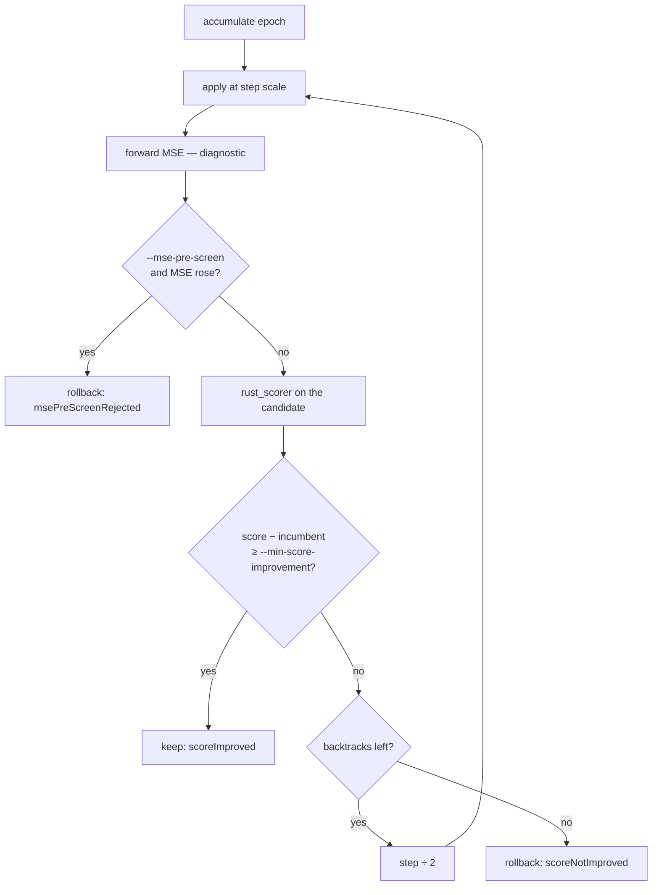

`scripts/run-scorer-guided-experiment.sh <rust_scorer>` runs one corpus
through both modes and prints the two verdicts. On its generated corpus
(a slice that contradicts 98% of the records) the MSE loop accepted a
candidate that cut slice MSE `14.839 → 3.490` while `rust_scorer`
fitness **fell** `0.7032 → −0.3324`; scorer-guided acceptance rejected
the same candidate and held the fitness. Point it at the production
creature and corpus with `CREATURE=` / `DATA_DIR=` to repeat the
comparison there.

### Scored step-scale ladder (issue #106)

The backtracking line search halves the step until the judge is satisfied and
stops at the **first** candidate that passes. That is only right if the judge
is monotonic along the backprop direction — on an evolved production creature
the scorer optimum may sit at a much smaller step, or at a step whose slice MSE
is slightly worse. `--step-scale-ladder` replaces "halve until something
passes" with "score the whole grid and keep the best":

```bash
cargo run -p neat_ai_backpropagation --release -- train \
  ~/src/GRQ-cluster/network.json /tmp/grq-train-slice \
  --acceptance scorer --step-scale-ladder \
  --scorer ../NEAT-AI-scorer/target/release/rust_scorer
```

| Flag | Default | Meaning |
| ---- | ------- | ------- |
| `--step-scale-ladder` | off | Comma-separated grid; the bare flag selects `0.0001,0.00025,0.0005,0.001,0.0025,0.005,0.01` |

- **One accumulation, many candidates.** The epoch accumulates once — the
  expensive corpus pass — then applies that same learning at every rung. A rung
  costs an apply, a slice-MSE pass and a share of one scorer call.
- **One batch scorer call per epoch.** `rust_scorer` scores a *directory* of
  creatures, so the whole ladder is scored in a single invocation and each
  result is matched back by file stem. A candidate the scorer did not report
  fails the run rather than shifting scores onto the wrong rung.
- **Best, not first.** The winner is the highest fitness, and it is kept only
  when it clears `--min-score-improvement`. A rung that improved but lost to a
  better rung is journalled as `scoreNotBest`. Ties keep the smaller step.
- **No winner leaves the incumbent unchanged**, exactly as a dry line search
  does.
- **Every rung is journalled** as a `"kind":"candidate"` line carrying its own
  `stepScale`, `candidateMse`, `mseDelta`, `candidateScore` and `scoreDelta`;
  the epoch line adds `ladderRungs`, and the run header records the grid.
- MSE stays a diagnostic. `--mse-pre-screen` still applies: a rung whose slice
  MSE did not fall is dropped before the batch is scored (the issue's optional
  catastrophic rejection).
- The ladder **supersedes** `--max-backtracks` — its rungs are the epoch's
  attempts, so a ladder epoch journals `"backtracks":0`. It requires
  `--acceptance scorer`, and a rung outside `(0, 1]` (or non-finite) is refused
  rather than silently rewritten by the applier.

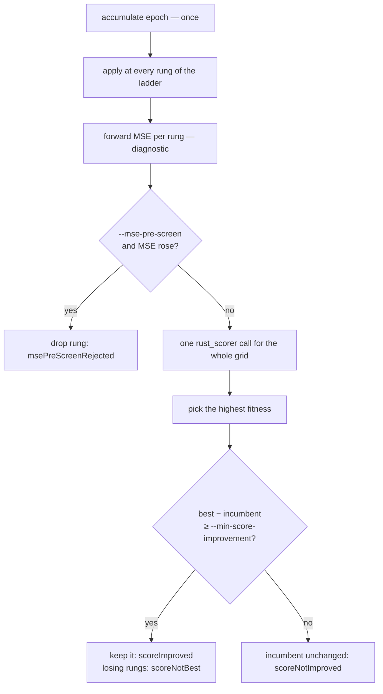

`scripts/run-step-scale-ladder-experiment.sh <rust_scorer>` runs the same
corpus, seed and epoch budget through both searches and prints each one's
accepted epochs, scorer gain, wall clock and wins/hour. Point it at production
with `CREATURE=` / `DATA_DIR=` to repeat the comparison on real GRQ history.

### Train step size (issue #39)

Every gene's proposal is computed as if the other genes hold still, so
moving all of them the whole way at once overshoots on a large creature
(~16.6k parameters move together on the GRQ network). The defaults are
therefore sweep-informed rather than full-jump:

| Flag | Default | Why |
| ---- | ------- | --- |
| `--step-scale` | `0.01` | Top of sweep's own grid; `1.0` raised production MSE 0.6515 → 0.7505 |
| `--max-backtracks` | `6` | Line search (#38) halves further on a rejected apply |
| `--maximum-bias-adjustment-scale` | `1.0` | ±10 (the `BackpropConfig` / TypeScript parity default) is huge per gene |
| `--maximum-weight-adjustment-scale` | `1.0` | as above |

`BackpropConfig::default()` keeps the ±10 clamps because `compare` must
mirror the TypeScript harness byte for byte; only the trainer CLI caps at
±1.

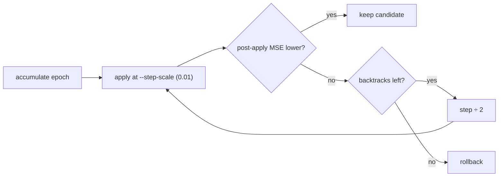

### Blockwise candidates (issue #105)

`--step-scale` shrinks *how far* the whole creature moves. `blocks`
changes *what moves*: one accumulation pass over the corpus is carved
into small regions, and each region becomes its own candidate creature
for `NEAT-AI-scorer` to judge.

```bash
cargo run -p neat_ai_backpropagation --release -- blocks \
  ~/src/GRQ-cluster/network.json \
  ~/src/GRQ/.trainData-binary_116 \
  --strategies neuron,neighbourhood,output-head,subgraph,top-genes \
  --blocks-per-strategy 8 --radius 1 --skip-mse \
  --scorer ../NEAT-AI-scorer/target/release/rust_scorer \
  --output-dir .backprop/blocks
```

| Strategy | Genes it moves |
| -------- | -------------- |
| `global` | Every gene — the whole-creature apply, kept for parity |
| `neuron` | One neuron's bias plus every synapse incident to it |
| `neighbourhood` | One neuron plus its neighbours out to `--radius` hops |
| `output-head` | Output neurons and the synapses that reach them |
| `subgraph` | A seeded random connected subgraph of `--subgraph-size` neurons |
| `top-genes` | The `--top-genes` loudest genes by proposal magnitude |

Focus neurons for `neuron` / `neighbourhood` / `subgraph` are the hidden
neurons the accumulated learning wants to move most — a neuron's rank is
its own `|Δbias|` plus the `|Δweight|` of every synapse touching it — so
the blocks land where the signal is. Blocks selecting no gene, and blocks
selecting genes an earlier block already selected, are dropped rather
than costing a duplicate scorer run; both counts are reported on stderr
and as `droppedEmptyBlocks` / `droppedDuplicateBlocks` in `blocks.json`,
never swallowed. `--radius 0` is refused, since it would make every
neighbourhood block a duplicate of its `neuron` block.

A block's size follows the graph, not the flag: `--radius` and
`--subgraph-size` bound the *neurons*, and each selected neuron brings
every synapse incident to it. Around a hub neuron a radius-1 block can
therefore be most of the creature — `geneCount` on each candidate record
says how large it actually came out, and `neuron` / `top-genes` are the
strategies that stay small by construction.

- **One pass, many candidates.** The corpus is accumulated **once** for the
  learning signal; every block is that same signal restricted to its genes,
  so a block candidate is exactly the whole-creature candidate with the rest
  of the creature held still. `--skip-mse` drops the per-candidate MSE pass,
  which is the only *learning-side* reread; `--scorer` still hands the
  corpus to `rust_scorer` once per candidate, because that is what scoring
  a candidate independently costs.
- **Each candidate is judged on its own.** With `--scorer`, the baseline
  is scored once and every written candidate is scored independently;
  `scoreDelta` and `scoreWin` (against `--min-score-improvement`, default
  `1e-6`) are recorded per candidate, and the CLI prints the winners best
  first. A win margin without `--scorer` is refused, as it is on `train`.
- **Metadata names the genes.** `blocks.json` records, per candidate, the
  `strategy`, the focus neuron, the UUIDs of every selected neuron, the
  export index and from/to pair of every selected synapse, how many genes
  actually moved, and the candidate's relative path. A block whose genes all held still
  writes no candidate and is counted in `unmovedBlocks`. The listing is
  literal, so on the GRQ creature the `global` row alone names all 22k
  synapses — drop `global` from `--strategies` when only the small blocks
  matter.

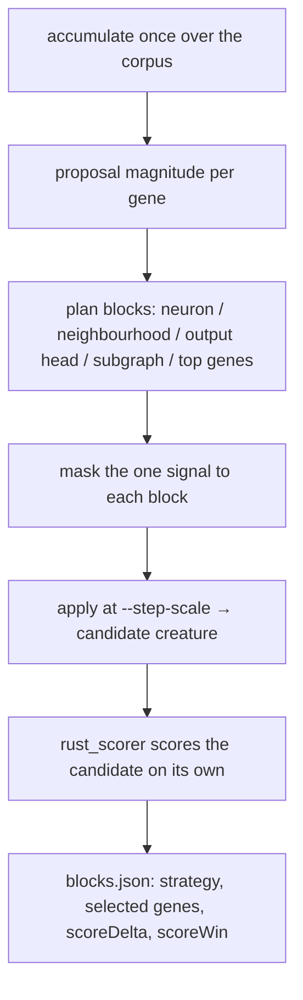

`scripts/run-blockwise-benchmark.sh <rust_scorer>` runs the same
creature, corpus and step scale through `--strategies global` and through
the blockwise strategies, and prints candidates, scorer wins, elapsed
seconds and **wins/hour** for each. Point it at the production creature
and corpus with `CREATURE=` / `DATA_DIR=` to measure the comparison
there.

### Train record sampling (issue #77)

`train --max-records N` is a **rate**, not a prefix. NEAT-AI forwards
`TrainOptions.trainingSampleRate` as `--max-records`, and its TypeScript
`selectFileSampleIndexes` draws the same fraction from *every* `.bin`
file. Taking the first *N* records in scan order instead would over-fit
the earliest files of the corpus and never look at the later years, so
`train` ports the TypeScript selection:

1. Total the records across the directory, then resolve the cap to a rate
   of `N / total_records` (capped at `1.0`).
2. Per file, shuffle the record indexes with a `--seed`-derived RNG,
   take `ceil(file_records × rate)` of them, and **sort the take
   ascending** so disk reads stay sequential.
3. Use that one sample for the whole run — baseline MSE, every epoch's
   accumulate, and every candidate's post-apply MSE — so an accept /
   rollback decision always compares like with like.

Because the per-file take is ceiled, the realised count can exceed `N` by
at most one record per file. That is the TypeScript behaviour and the
contract this crate matches.

| Flag | Effect |
| ---- | ------ |
| `--max-records N` | Sample a rate of `N / total_records` from every file |
| `--seed S` | Reproducible draw — same seed, same records, same MSE |
| `--disable-random-samples` | Skip the shuffle: each file's leading prefix (NEAT-AI `disableRandomSamples`) |

The header line of `journal.jsonl` records `maxRecords`,
`sampledRecords`, `totalRecords` and `disableRandomSamples`, so a remote
runner can audit which slice an epoch scored.

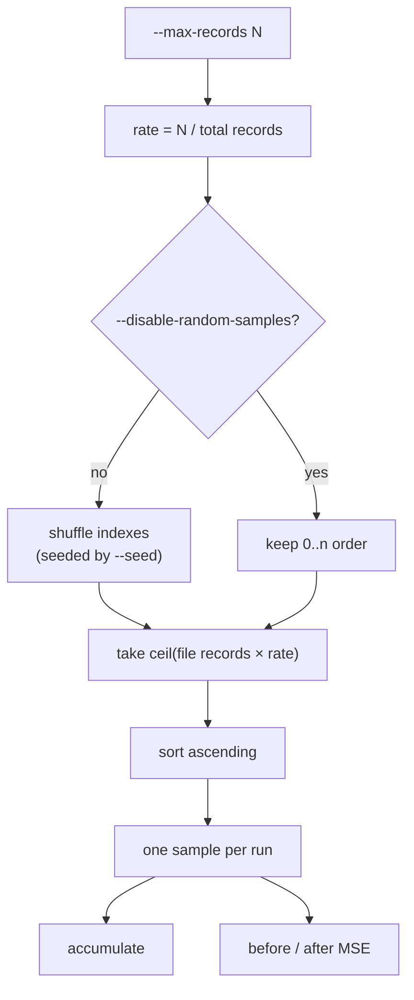

Only `train` samples. `compare`, `sweep`, and `gradient-check` keep the
prefix cap — they are parity and diagnostic surfaces where reading the
same leading bytes as the TypeScript harness is the point.

### Train trace store (issue #78)

`train --trace-store DIR` is NEAT-AI's `TrainOptions.traceStore`. The
TypeScript trainer snapshots `creature.traceJSON()` whenever an
iteration makes the network worse, and those snapshots are how a failed
fine-tune gets diagnosed gene by gene. `train` writes the same wire
format, so a Rust epoch is as debuggable as a TypeScript one:

| Epoch outcome | Artifact |
| ------------- | -------- |
| Lowered the best MSE | `<output-dir>/best-trace.json` (beside `best.json`) |
| Did not | `<store>/failed/epoch-<N>.json` |

The split keys off the MSE, not off the accept flag, so under
`--accept-always` a kept-but-worse candidate is still filed as a failed
candidate. Without `--trace-store` no trace is written at all.

A trace is a NEAT-AI `CreatureTrace`: the ordinary UUID-only creature
export with a `trace` object added to every gene the epoch accumulated.
Neuron `trace` is NEAT-AI's `NeuronState` (`count`, `totalBias`,
`totalAdjustedBias`, `hintValue`, `maximumActivation`,
`minimumActivation`, `totalActivation`, `totalErrorAbsolute`,
`noChange`); synapse `trace` is its `SynapseState` (`count`, the
positive / negative activation and adjusted-value masses, and their
counts). A gene with a zero accumulation count carries no `trace` key,
matching `traceJSON()`'s own `if (state.count)` guard, and — as in
TypeScript — constant neurons are never traced.

The genes in the artifact are the **candidate** the epoch produced (the
creature that was measured better or worse); the `trace` state is the
accumulation over the incumbent that proposed it. That is the same
pairing NEAT-AI writes, and it is what makes a rejected candidate
readable: the weights that were tried, beside the evidence that argued
for them.

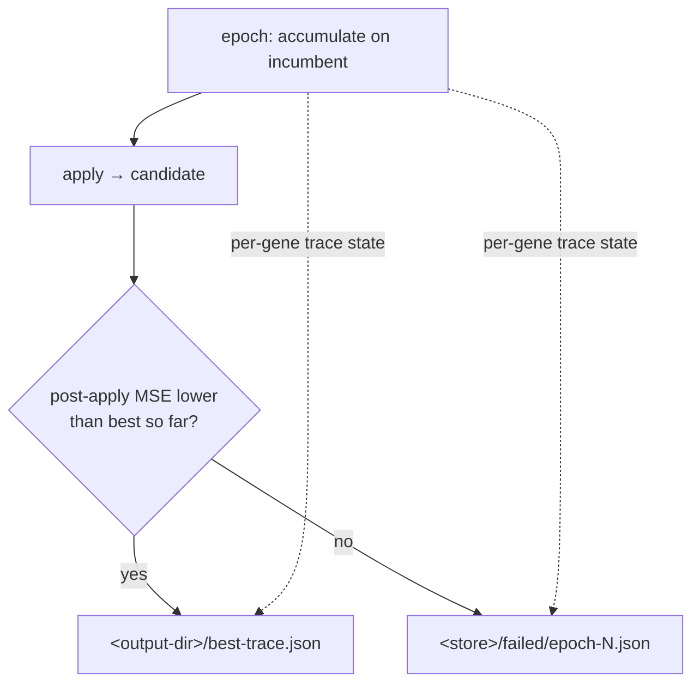

NEAT-AI's `RustTrainDirBridge` drives both ends of that store (issue #81):
it passes `TrainOptions.traceStore` through as `--trace-store`, and reads
`<output-dir>/best-trace.json` back as `TrainingResult.trace` instead of
synthesising one from `best.json`. An older binary that predates the flag
fails the run loudly with clap's unknown-argument error — rebuild the
sibling checkout rather than dropping the option.

`--learning-rate` is the *initial* rate; `--learning-rate-strategy`
(`fixed`, `decay`, `adaptive`, `warm-restart`) plus `--learning-rate-decay`
schedule it per epoch, and each epoch's resolved rate is journalled as
`learningRate`. `--normalise-gradients` divides multi-path gradients by
`sqrt(path count)` (NEAT-AI #1872) so dense graphs stop multi-counting a
neuron's signal.
`gradient-check` (issue #40) compares per-gene proposal Δ to a
finite-difference ∂MSE/∂θ and reports sign-agreement by gene class, and
stratifies that agreement by squash and local topology (issue #107,
below).

Recurrent / re-entrant creatures are refused by every subcommand that
drives the accumulate engine — `compare`, `gradient-check`, `sweep`, and
`train` — through the shared
`creature_io::load_forward_only_creature` loader (issue #54).

### Gradient diagnostics by gene class and squash (issue #107)

A NEAT creature is heterogeneous. One whole-creature sign-agreement
percentage says nothing about *where* the proposal is trustworthy: a
TANH pinned at ±1, an aggregate output, a dead ReLU and a shallow
identity chain all sit in the same graph. `gradient-check` therefore
labels every probed gene and aggregates the outcome across every facet
at once, so scorer-guided local backprop can pick gene classes on
evidence rather than intuition.

Each sampled gene costs three MSE passes over the record slice — `+ε`,
`−ε` and the **proposal applied on its own** — so the artifact carries
the ground truth beside the gradient: whether the move actually lowered
slice MSE (`improved`), and how far the first-order prediction
`fdGrad · Δ` was from that outcome (`absError`, `relError`). Run cost is
`(2 + 3 × sampled genes)` passes; the sample caps are what bounds it.

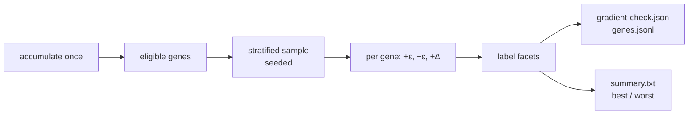

| Facet | Buckets |
| ----- | ------- |
| `geneKind` | `bias`, `weight` |
| `role` | `output`, `hidden` |
| `class` | `hiddenBias`, `outputBias`, `hiddenWeight`, `outputWeight` |
| `squash` | the neuron's squash name as exported |
| `aggregate` | `aggregate` (`SquashType::is_aggregate()`), `ordinary` |
| `depth` | longest hop count from an input — `0-1`, `2-3`, `4-7`, `8-15`, `16+` |
| `fanIn` / `fanOut` | `0`, `1`, `2-3`, `4-7`, `8-15`, `16+` |
| `activity` | `active`, `saturated`, `lowActivity`, `unobserved` |
| `proposalMagnitude` | `<1e-6`, `1e-6..1e-4`, `1e-4..1e-2`, `>=1e-2` |

A weight takes the facets of the neuron it **targets** — that is the
unit whose saturation and local topology decide whether the weight's
proposal is trustworthy. `activity` is read from the accumulate trace:
`saturated` means the mean activation sits within 2% of an end of the
squash's own range, `lowActivity` that the neuron barely moves across
the slice (a spread below `1e-6`, judged only once two or more records
have been seen), `unobserved` that the forward pass never activated it.

| Artifact | Contents |
| -------- | -------- |
| `gradient-check.json` | `schemaVersion`, `seed`, creature fingerprint, `byClass`, `byFacet`, `bestClasses`, `worstClasses` |
| `genes.jsonl` | one row per probed gene: value, Δ, FD gradient, facets, predicted vs actual ΔMSE |
| `summary.txt` | the concise report an unattended run reads back — also printed to stderr |

`bestClasses` / `worstClasses` rank `(facet, bucket)` pairs by sign
agreement. Only buckets with at least `--facet-min-scored` scored genes
are ranked, and a facet with a single bucket is skipped because it
offers no contrast; ties break on relative error then on name, so the
ranking is stable. With few eligible buckets the two lists overlap —
that is the honest reading of a small sample, not two findings.

The run is reproducible from `seed` alone: the same seed over the same
creature, corpus and caps writes byte-identical artifacts.
`schemaVersion` plus the creature fingerprint are what let two artifacts
be compared across NEAT-AI-core / Backpropagation versions — read the
schema first and refuse one you do not know.

```bash
CREATURE=~/src/GRQ-cluster/network.json \
DATA_DIR=~/src/GRQ/.trainData-binary_116 \
  ./scripts/run-gradient-diagnostics.sh
```

That is the documented command for the GRQ integration-testing
workflow. Every target is an env var (`CREATURE`, `DATA_DIR`, `OUT`,
`SEED`, `MAX_RECORDS`, `SAMPLE_BIASES`, `SAMPLE_WEIGHTS`,
`FACET_MIN_SCORED`, `RANK_LIMIT`, `STEP_SCALE`, `LEARNING_RATE`,
`FD_EPS`) — this public library carries no GRQ paths or stock-market
logic of its own.

### Output validation gate (issue #94)

No trained creature leaves this crate uncertified. `train` validates the
creature it finishes with, and `sweep` validates each candidate it
writes, through `neat_core::creature_validate` — the shared definition of
a valid creature (NEAT-AI#3800). Nothing is re-implemented here.

Backpropagation moves values rather than topology, so the failure it is
most likely to produce is numeric: a diverged run whose biases go `NaN`
or infinite. Such a creature serialises its biases as `null` and only
breaks later, in whatever tries to load it. The gate stops it at the
point it was produced, naming the run, neat-core's `reason` and message,
and the offending neuron or synapse index.

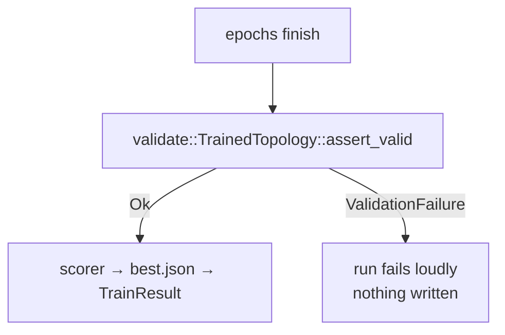

`validate::TrainedTopology` pins the source creature's neuron and synapse
counts and passes them as `ValidateOptions::neurons` / `connections`, so
the check also proves training preserved the topology;
`forward_only: true` holds the output to the same feed-forward contract
the loader demanded of the input. The gate runs **once per completed
run** — not per epoch, and not on load: an externally-supplied creature
is not this crate's bug to report, and the per-epoch `candidate.json`
dumps are working state rather than a returned creature.

### Creature identity — no inherited `uuid` (issue #101)

A creature-level `uuid` is a **content hash**: NEAT-AI derives it as a v5
UUID over the creature's neurons (`uuid`, `type`, `bias`, `squash`,
`frozen`), its synapses (`fromUUID`, `toUUID`, `weight`, `type`,
`frozen`) and `input`. Backpropagation's whole job is to move biases and
weights, so a trained creature never has its source creature's identity.

`best.json` — and the identical bytes returned as `bestCreatureJson` —
therefore carry **no top-level `uuid`**. The consumer derives it from the
content it actually received, which is what `neat_core`'s exporter
already does everywhere else in this crate. Emitting the source uuid
would be worse than useless: NEAT-AI's `makeUUID` short-circuits on a
uuid that is already present and never recomputes it, and `Fitness`
deduplicates its evaluation queue by uuid — so a trained creature wearing
its parent's identity can be handed a score it never earned.

Two things are deliberately **not** dropped:

- **`tags`** are excluded from the uuid hash, so pedigree tags
  (`name`, `lamarck`, `intelligentDesign`, …) survive the round trip
  alongside the `score` / `error` / `backpropagation` stamps.
- **Per-neuron `uuid`** is a stable identity label and an *input* to the
  creature hash, not the hash itself — it is preserved verbatim.

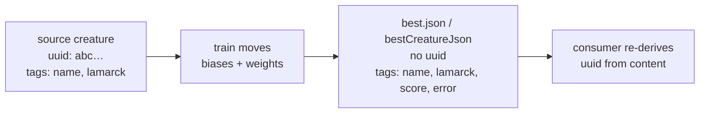

## C ABI — in-process `trainDir` (issue #84)

NEAT-AI reached this crate by **spawning** the CLI, which costs a process
launch and a JSON temp directory on every memetic `trainDir`. The crate
also ships a `cdylib` exposing the same `train` contract as C symbols a
Deno FFI (or any C) caller can `dlopen`:

```bash
cargo build --release -p neat_ai_backpropagation
# target/release/libneat_ai_backpropagation.{dylib,so,dll}
```

Declarations live in
[`include/neat_ai_backpropagation.h`](./include/neat_ai_backpropagation.h);
the implementation is `backpropagation/src/ffi.rs`.

| Symbol | Purpose |
| ------ | ------- |
| `neat_backprop_abi_version() -> uint32_t` | Wire-contract revision (currently `1`) |
| `neat_backprop_version() -> const char *` | Static NUL-terminated crate version |
| `neat_backprop_train(request, request_len, out) -> int32_t` | One `trainDir` run |
| `neat_backprop_buffer_free(buffer)` | Release a buffer the library produced |

Requests and responses are UTF-8 JSON carried in owned buffers with
explicit lengths (`NeatBackpropBuffer { data, len, capacity }`), so the
caller never guesses a length and never mixes allocators — every buffer
goes back through `neat_backprop_buffer_free`.

The request takes the creature as **JSON text** (`creatureJson`, UUID-only
export), not a path, so nothing round-trips through a temporary file.
Every other field is optional and defaults to the matching CLI `train`
flag — `epochs`, `maxRecords`, `seed`, `disableRandomSamples`,
`learningRate`, `learningRateStrategy`, `learningRateDecay`,
`normaliseGradients`, `maximumBiasAdjustmentScale`,
`maximumWeightAdjustmentScale`, `stepScale`, `stepScaleLadder`,
`outputsOnly`, `hiddenOnly`, `acceptance`, `minScoreImprovement`,
`msePreScreen`, `acceptAlways`, `maxBacktracks`, `scorer`, `traceStore` —
so the sampling (#77), trace-store (#78), scorer-guided acceptance (#104)
and step-scale ladder (#106) work is reachable from the ABI, not only from
the CLI. An unknown field is rejected rather than ignored.

The response carries `bestCreatureJson` (the exact bytes written to
`best.json`), `baselineMse`, `bestMse`, `acceptedEpochs`, the `bestPath` /
`journalPath` written, the trace artefact paths when a store was
requested, and the scorer results when a scorer was supplied.

Failure is loud at every step: a null pointer, non-UTF-8 bytes, malformed
JSON, a trainer error, or a panic caught at the boundary all return a
non-zero status **and** put the message in the same out buffer. There is
no silent fallback — a caller must never treat an empty buffer as success.

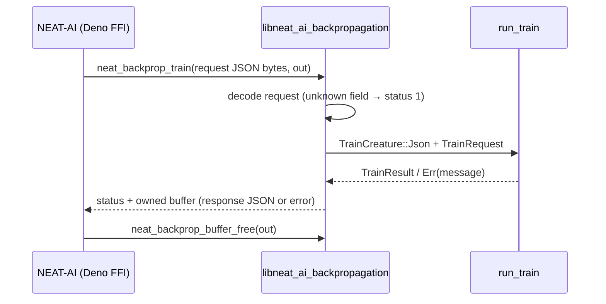

| Status | Meaning |
| ------ | ------- |
| `0` `NEAT_BACKPROP_OK` | Buffer holds the response JSON |
| `1` `NEAT_BACKPROP_ERR_INVALID_ARGUMENT` | Null / non-UTF-8 / malformed request |
| `2` `NEAT_BACKPROP_ERR_TRAIN_FAILED` | The trainer failed; buffer holds its message |
| `3` `NEAT_BACKPROP_ERR_PANIC` | A panic was caught at the boundary |

Retiring the process spawn on the NEAT-AI side (`RustTrainDirBridge.ts`)
is a follow-up in that repository; this crate only owns the library it
`dlopen`s.

## Production win protocol

Locked targets:

| Item | Path | Shape |
| ---- | ---- | ----- |
| Creature | `~/src/GRQ-cluster/network.json` | 2511→1, 1605 neurons, 22011 synapses |
| Corpus | `~/src/GRQ/.trainData-binary_116` | ~2.26M records, 10048 bytes/record |

1. Slice the first *N* records of a real production `.bin` into `0.bin`
   (`scripts/extract-bin-slice.sh`) so Rust and TypeScript read identical
   bytes.
2. `compare` on that slice; Deno `scripts/ts-compare.ts` on the same
   slice; `diff` must report no field mismatches (abs `1e-9` / rel
   `1e-6`).
3. Accumulate on the **full** production directory (not one year file)
   **without** `--outputs-only`, so aggregate linearisation can move
   hidden genes. Every aggregate squash neat-core owns
   (`SquashType::is_aggregate()` — IF/MIN/MAX plus the deprecated
   HYPOT/HYPOTv2/MEAN) is linearised; MIN/MAX keep the winning link, IF
   the taken branch, and the deprecated three every inward link. A win is `rust_scorer` on all 2,262,277 records up by
   more than `1e-6`. Saturated full-net applies overfit a slice and
   **lower** the full-corpus score — treat slice MSE as a hint only.

```bash
./scripts/run-production-win.sh
```

Recorded result (see [`docs/production-win.json`](./docs/production-win.json)):

- Parity on 256 records of `A-2007.bin`: forward MSE agrees; the 3
  overlap neurons match at `1e-9`. Rust continues through IF/MIN/MAX
  (TypeScript/WASM does not).
- Full-corpus `rust_scorer` win: 11 hidden weights into IF/MINIMUM
  plus one MAXIMUM bias, signed from a 2,262,277-record accumulate.
  Score `0.347586415202` → `0.347614794359` (Δ `+2.84e-5`). Topology
  and complexity penalty unchanged.

## Dependency updates

External crates.io dependencies are bumped by Renovate
([`renovate.json`](./renovate.json)) under a **24-hour quarantine**
(`minimumReleaseAge`), so a freshly-hijacked release cannot be merged on
publish day. Internal `stSoftwareAU/*` dependencies carry no embargo, and
`neat-core` is disabled outright — it is a sibling path dependency whose
lockfile entry is already synced by the Auto Format workflow's
`cargo update -p neat-core`.

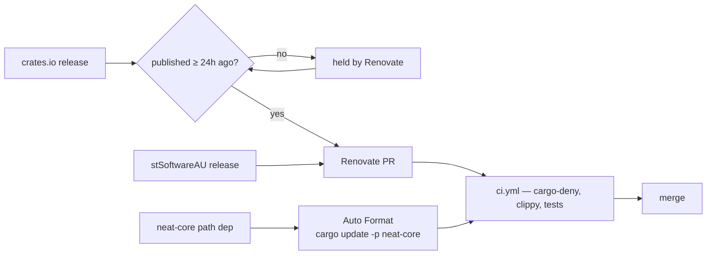

`scripts/check-renovate-config.sh` gates that policy in `quality.sh` and CI:
it fails if the quarantine is missing, shorter than 24 hours, unparsable,
shortened for an external crate, or if the `cargo` manager is switched off.

## Dependency review

[`security.yml`](./.github/workflows/security.yml) runs two complementary
advisory gates on every pull request. `rustsec/audit-check` scans the resolved
graph as a whole; `actions/dependency-review-action` scans the *diff* — the
crates the PR itself adds or upgrades — and comments the summary on the PR.

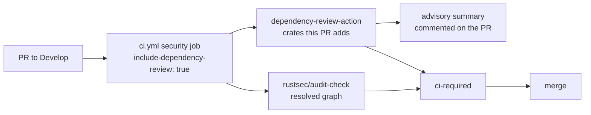

`scripts/check-dependency-review.sh` gates that policy in `quality.sh` and CI:
it fails if the step is missing or pinned to a movable tag, if the
`include-dependency-review` input stops defaulting to `true`, if any caller
passes `include-dependency-review: false`, or if no caller reaches the
reusable workflow on a `pull_request` event.

## Code scanning

`security.yml` only asks whether a *dependency* carries a known advisory.
[`codeql.yml`](./.github/workflows/codeql.yml) analyses this crate's own
Rust with CodeQL's `security-and-quality` queries, and runs on a weekly
schedule as well as on pull requests — so a newly published query pack is
applied even in a week with no PR.

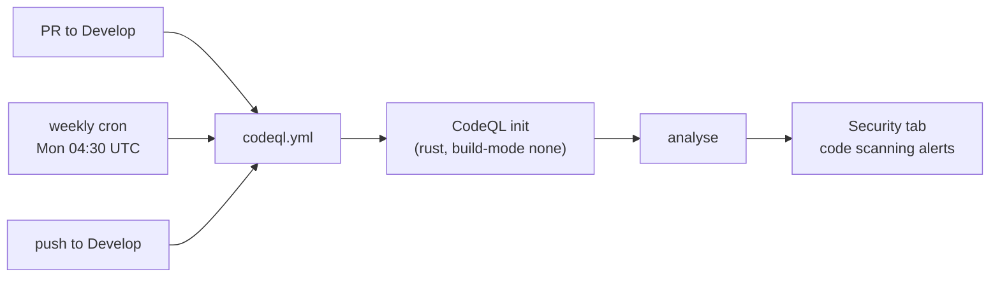

`scripts/check-codeql-workflow.sh` gates that policy in `quality.sh` and CI:
it fails if the workflow is missing, skips `Develop`, has no schedule (or one
slower than weekly), cannot upload results (`security-events: write`), does
not analyse Rust, is missing either CodeQL step, or pins an action to a
movable tag instead of a commit SHA.

## Secrets detection

CodeQL reads code, not credentials. A secret committed by accident cannot be
undone by a revert — it has to be rotated — so
[`gitleaks.yml`](./.github/workflows/gitleaks.yml) scans the pull request diff
before it reaches `Develop`.

`gitleaks-action@v2` needs an organisation licence (`GITLEAKS_LICENSE`), and
bot-authored pull requests (Renovate, Dependabot) receive no Actions secrets —
the action then exits with a licence error. The workflow branches on whether
the licence is present and falls back to the free, open-source `gitleaks` CLI,
installed from a version-pinned release whose SHA-256 is verified in the job.
Without that fallback a bot PR would report green while scanning nothing.

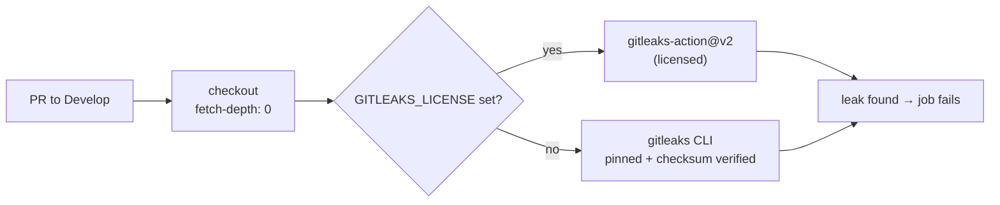

`scripts/check-gitleaks-workflow.sh` gates that policy in `quality.sh` and CI:
it fails if the workflow is missing, does not run on pull requests to
`Develop`, never invokes a scan, neuters the verdict (`|| true`,
`continue-on-error: true`, `--exit-code 0`), drops the licence-less fallback,
checks out a shallow clone the commit range cannot resolve against, or pulls
either the action or the CLI from an unpinned or unverified source.

## Static analysis (Semgrep)

CodeQL and Semgrep read the same tree with independently maintained rules, so a
pattern one engine misses the other still has a chance of catching.
[`semgrep.yml`](./.github/workflows/semgrep.yml) runs `semgrep ci --config
p/default` on every pull request, inside the official Semgrep image pinned to a
`@sha256:` digest — and unlike the Rust-only CodeQL analysis it also reads the
repository's shell scripts and workflow YAML.

`semgrep ci` suppresses its own errors by default: when Semgrep itself fails it
exits 0, and a crashed scan reads as a clean one. The job passes
`--no-suppress-errors` so that failure blocks the merge like any finding.
`SEMGREP_APP_TOKEN` is optional — with no Semgrep Cloud account the secret is
empty and the scan runs unauthenticated against the explicit rule set, so
bot-authored pull requests (Renovate, Dependabot), which receive no Actions
secrets, are scanned exactly the same.

One `p/default` rule is excluded, named and justified in the workflow:
`renovate-missing-minimum-release-age` demands a ≥ 7-day embargo on every
`packageRules` entry, which contradicts the deliberate 24-hour quarantine (and
no embargo for internal `stSoftwareAU` code) committed in
[`renovate.json`](./renovate.json) — see
[Dependency updates](#dependency-updates). JSON has no comment syntax, so an
inline `nosemgrep` is not available.

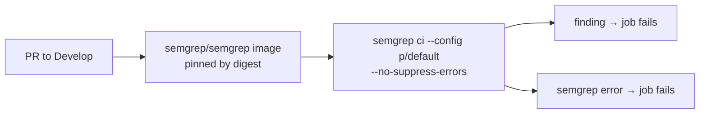

`scripts/check-semgrep-workflow.sh` gates that policy in `quality.sh` and CI:
it fails if the workflow is missing, does not run on pull requests to
`Develop`, never invokes a scan, configures no rule set, neuters the verdict
(`|| true`, `continue-on-error: true`, `--suppress-errors`), drops
`--no-suppress-errors`, runs the scan outside strict bash, or pulls the action,
container image, or CLI from an unpinned source.

## Workflow linting

Workflow YAML is the one thing no other gate reads — clippy, shellcheck and
codespell all stop at the repository's own sources, so an invalid expression or
an unknown `runs-on` used to surface only the next time the workflow ran. The
`workflow-lint` job in [`ci.yml`](./.github/workflows/ci.yml) runs
[`actionlint`](https://github.com/rhysd/actionlint) over
`.github/workflows`, and feeds the `ci-required` aggregator so a lint failure
blocks the merge. `actionlint` also pipes every `run:` block through the
runner's shellcheck, which the `shell-checks` job never sees (it only walks
`*.sh` files).

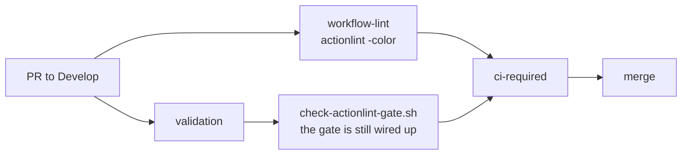

The linter is installed from a version-pinned release whose SHA-256 is
verified in the job, so a hijacked `actionlint` release cannot run unnoticed.
`scripts/check-actionlint-gate.sh` gates the policy itself in `quality.sh` and
CI: it fails if no job invokes `actionlint`, if the invocation is neutered
(`continue-on-error: true`, `|| true`), if the job runs without
`set -euo pipefail`, if no other job lists it in `needs:` (a lint that gates
nothing), or if the linter is pulled from an unpinned or unverified source.

Run it locally with the rest of the gate — `quality.sh` invokes `actionlint`
directly, so install it first (`brew install actionlint`, or see the
[install docs](https://github.com/rhysd/actionlint/blob/main/docs/install.md)).

**Dependabot alerts and security updates** are a repository *setting*, not a
committed file, so they cannot be enabled from the checkout — see
[SECURITY.md](./SECURITY.md#automated-scanning). Renovate's
`osvVulnerabilityAlerts` already raises an advisory-driven PR without them.

## Markdown linting

[`.markdownlint-cli2.yaml`](./.markdownlint-cli2.yaml) has been committed since
the README rewrite, but nothing in CI read it: the structural rules it keeps on
(heading hierarchy, list indentation, fencing) were advisory, so every
hand-written README, CHANGELOG and audit note drifted on its own.
[`markdown-lint.yml`](./.github/workflows/markdown-lint.yml) runs
[`markdownlint-cli2`](https://github.com/DavidAnson/markdownlint-cli2) against
that config on every pull request, and a violation blocks the merge.

The job reports; it never rewrites. `--fix` would edit the runner's throwaway
checkout and exit 0, merging the violation unfixed while the job read green.
`markdownlint-cli2` is installed at an exact version for the same reason the
actions are pinned to commit SHAs — a hijacked release must not run unreviewed
code in CI.

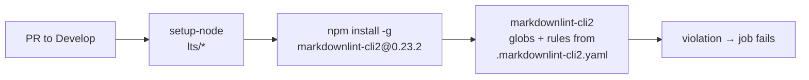

`scripts/check-markdown-lint-workflow.sh` gates that policy in `quality.sh` and
CI: it fails if the workflow is missing, does not run on pull requests to
`Develop`, never invokes a lint (a step merely *named* for one, or an install
with no invocation), rewrites instead of reporting (`--fix`, the action's
`fix: true`), neuters the verdict (`|| true`, `continue-on-error: true`), runs
the CLI outside strict bash, or pulls the action or the linter from an unpinned
source.

## Local quality

```bash
./quality.sh < /dev/null
```

See [CONTRIBUTING.md](./CONTRIBUTING.md) for the version-bump contract
(same as NEAT-AI-Lamarck / GRQ `runlib.sh`).
