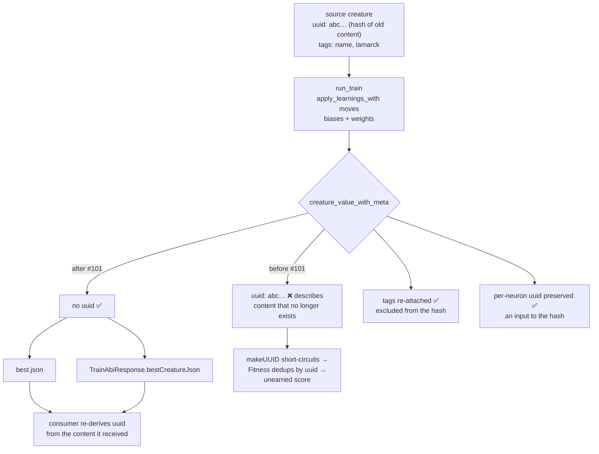

# Never re-attach the source creature's uuid to a trained creature

## Summary

`best.json` — and the identical bytes returned over the C ABI as
`TrainAbiResponse.best_creature_json` — carried the **source** creature's
top-level `uuid` even though training had moved every weight and bias.
That uuid is content-derived: NEAT-AI hashes it as a v5 UUID over the
creature's neurons (`uuid`, `type`, `bias`, `squash`, `frozen`), its
synapses (`fromUUID`, `toUUID`, `weight`, `type`, `frozen`) and `input`.
Backpropagation's whole job is to move that content, so the inherited
uuid described a creature that no longer existed.

The consequence is not cosmetic. NEAT-AI's `makeUUID` short-circuits —
`if (creature.uuid) return creature.uuid;` — and never recomputes, so the
stale value survives every subsequent hop. `Fitness.calculate` then
deduplicates its evaluation queue by uuid and copies `score` / `error` /
tags from the one representative onto every creature it treated as a
duplicate. A trained creature wearing its parent's identity could
therefore be handed a score it never earned, without ever being
evaluated — and because training always moves weights, the trained
creature and its parent always collided.

The fix is a structural removal, not a conditional. This crate has no
reason to compute a v5 content hash, and a structurally identical
creature re-derives the same uuid anyway, so emitting no `uuid` is both
simpler and always correct — and it is what every other write path in
this crate already did (`neat_core::CreatureExport` has no `uuid` field,
so `creature_to_json` drops it; exactly one line put it back).

Closes #101.

### What changed

- `backpropagation/src/tags.rs` — removed the `uuid` re-attachment in
  `creature_value_with_meta`, the `CreatureMeta.uuid` field, and its
  extraction in `from_creature_json`. Module and function docs now state
  the identity contract.
- `backpropagation/tests/creature_identity.rs` — new integration test
  covering both write surfaces.
- `README.md` — new **Creature identity — no inherited `uuid`** section.
- `CHANGELOG.md` — entry under Unreleased → Fixed.
- `backpropagation/Cargo.toml` — crate bumped 0.1.24 → 0.1.25 via
  `scripts/bump-backpropagation-version.sh` (a build-affecting change
  must bump, issue #95).

### What deliberately did *not* change

A tags-only change is not a structural change — tags are excluded from
the uuid hash — so the `tags` re-attachment stays exactly as it was, and
`score` / `error` / `backpropagation` are still stamped for GRQ check-in.
Per-neuron `uuid` is a different concept: a stable identity label that is
an *input* to the creature hash rather than the hash itself, and it is
preserved verbatim. Both are locked down by the over-correction guard
test below, so the fix cannot drift into "strip everything".

## Evidence

Backend/CLI change with no web interface, so there is nothing to
screenshot; the evidence is the tests, written red-first.

**Red, before the fix** — both surfaces carried the inherited uuid:

```text
failures:
    tags::tests::serialize_never_emits_a_creature_level_uuid
    ... "uuid": "creature-1"

failures:
    a_trained_creature_carries_no_source_uuid_on_either_surface
    ... "uuid": "3f1c2b6a-0000-5000-8000-000000000001"
```

The two guard tests (`the_trained_creature_differs_structurally_from_its_source`
and `dropping_the_creature_uuid_keeps_tags_and_per_neuron_uuids`) passed
in that same red run, which is the point: they prove the failing
assertion was about identity alone, not about a run that did nothing.

**Green, after the fix** — full suite, `cargo test --workspace
--all-features -- --test-threads=2`: **148 passed, 0 failed** across the
library and every integration target.

Data flow before and after:



### Quality gate

`./quality.sh < /dev/null` passes every stage except `codespell`, which
is **not installable in this container** — there is no `pip`, `pip3`,
`pipx` or `sudo`, so `scripts/spell-check.sh` exits with its
"codespell is not installed" message before any typo is reported. That
is a pre-existing environment gap, not a finding against this change; CI
runs the stage for real. Every stage the container can run was executed
and passes: shellcheck, the workflow validators, branch protection,
`cargo deny check` (advisories / bans / licenses / sources ok),
`cargo fmt --all -- --check`, `cargo clippy --workspace --all-targets
--all-features -D warnings`, the test suite, and
`RUSTDOCFLAGS="-D warnings" cargo doc --workspace --no-deps`.

### Note on `Cargo.lock`

The lockfile records the sibling `neat-core` path dependency moving
0.10.2 → 0.10.3. That is an environmental patch bump picked up by
building against the sibling checkout, not a change this PR makes; it is
below the `neat-core.expected-version` breaking-bump baseline (0.10.0)
and needs no code change.

### Cross-repo finding — the Lamarck twin is still defective

`docs/audit/issue-35-neat-ai-core-duplication.md:32` records `tags.rs` as
a duplicate of NEAT-AI-Lamarck's, and the same defect is live there:
`NEAT-AI-Lamarck/lamarck/src/tags.rs:300-302` re-attaches `meta.uuid`,
fed by `CreatureMeta.uuid` (`tags.rs:58`) and its extraction
(`tags.rs:77-80`), with `tags.rs:432` asserting the defect. The file has
since diverged from this one (Lamarck added `neuron_tags`, and its
`candidates.rs` batch writer is a third write surface whose test at
`candidates.rs:2712` asserts the inherited uuid), so it is not a
copy-paste of this patch and belongs in that repo's own PR against its
own gate. Filing the issue there was refused by this run's `gh` guard
(`[SECURITY] [WRITE_REPO_BLOCKED]` — writes are allowlisted to
`stsoftwareau/neat-ai-backpropagation`), so the finding is recorded here
and on issue #101 instead.

**Durably captured since:** this finding now also lives in
`docs/audit/issue-35-neat-ai-core-duplication.md` under Finding 3 ("Confirmed
cross-repo defect — Lamarck's copy is live and test-asserted"), with a
`NEAT-AI-Lamarck` row in that document's Filing status table (issue #140), so it
no longer depends on this PR summary surviving.

## Test Plan

Added `backpropagation/tests/creature_identity.rs` — trains a tagged
creature over a learnable corpus through the real C ABI
(`neat_backprop_train`), so both surfaces are exercised as a foreign
caller exercises them:

- `a_trained_creature_carries_no_source_uuid_on_either_surface` — the
  regression test. Asserts `get("uuid").is_none()` on the
  `TrainAbiResponse.best_creature_json` payload **and** on the bytes read
  back from `best.json`, plus that the two are byte-identical. Fails
  against the unfixed code with the inherited uuid in the dump.
- `the_trained_creature_differs_structurally_from_its_source` — the
  anti-vacuity cross-check. Asserts the emitted `neurons` and `synapses`
  differ from the source's, so the run really did move the content the
  uuid hashes over.
- `dropping_the_creature_uuid_keeps_tags_and_per_neuron_uuids` — the
  over-correction guard. Asserts every pedigree tag from the source
  survives with its value intact, and that per-neuron `uuid` values and
  synapse endpoints are byte-identical to the input.

Added in `backpropagation/src/tags.rs`:

- `serialize_never_emits_a_creature_level_uuid` — unit-level cover on
  `serialize_creature_with_meta` directly: no top-level `uuid`, while
  `neurons[0].uuid` and `tags[0]` survive.

Modified in `backpropagation/src/tags.rs`:

- `extract_preserves_uuid_and_tags` → `extract_preserves_tags`. The uuid
  half of this test asserted `meta.uuid.as_deref() == Some("creature-1")`
  — it encoded the defect, and `CreatureMeta.uuid` no longer exists. The
  tags half is unchanged. This is the only existing assertion removed;
  no test was commented out or disabled.
