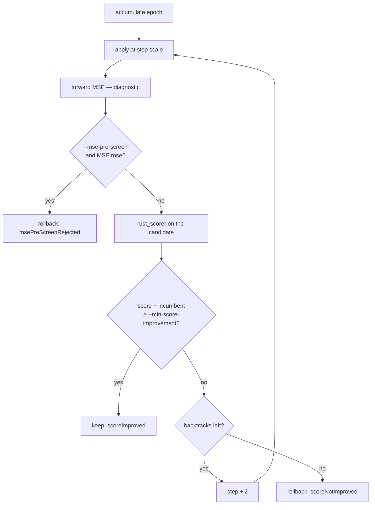

# Make NEAT-AI-scorer the acceptance oracle for production backprop candidates

## Summary

`train` accepted or rolled back an epoch on training-slice MSE and only
invoked `rust_scorer` after the loop, so a candidate could lower MSE and lower
the fitness evolution actually optimises. This adds an explicit scorer-guided
acceptance mode: `train --acceptance scorer` scores the baseline **before**
epoch 1, scores **every** attempted candidate (each backtracking step
included), and keeps one only when fitness rises by `--min-score-improvement`
(default `1e-6`, the production win margin). MSE becomes a journalled
diagnostic, or an opt-in `--mse-pre-screen` gate in front of the scorer. The
scorer is called and trusted — no part of its objective is reimplemented here.

MSE remains the default mode, so existing runs and parity tests are unchanged.
The new settings reach the C ABI as `acceptance` / `minScoreImprovement` /
`msePreScreen`. Misconfiguration fails loudly rather than degrading quietly:
`--acceptance scorer` without `--scorer`, `--accept-always` combined with the
scorer gate, a non-finite or negative epsilon, and a scorer knob on an
`--acceptance mse` run are all refused.

Closes #104.

## Evidence

Backend/CLI change — no web interface to screenshot. Evidence is the real
`rust_scorer` binary, the test suite, and the full quality gate.

**Experiment with the real scorer** (`scripts/run-scorer-guided-experiment.sh`,
run against `NEAT-AI-scorer/target/release/rust_scorer`). Same creature,
corpus, seed and epoch budget through both modes:

| Mode | Slice MSE | `rust_scorer` fitness | Accepted epochs |
| ---- | --------- | --------------------- | --------------- |
| `--acceptance mse` | `14.839056 → 3.489936` | `0.703219 → -0.332415` (Δ `-1.0356`) | 1 |
| `--acceptance scorer` | `14.839056 → 14.839056` | `0.703219 → 0.703219` (Δ `0`) | 0 |

The MSE loop's one "win" cost more than a whole point of real fitness;
scorer-guided acceptance rejected the same candidate (`scoreNotImproved`) and
held the creature. That is the mismatch the issue describes, reproduced against
the authoritative oracle rather than a stub.

Full gate: `./quality.sh < /dev/null` passes end to end (shellcheck, actionlint,
the workflow validators, codespell, cargo-deny, fmt, clippy `-D warnings`, 13
test binaries, rustdoc `-D warnings`).

## Acceptance Criteria

<!-- vibe-spec-review inputs="diff+issue-body" -->

- **met** — New explicit scorer-guided acceptance mode — evidence:
  `backpropagation/src/acceptance.rs::AcceptanceMode::Scorer`, CLI
  `--acceptance`, ABI `acceptance`;
  `backpropagation/tests/scorer_guided_acceptance.rs::scorer_guided_rolls_back_a_candidate_whose_score_falls`
  — reviewer: met
- **met** — Baseline scorer result established before candidate acceptance —
  evidence:
  `backpropagation/tests/scorer_guided_acceptance.rs::the_baseline_is_scored_before_the_first_candidate`
  — reviewer: met
- **met** — Candidate scorer result participates in accept/rollback during the
  loop — evidence:
  `backpropagation/tests/scorer_guided_acceptance.rs::each_backtracking_step_is_scored_and_journalled`
  and `::a_backtracked_step_can_win_on_score` — reviewer: met
- **met** — Configurable minimum score improvement, conservative default —
  evidence: `DEFAULT_MIN_SCORE_IMPROVEMENT = 1e-6`;
  `backpropagation/tests/scorer_guided_acceptance.rs::a_gain_below_the_minimum_improvement_is_not_a_win`
  — reviewer: met
- **met** — Journal records baseline/candidate score, MSE, step scale and
  accept reason — evidence: `TrainCandidateRecord` in
  `backpropagation/src/train.rs`; asserted field by field in
  `::scorer_guided_rolls_back_a_candidate_whose_score_falls` — reviewer:
  partial — reason: the reviewer flagged that a candidate line's
  `baselineScore` is the *incumbent*, which moves on accept, so a run's opening
  number was not journalled under its own name; the run header now carries
  `baselineScore` and both doc comments say which is which.
- **partial** — Existing MSE-only mode and parity tests remain unchanged —
  evidence: every pre-existing test passes untouched except for the mechanical
  `acceptance:` field; `::mse_only_mode_still_accepts_on_slice_mse_alone`
  proves MSE still decides alone — reviewer: partial — reason: MSE-mode
  *behaviour* is unchanged, but its journal gains `acceptReason` (and
  `TrainEpochRecord` now requires it, so a pre-0.1.26 journal line no longer
  deserialises — recorded under **Changed** in `CHANGELOG.md`), and
  `TrainRequest` gained a required public field, so every `run_train` caller
  needed the one-line edit.
- **partial** — Production experiment demonstrates whether scorer-guided mode
  finds more usable wins — evidence: `scripts/run-scorer-guided-experiment.sh`
  and the table above, run against the real `rust_scorer` — reviewer: partial
  — reason: the container has no production target (`~/src/GRQ-cluster/network.json`
  and the 2.26M-record corpus are absent), so the demonstration is on a
  generated corpus that reproduces the slice-vs-corpus mismatch. The harness
  takes `CREATURE=` / `DATA_DIR=` overrides so an operator can repeat it on the
  production creature; no production number is claimed, and `docs/production-win.json`
  is deliberately untouched.
- **unrequested** — `--accept-always` combined with scorer acceptance is
  refused, as is a negative / non-finite epsilon and a scorer knob on an
  `--acceptance mse` run — reviewer: unrequested — reason: each would otherwise
  disable or silently ignore the gate the issue asks for, which the repo's
  fail-loud standard forbids.
- **unrequested** — the accepted candidate's score is reused as the run's
  `bestScore` instead of re-scoring the winner — reviewer: unrequested —
  reason: the bytes are identical, and on the production corpus the extra pass
  would double the cost of every accepted epoch.
- **unrequested** — under scorer acceptance the trace store's "improved"
  predicate follows the scorer verdict rather than MSE — reviewer:
  unrequested — reason: #78 files a candidate that "made the network worse";
  in this mode the scorer defines worse.

## Standards Review

<!-- vibe-standards-review inputs="diff+CODING-STANDARDS.md" -->

The repo has no `CODING-STANDARDS.md`; the reviewer was given the diff plus
`CONTRIBUTING.md` and the fleet-wide engineering standards.

- **violation** — a test helper swallowed a read error, so an unreadable calls
  file read as "the scorer never ran" — evidence:
  `backpropagation/tests/scorer_guided_acceptance.rs:87` — reason: fixed here;
  only `NotFound` is zero, any other error panics.
- **violation** — the scorer-guided line search had no coverage: every request
  set `max_backtracks: 0`, so the README's "including each backtracking step"
  claim was untested — evidence:
  `backpropagation/tests/scorer_guided_acceptance.rs:147` — reason: fixed here
  by `::each_backtracking_step_is_scored_and_journalled` and
  `::a_backtracked_step_can_win_on_score`.
- **violation** — a doc comment claimed a non-finite epsilon was covered when
  only `-1.0` was tested — evidence:
  `backpropagation/tests/scorer_guided_acceptance.rs:413` — reason: fixed here;
  the test now loops `-1.0`, `NaN` and `∞`, and `acceptance.rs` unit-tests the
  same values through both entry points.
- **violation** — two near-identically named validators split the checks, so a
  `NaN` epsilon passed the CLI/ABI resolver and only failed inside `run_train`
  — evidence: `backpropagation/src/train.rs:381` — reason: fixed here;
  `ScorerAcceptance::validate` is the single check both call.
- **violation** — the same `incumbent_score … ok_or(…)?.score` expression twice
  in one loop iteration — evidence: `backpropagation/src/train.rs:558` —
  reason: fixed here, hoisted above the match.
- **violation** — the experiment script gated corpus reuse on the *directory*,
  so an interrupted generator left an empty corpus that later runs would
  "compare" on — evidence: `scripts/run-scorer-guided-experiment.sh:45` —
  reason: fixed here; it gates on `0.bin` and fails loudly if generation wrote
  no records.
- **violation** — `python3` used with no preflight, unlike the two sibling
  scripts, and missing from CONTRIBUTING's prerequisites — evidence:
  `scripts/run-scorer-guided-experiment.sh:49` — reason: fixed here; preflight
  added and CONTRIBUTING updated.
- **violation** — a journal with no epoch line aborted the script through
  `pipefail` with no diagnostic — evidence:
  `scripts/run-scorer-guided-experiment.sh:112` — reason: fixed here with an
  explicit `FAIL:` message.
- **violation** — `train.rs` grew to become the crate's largest file by ~35%,
  against the smaller-focused-files standard — evidence:
  `backpropagation/src/train.rs:44` — reason: fixed here; the acceptance
  vocabulary and its validation moved to `backpropagation/src/acceptance.rs`,
  re-exported from `train` so existing paths still resolve.
- **clean** — Australian English throughout (codespell clean); docs updated
  alongside the code (README flag table, behaviour section, Mermaid diagram,
  ABI field list; CHANGELOG Added *and* Changed; `include/neat_ai_backpropagation.h`);
  crate version bumped 0.1.25 → 0.1.26 in both manifest and lockfile; fail-loud
  production paths with no swallowed errors; tests call real code with real
  assertions and no source-text grepping; 15 tests in 0.02s with no sleeps and
  no wall-clock thresholds; no hidden or credential files staged; bash 3.2-safe,
  shellcheck-clean, non-interactive, no spin-wait and no `tail -f`.

## Test Plan

- Added `backpropagation/tests/scorer_guided_acceptance.rs` (15 tests) —
  stub-scorer integration covering: MSE-only mode unchanged; rollback when the
  scorer disagrees with an MSE win; accept on a scorer win; the baseline scored
  before the first candidate and journalled in the run header; the epsilon gate
  (default rejects `1e-9`, a lowered epsilon accepts it); the pre-screen both
  skipping and passing a candidate through; each backtracking step scored and
  journalled; a backtracked step winning; and the four refusals (no scorer,
  `accept_always`, bad epsilon, scorer knobs on an MSE run), plus a dead scorer
  failing the run rather than counting as "no improvement".
- Added `backpropagation/src/acceptance.rs` unit tests — defaults, epsilon
  validation through both entry points, `accepted()` per verdict, and the
  camelCase wire forms.
- Added `backpropagation/src/main.rs` tests — `--acceptance` defaults, the flag
  round trip, and the refusal of scorer settings on an MSE run.
- Added `backpropagation/src/ffi.rs` tests — the new fields' defaults, their
  camelCase wire form, and a scorer-guided request without a scorer binary
  failing loudly.
- Existing suites unchanged apart from the mechanical `acceptance:` field; the
  full gate runs 13 test binaries green.
