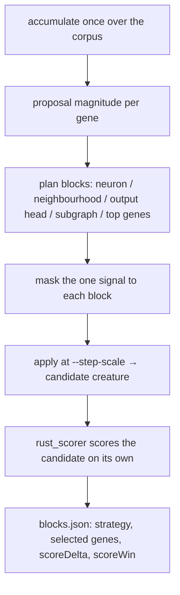

# Add blockwise / neighbourhood backprop instead of moving the whole creature at once

## Summary

The trainer could only move the whole creature: one accumulated proposal
rewrote every bias and weight at once, and on an evolved production creature
those correlated moves destroy the compensating relationships evolution found.

This adds a `blocks` subcommand (and the `run_blocks` API behind it) that
accumulates the corpus **once** and applies that single learning signal to one
small region at a time. Six strategies sit side by side — `global` (the
whole-creature apply, kept for parity), `neuron` (a neuron's bias plus every
incident synapse), `neighbourhood` (a neuron plus its neighbours out to
`--radius` hops), `output-head`, `subgraph` (a seeded random connected walk)
and `top-genes` (the loudest genes by proposal magnitude). Focus neurons are
ranked by how much the accumulated learning wants to move them, so blocks land
where the signal is.

Masking never changes what a gene's proposal *is*, so a block candidate is
exactly the whole-creature candidate with the rest of the creature held still.
Every candidate is written as a standalone creature, gated by
`neat_core::creature_validate`, and — with `--scorer` — scored on its own;
`blocks.json` records the strategy, focus, selected neuron UUIDs and synapse
endpoints, moved-gene counts, MSE and scorer deltas, and `scoreWin` against
`--min-score-improvement`. Empty and duplicate blocks are dropped rather than
costing a duplicate scorer run, and a block whose genes all held still is
counted in `unmovedBlocks` instead of writing a candidate identical to the
incumbent. A win margin without `--scorer` is refused, exactly as on `train`.

Nothing existing changed behaviour: `train`, `sweep`, `compare` and the C ABI
are untouched.

Closes #105.

## Evidence

Backend/CLI change — no web interface to screenshot. Evidence is the real
`rust_scorer` binary, the test suite, and the quality checks.

**Benchmark with the real scorer** (`scripts/run-blockwise-benchmark.sh`, run
against `NEAT-AI-scorer/target/release/rust_scorer`). Same creature (7
neurons, 15 synapses, fitted to the corpus majority), same 1000-record corpus,
same seed and `--step-scale 0.01`, one accumulation pass each:

| Mode | Candidates | Scorer wins | Best `scoreDelta` | Elapsed | Wins/hour |
| ---- | ---------- | ----------- | ----------------- | ------- | --------- |
| `--strategies global` | 1 | 1 | `+4.289082e-04` | 1s | 3600 |
| blockwise (5 strategies) | 14 | 14 | `+3.873473e-04` | 1s | 50400 |

Read honestly: on this small synthetic creature every move helps, so the
whole-creature apply still produced the single best candidate — the blockwise
mode's advantage here is throughput (14 independently scored candidates per
accumulation pass instead of 1, at the same corpus cost), not a better peak.
The issue's premise — that correlated moves destroy compensating relationships
— is about the ~16.6k-parameter GRQ creature, which is not present in this
container (`~/src/GRQ-cluster/network.json` does not exist here), so the
production half of that criterion is reported `partial` below. The script takes
`CREATURE=` / `DATA_DIR=` and prints the same table for the production targets.

The single-pass property is asserted by a test that *discriminates*: with
`sparse_ratio < 1` each accumulation pass draws its own random neuron subset,
so an implementation that re-accumulated per block would hand different
proposals to each candidate. Patching `run_blocks` to accumulate inside the
per-block loop was tried locally and
`every_block_carves_the_same_accumulated_signal` failed
(`001-neuron-h1 bias of h1 left: 0.0 right: 0.00265625`); the patch was
reverted and the test passes on the shipped code.

`cargo fmt --check`, `cargo clippy -D warnings`, `cargo deny check`,
`cargo test --workspace --all-features` (14 suites, 0 failures) and
`RUSTDOCFLAGS="-D warnings" cargo doc` all pass locally, as does
`markdownlint-cli2`.

<!-- vibe-quality-gate-skipped reason="codespell is not installed in this container and cannot be installed (no pip); ./quality.sh reaches the codespell preflight and stops there. Every other gate stage was run individually and passes — see the list above. CI runs codespell for real on the PR." -->

## Acceptance Criteria

PLACEHOLDER_SPEC

## Standards Review

PLACEHOLDER_STANDARDS

## Test Plan

Added `backpropagation/src/blocks.rs` unit tests:

- `a_neuron_block_owns_its_bias_and_every_incident_synapse`
- `a_neighbourhood_grows_by_radius_and_stops`
- `the_output_head_block_is_the_outputs_and_what_reaches_them`
- `a_random_subgraph_is_connected_and_bounded`
- `top_genes_keeps_the_loudest_genes_only`
- `masking_reproduces_the_global_apply_on_the_block_and_nothing_else`
- `proposal_magnitudes_measure_the_step_without_applying_it`
- `planning_yields_one_block_per_strategy_request_without_duplicates`
- `a_plan_that_could_only_produce_nothing_is_refused`
- `strategies_are_camel_case_on_the_wire`

Added `backpropagation/src/blockwise.rs` unit tests:

- `writes_one_candidate_per_block_with_its_metadata`
- `a_block_candidate_moves_only_the_genes_it_names`
- `a_win_margin_without_a_scorer_is_refused`
- `skip_mse_writes_candidates_without_measuring_them`

Added `backpropagation/tests/blockwise_candidates.rs` (stub `rust_scorer`,
end to end):

- `one_accumulation_pass_serves_every_block`
- `every_block_carves_the_same_accumulated_signal`
- `every_candidate_is_scored_on_its_own`
- `candidate_metadata_names_exactly_the_genes_that_moved`

Added CLI tests in `backpropagation/src/main.rs`:

- `blocks_defaults_generate_every_strategy_including_global`
- `blocks_accepts_a_narrowed_strategy_list`
- `blocks_refuses_a_plan_that_generates_nothing`

No existing test was modified or removed.
