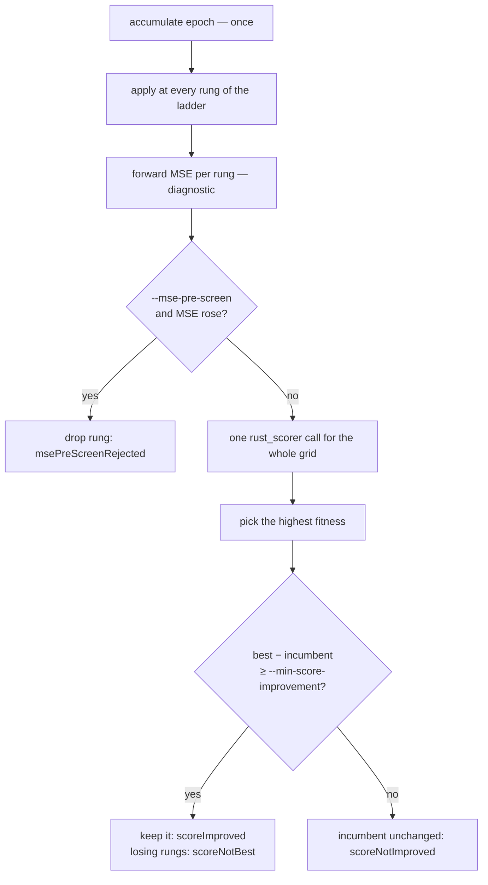

# Score a step-scale ladder and keep the best scorer winner

## Summary

The scorer-guided trainer (#104) still searched for its step with the MSE-era
backtracking line search: start at `--step-scale`, halve on a rejection, and
stop at the **first** candidate the judge accepts. That is only correct if the
judge is monotonic along the backprop direction — on an evolved production
creature the scorer optimum can sit at a much smaller step, or at a step whose
slice MSE is slightly worse.

`train --acceptance scorer --step-scale-ladder` replaces "halve until something
passes" with "score the whole grid and keep the best":

- **`backpropagation/src/ladder.rs` (new)** — the default grid
  (`0.0001,0.00025,0.0005,0.001,0.0025,0.005,0.01`, the issue's own ladder),
  rung validation, and `run_ladder_epoch`: the epoch's **one** accumulation is
  applied at every rung, each rung's slice MSE is measured as a diagnostic, the
  survivors are batch-scored, and the highest fitness wins. Ties keep the
  smaller step. A rung outside `(0, 1]` or non-finite is refused, because
  `effective_step_scale` would silently rewrite it and the journal would record
  a step that was never applied.
- **`backpropagation/src/scorer.rs`** — `score_creatures` batch-scores a
  directory of candidates in a single `rust_scorer` invocation (the binary
  already scores a directory and prints a stem → result map) and matches each
  result back **by stem**. A candidate the scorer did not report fails the run
  rather than shifting scores onto the wrong rung; the candidate directory is
  cleared between batches so a stale rung is never re-scored. `score_creature`
  is now a one-candidate call through the same path.
- **`backpropagation/src/train.rs`** — the ladder branch of the epoch loop, and
  the journal: every rung is a `"kind":"candidate"` line with its own
  `stepScale`, `candidateMse`, `mseDelta`, `candidateScore` and `scoreDelta`;
  the epoch line gains `ladderRungs` (and reports `"backtracks":0`, since the
  rungs are the epoch's attempts); the run header records the grid. No winner
  leaves the incumbent, `best_mse` and `bestScore` exactly where they were.
- **`backpropagation/src/acceptance.rs`** — new `scoreNotBest` reason for a rung
  that improved on the incumbent but lost to a better rung.
- **`backpropagation/src/main.rs` / `ffi.rs`** — `--step-scale-ladder` (bare
  flag = default grid) and `stepScaleLadder` over the C ABI. Both refuse a
  ladder on an `--acceptance mse` run rather than silently ignoring it, matching
  how the other scorer knobs already fail loud.
- **`scripts/run-step-scale-ladder-experiment.sh` (new)** — runs one corpus,
  seed and epoch budget through both searches and prints accepted epochs,
  scorer gain, wall clock and wins/hour.

MSE stays a diagnostic; `--mse-pre-screen` still drops a rung whose slice MSE
did not fall before the batch is scored (the issue's optional catastrophic
rejection). The line search is untouched and remains the default, so every
existing run behaves exactly as before.

Closes #106.

## Evidence

Backend/CLI change — no web interface to screenshot. The evidence is the test
suite, the CLI refusals, and the comparison harness.



**Test suite** — `cargo test --workspace --all-features`: 200 tests pass,
including the 13 new `tests/step_scale_ladder.rs` cases and 5 new
`scorer::tests::batch` cases. `cargo fmt --check`, `cargo clippy -D warnings`,
`cargo deny check`, `RUSTDOCFLAGS="-D warnings" cargo doc` and
`shellcheck -x -s bash` on the new script all pass.

**CLI refusals**, run against the release binary:

```text
$ ... train creature.json data --step-scale-ladder
error: the step-scale ladder only applies to scorer-guided acceptance — set acceptance to "scorer"

$ ... train creature.json data --acceptance scorer --step-scale-ladder "0.01,2.0" --scorer ...
error: step-scale ladder rungs must be finite and within (0, 1]: 2
```

**Wins/hour comparison** — `scripts/run-step-scale-ladder-experiment.sh` on its
generated corpus (a 20-record slice that contradicts 98% of 1,000 records),
8 epochs, seed 1. `NEAT-AI-scorer` is not present in this container and neither
is GRQ history, so the runs below used a throwaway stand-in scorer whose fitness
is the negative full-corpus MSE (not committed); the numbers are indicative of
the mechanism, **not** a production result:

| Run | Search | Accepted epochs | Scorer gain | Candidates scored | wins/hour |
| --- | ------ | --------------- | ----------- | ----------------- | --------- |
| default `--step-scale 0.01` | line search | 4 | `+1.742e-2` | 11 | 98,759 |
| default `--step-scale 0.01` | ladder (7 rungs) | 4 | `+1.742e-2` | 35 | 143,993 |
| `STEP_SCALE=1.0` (overshooting) | line search | 1 | `+1.225e-2` | 12 | 22,186 |
| `STEP_SCALE=1.0` (overshooting) | ladder (6 rungs to 1.0) | **4** | **`+1.742e-2`** | 30 | 148,806 |

Read honestly: when the trainer's starting step is already the best rung, both
searches find the same winner and the ladder simply pays for more scoring. When
the starting step overshoots — the production case the issue describes — the
line search accepted one epoch and stalled, while the ladder kept winning and
finished 42% higher on fitness. The wall-clock figures are dominated by process
start-up at this scale, so treat wins/hour as directional until the script is
run against the real scorer and corpus.

## Acceptance Criteria

<!-- vibe-spec-review inputs="diff+issue-body" -->

- **met** — Configurable step-scale grid — evidence: `backpropagation/src/main.rs:168` (`--step-scale-ladder`, bare flag = the issue's own 7-rung default), `backpropagation/src/ffi.rs:224` (`stepScaleLadder`), tests `backpropagation/tests/step_scale_ladder.rs::the_default_grid_is_configurable_from_the_cli_spelling` and `main::tests::the_step_scale_ladder_is_opt_in_with_a_default_grid` — reviewer: met
- **met** — Candidates are generated from one learning accumulation — evidence: `backpropagation/src/train.rs:432` accumulates once per epoch and hands the same `report.learning` to `run_ladder_epoch` (`backpropagation/src/ladder.rs:169`); test `backpropagation/tests/step_scale_ladder.rs::a_single_rung_ladder_matches_the_line_search_candidate` — reviewer: met
- **met** — Batch scoring supported where NEAT-AI-scorer allows it — evidence: `backpropagation/src/scorer.rs::score_creatures` (one invocation, results matched by stem), tests `scorer::tests::batch::results_follow_the_request_order_not_the_scorer_order` and `backpropagation/tests/step_scale_ladder.rs::the_whole_ladder_is_scored_in_one_call_and_journalled` (2 scorer processes for baseline + a 3-rung grid) — reviewer: met
- **met** — Best candidate selected by scorer delta — evidence: `backpropagation/src/ladder.rs:227` picks the maximum fitness, not the first improver; tests `::the_best_rung_wins_not_the_first_improver`, `::a_middle_rung_can_win`, `::the_ladder_beats_the_line_search_on_the_same_scores` — reviewer: met
- **met** — Journal records score and MSE for every step — evidence: one `"kind":"candidate"` line per rung built at `backpropagation/src/ladder.rs:248`; test `::the_whole_ladder_is_scored_in_one_call_and_journalled` — reviewer: met
- **met** — No winner => leave incumbent unchanged — evidence: `backpropagation/src/train.rs` only moves the incumbent under `if accepted`; test `::no_rung_beating_the_incumbent_leaves_it_unchanged` asserts `accepted_epochs == 0`, unchanged `best_mse`, unchanged `bestScore` — reviewer: met
- **partial** — Compare wins/hour with the current MSE-halving line search on real GRQ history — evidence: `scripts/run-step-scale-ladder-experiment.sh` runs both searches on one creature/corpus/seed and prints accepted epochs, scorer gain, wall clock and wins/hour, with `CREATURE=` / `DATA_DIR=` overrides for production — reviewer: partial — reason: neither `NEAT-AI-scorer` nor GRQ history exists in this container, so the numbers in the Evidence table come from a synthetic corpus and a throwaway stand-in scorer; the production comparison still has to be run by someone with those inputs.
- **unrequested** — A ladder on an `--acceptance mse` run, an empty ladder, and a rung outside `(0, 1]` are hard errors rather than ignored — evidence: `backpropagation/src/train.rs:306`, `backpropagation/src/ladder.rs:56` — reviewer: unrequested — reason: the fail-loud house style the #104 scorer knobs already follow; `effective_step_scale` would otherwise rewrite the rung and the journal would record a step that was never applied.
- **unrequested** — New wire vocabulary: `AcceptReason::ScoreNotBest`, epoch `ladderRungs`, header `stepScaleLadder` — evidence: `backpropagation/src/acceptance.rs:86`, `backpropagation/src/train.rs:113` — reviewer: unrequested — reason: "journal records score and MSE for every step" needs a per-rung verdict a losing-but-improving rung can carry, and the grid itself has to be auditable from the journal.
- **unrequested** — `score_creature` reimplemented on top of `score_creatures`, which now clears its candidate directory per call — evidence: `backpropagation/src/scorer.rs:33` — reviewer: unrequested — reason: one scoring path instead of two (DRY); clearing is required so a stale rung from a longer earlier ladder is not re-scored, and the single-candidate path keeps its historical by-position match, now pinned by `scorer::tests::batch::a_single_candidate_accepts_whatever_stem_the_scorer_echoes`.
- **unrequested** — Tie-break rule "equal scores keep the smaller step" — evidence: `backpropagation/src/ladder.rs:227`, test `::a_tie_keeps_the_smaller_step` — reviewer: unrequested — reason: scoring a grid forces a tie policy; the conservative one is documented rather than left to iteration order.
- **unrequested** — The ladder supersedes `--max-backtracks` instead of refusing the combination — evidence: `backpropagation/src/train.rs:275`, `README.md` — reviewer: unrequested — reason: `--max-backtracks` defaults to 6, so refusing would make the ladder unusable without a second flag; the rungs are the attempts and the epoch line journals `"backtracks":0` beside `ladderRungs`.
- **unrequested** — Signed / reversed micro-steps are *not* implemented; negative rungs are refused — evidence: `backpropagation/src/ladder.rs:56` — reviewer: unrequested — reason: the issue marks them optional and conditional on gradient-check evidence, and supporting them means changing `effective_step_scale`'s "non-positive means full step" contract, which is a separate change.
- **unrequested** — Crate version bump `0.1.26 → 0.1.27`, README section, CHANGELOG entry, C ABI header field, CONTRIBUTING python3 prerequisite — evidence: `backpropagation/Cargo.toml:3`, `include/neat_ai_backpropagation.h:79`, `CONTRIBUTING.md:35` — reviewer: unrequested — reason: repository convention (the version gate fails a build-affecting change without a bump) and the docs-change-owed rule.

## Standards Review

<!-- vibe-standards-review inputs="diff+CODING-STANDARDS.md" -->

- **violation** — The C ABI header's request-JSON block did not list the new `stepScaleLadder` field, so a C consumer could not discover it — evidence: `include/neat_ai_backpropagation.h:79` — reason: fixed here; the field is documented beside `stepScale`.
- **violation** — The CHANGELOG quoted a wins/hour figure without the caveats that it came from a stand-in scorer and a non-default `STEP_SCALE=1.0` — evidence: `CHANGELOG.md:26` — reason: fixed here; the entry now says the comparison has *not* been run against `rust_scorer` or GRQ history and names the override.
- **violation** — `scripts/run-step-scale-ladder-experiment.sh` claimed to print scorer gain but printed only accepted epochs, verdicts and wins/hour — evidence: `scripts/run-step-scale-ladder-experiment.sh:137` — reason: fixed here; the gain is now read back out of the journal (and a journal with no baseline score fails the run).
- **violation** — Stale doc comments: `TrainCandidateRecord` and its `attempt` field still described only the backtracking line search after the ladder started writing rung indexes into them — evidence: `backpropagation/src/train.rs:57` — reason: fixed here.
- **violation** — DRY: the default grid was spelled a third time inside the experiment script — evidence: `scripts/run-step-scale-ladder-experiment.sh:26` — reason: fixed here; the script now passes the bare flag and lets the CLI supply the grid, so `LADDER=` is an override rather than a copy.
- **violation** — DRY: the scorer accept rule (the epsilon test) was implemented twice, once per search — evidence: `backpropagation/src/ladder.rs:296` — reason: fixed here; both paths now call `ScorerAcceptance::verdict`, pinned by `acceptance::tests::the_verdict_gates_on_the_epsilon_and_rejects_a_nan` (which caught a floating-point trap in its own first draft).
- **violation** — Fail loud: `zip`-ing scores onto rungs truncates silently, and a short result set would have been journalled as an MSE pre-screen rejection that never happened — evidence: `backpropagation/src/ladder.rs:218` — reason: fixed here; the batch now fails with the two counts if they disagree.
- **violation** — Fail loud: `parse_step_scale_ladder` skipped empty CSV fields, so `"0.001,,0.01"` silently became a shorter grid — evidence: `backpropagation/src/ladder.rs:75` — reason: fixed here; an empty rung is refused, covered by `ladder::tests::an_empty_rung_is_refused_rather_than_skipped`.
- **violation** — The lenient single-candidate scoring path (score accepted under any stem) had no test — evidence: `backpropagation/src/scorer.rs:95` — reason: fixed here by pinning the behaviour in `scorer::tests::batch::a_single_candidate_accepts_whatever_stem_the_scorer_echoes`; the leniency itself is kept deliberately, because tightening it would change the untouched baseline / line-search path against a real `rust_scorer` whose stem choice we do not control.
- **violation** — `CONTRIBUTING.md`'s python3 prerequisite list did not name the new script — evidence: `CONTRIBUTING.md:35` — reason: fixed here.
- **violation** — `run_train` grew from 339 to ~390 lines and gained a nesting level: the ladder branch was added inline and the pre-existing line-search loop was re-indented into the `else` — evidence: `backpropagation/src/train.rs:335` — reason: **stands.** The ladder's own logic *was* extracted (`backpropagation/src/ladder.rs`); extracting the line-search loop as well means rewriting the epoch path this issue deliberately leaves untouched, which is scope this change should not take. Noted for a follow-up.
- **clean** — Australian English throughout the added lines (no `behavior`/`color`/`optimiz`/`normaliz`/… hits); doc comments on every new public item with `#![warn(missing_docs)]`, `cargo doc -D warnings` clean; camelCase journal fields with `#[serde(default)]` on the new optional ones and a test pinning `"scoreNotBest"`; house-style error messages naming the offending value; refusals tested to prove the scorer was never invoked; tests drive `run_train` end to end and parse real record types rather than grepping source; happy / error / edge coverage including ties, multi-epoch incumbent tracking and the pre-screen; no existing test removed or weakened; no hidden path staged and no credential patterns; version bump with `Cargo.lock` in sync; `cargo fmt --check`, clippy `-D warnings`, `shellcheck -x` and `markdownlint-cli2` all pass.

## Test Plan

New — `backpropagation/tests/step_scale_ladder.rs` (13 cases, driven through a
stub scorer that scores a whole directory like the real binary and tallies both
invocations and creatures scored):

- `the_whole_ladder_is_scored_in_one_call_and_journalled` — one batch call for
  the grid, every rung journalled with its own MSE and score, header records the
  grid.
- `the_best_rung_wins_not_the_first_improver` — the best fitness wins; losing
  rungs are `scoreNotBest`; `ladderRungs` set and `backtracks` zero.
- `the_ladder_beats_the_line_search_on_the_same_scores` — same fixture, both
  searches: the line search keeps `0.6` (first improver), the ladder keeps `0.8`.
- `a_middle_rung_can_win`, `a_tie_keeps_the_smaller_step`.
- `no_rung_beating_the_incumbent_leaves_it_unchanged` — MSE fell on every rung
  and nothing was kept; `best_mse` and `bestScore` unchanged.
- `the_mse_pre_screen_drops_rungs_before_the_batch` — no scorer call at all.
- `a_single_rung_ladder_matches_the_line_search_candidate` — the same
  accumulation produces the same candidate either way.
- `each_epoch_judges_the_ladder_against_the_last_winner` — one batch per epoch,
  incumbent moves with each accept.
- `a_ladder_without_scorer_guided_acceptance_is_refused`,
  `an_unusable_rung_is_refused_before_any_scoring` — both refuse before any
  scoring.
- `the_default_grid_is_configurable_from_the_cli_spelling`,
  `train_help_documents_the_step_scale_ladder_flag`.

New unit tests:

- `scorer::tests::batch::*` — request-order results, a dropped candidate fails
  loudly, the candidate directory is cleared between batches; plus
  `an_empty_batch_is_refused`.
- `ladder::tests::*` — the default CSV parses to the default grid, the grid tops
  out at `DEFAULT_STEP_SCALE` and ascends, an unusable rung, an empty ladder and
  an empty CSV field are refused, a single-rung ladder is valid.
- `ffi::tests::the_step_scale_ladder_crosses_the_wire`,
  `ffi::tests::a_ladder_on_an_mse_request_fails_loudly`.
- `main::tests::the_step_scale_ladder_is_opt_in_with_a_default_grid`.
- `acceptance::tests` — `scoreNotBest` never accepts and is camelCase on the
  wire; `the_verdict_gates_on_the_epsilon_and_rejects_a_nan` pins the one accept
  rule both searches now share.

Modified: every existing `TrainRequest` literal gained `step_scale_ladder: &[]`
(the historical line search). No existing test was removed or weakened.

<!-- vibe-quality-gate-skipped stage="codespell" reason="codespell is not installed in this container and there is no pip/pipx to install it; every other quality.sh stage was run and passes" -->
