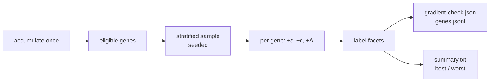

## Summary

`gradient-check` reported one sign-agreement percentage over four gene
classes, which says nothing about *where* a backprop proposal is trustworthy
in a heterogeneous evolved creature. This change stratifies the probe: every
sampled gene is labelled with the facets a NEAT creature actually varies over —
bias vs weight, output vs hidden, squash name, aggregate vs ordinary,
longest-path depth, fan-in / fan-out, activation health from the accumulate
trace, and proposal-magnitude decade — and sign agreement, gradient error and
applied-proposal improvement are aggregated across every one of them.

Gradient error is now the proposal judged against the finite difference in the
FD's own units: a descent step is `Δ = −lr · step · g`, so inverting it recovers
the gradient the proposal implies (`proposalGrad`), giving `gradAbsError` and
`gradRelError`. Each gene also pays a third MSE pass with the proposal applied
on its own, so the artefact records whether the move really lowered slice MSE
(`improved`) beside the first-order prediction it is compared against. Only a
gene whose FD cleared the floor carries a gradient error, so an unmeasurable
gene never inflates a distribution.

`gradient-check.json` gains `schemaVersion` (2), `neatCoreBaseline`, the `seed`,
a creature fingerprint, `byFacet` and non-overlapping `bestClasses` /
`worstClasses`; the run also writes a concise `summary.txt` for unattended
readers. `scripts/run-gradient-diagnostics.sh` is the documented GRQ
integration-testing command, with every target an env var so no stock-market
logic lands in this public library. Closes #107.

## Evidence

Backend/CLI change — no web interface to screenshot. Evidence is the artefact
the command produces and the tests below.

Run against a five-neuron mixed-squash fixture (TANH, IDENTITY, dead ReLU,
LOGISTIC, MAXIMUM output) over 64 records:

```text
gradient-check v0.1.29 schema=2 neat-core=0.10.0 seed=1 records=64 creature=5n/10s
sampled=12 scored=12 signAgree=100.0% improved=100.0% gradRelErrorP50=0.7119 gradRelErrorP90=0.9969
best : aggregate=aggregate signAgree=100.0% improved=100.0% gradRelErrorP50=0.5092 n=4
best : class=outputWeight signAgree=100.0% improved=100.0% gradRelErrorP50=0.5092 n=3
worst: squash=LOGISTIC signAgree=100.0% improved=100.0% gradRelErrorP50=0.9969 n=3
worst: squash=IDENTITY signAgree=100.0% improved=100.0% gradRelErrorP50=0.8689 n=2
```

One gene row from `genes.jsonl`:

```json
{
  "class": "hiddenBias", "index": 0, "id": "h1", "current": 0.1,
  "proposalDelta": 0.0037914325691138645, "fdGrad": -0.3477585690159213,
  "signAgree": true, "magnitudeRatio": 0.010902484962032045,
  "attributes": { "squash": "TANH", "aggregate": false, "depth": 1,
                  "fanIn": 2, "fanOut": 2, "activity": "active" },
  "proposalGrad": -0.37914325691138645, "gradAbsError": 0.03138468789546517,
  "gradRelError": 0.08277791395034731,
  "predictedDeltaMse": -0.0013185031647553957,
  "actualDeltaMse": -0.001320205693786658, "improved": true
}
```



`./quality.sh` stops at its codespell preflight — codespell is not installed in
this container and there is no `pip` to install it, so the stage cannot run
here; CI runs it on the PR. Every stage after it was run individually and
passed: `cargo deny check` (advisories/bans/licenses/sources ok),
`cargo fmt --all -- --check`, `cargo clippy --workspace --all-targets
--all-features -- -D warnings`, `cargo test --workspace --all-features`
(248 passed, 0 failed) and `RUSTDOCFLAGS="-D warnings" cargo doc`. Every stage
before it passed inside the gate run (shellcheck, workflow gates, branch
protection).

<!-- vibe-quality-gate-skipped reason="codespell is not installed in this container and no pip is available; every other gate stage was run individually and passed" -->

## Acceptance Criteria

<!-- vibe-spec-review inputs="diff+issue-body" -->

- **met** — Can run against a real production-size creature/corpus with bounded sample/time — evidence: `scripts/run-gradient-diagnostics.sh`, `backpropagation/tests/gene_diagnostics.rs::the_sample_caps_bound_the_run` — reviewer: met
- **met** — Deterministic under seed — evidence: `backpropagation/tests/gene_diagnostics.rs::the_same_seed_reproduces_the_artefact_byte_for_byte` — reviewer: met
- **partial** — Reports sign-agreement and error distributions by the categories above — evidence: `backpropagation/src/gene_facets.rs::aggregate_facets`, `backpropagation/tests/gene_diagnostics.rs::every_gene_carries_its_class_and_squash_facets` — reviewer: partial — reason: the reviewer saw the absolute gradient error only per gene and the relative distribution polluted by unscored genes; both were fixed after that review (`gradAbsErrorP50` is now aggregated, and `grad_rel_error` is `None` for a gene the FD could not score)
- **partial** — Identifies the worst and best-performing gene classes — evidence: `backpropagation/src/gene_facets.rs::rank_facets`, `backpropagation/tests/gene_diagnostics.rs::best_and_worst_classes_are_ranked_with_evidence` — reviewer: partial — reason: the ranking pools all ten facets rather than ranking within each, so a `class` bucket is not guaranteed a slot; `byClass` still reports all four gene classes unconditionally, and the reviewer's other finding (an empty worst list mis-reported as "nothing rankable") was fixed and is covered by `a_ranking_that_fits_entirely_in_best_does_not_claim_nothing_was_rankable`
- **met** — Artifact can be compared between NEAT-AI-core / Backpropagation versions — evidence: `backpropagation/src/gradient_check.rs` (`GRADIENT_CHECK_SCHEMA`, `neat_core_baseline`, `CreatureFingerprint`), `gradient_check::tests::the_neat_core_baseline_is_read_from_the_committed_file` — reviewer: met
- **met** — Documented command for the GRQ integration-testing workflow without private stock-market logic — evidence: `scripts/run-gradient-diagnostics.sh`, `README.md` "Gradient diagnostics by gene class and squash" — reviewer: met
- **unrequested** — Applied-proposal ground truth: a third MSE pass per gene yielding `improved` / `predictedDeltaMse` / `actualDeltaMse` — reviewer: unrequested — reason: the issue's Why asks to "measure where it is actually predictive", which sign agreement alone cannot answer; it costs one extra MSE pass per gene and the cost formula is documented
- **unrequested** — `gradient-check` now refuses a synapse whose `toUUID` names no neuron, and a non-positive `lr × step` — reviewer: unrequested — reason: fail-loud rather than probing a silently shortened sample or reporting a substituted scale as a measurement; the layout build already refuses the first case, so it is defence in depth
- **unrequested** — `summary.txt` as a third artefact and the changed CLI stderr block — reviewer: unrequested — reason: the issue asks for "a concise summary suitable for unattended runs"; a file makes it readable after the run, and the same text is printed
- **unrequested** — Crate version bump 0.1.28 → 0.1.29 — reviewer: unrequested — reason: repository convention (issue #95) — a build-affecting change must bump the version or remotes keep a stale library

## Standards Review

<!-- vibe-standards-review inputs="diff+CODING-STANDARDS.md" -->

- **violation** — US spelling "artifact" in new prose, doc comments and a test name — evidence: `backpropagation/src/gradient_check.rs:15` — reason: fixed — every new occurrence is now "artefact" (pre-existing ones elsewhere in `README.md` / `CHANGELOG.md` were left alone as out of scope)
- **violation** — Silent fallback: a non-positive `lr × step` was replaced by `1.0` and the invented gradient written out as measured — evidence: `backpropagation/src/gradient_check.rs:341` — reason: fixed — the run is refused with the cause named, covered by `an_unmeasurable_proposal_scale_is_refused_rather_than_substituted`
- **violation** — DRY: `percentage` duplicated and the "collect finite, sort" idiom written three times — evidence: `backpropagation/src/gradient_check.rs:442` — reason: fixed — both live in `gene_facets` as `pub(crate)` helpers and are reused
- **violation** — Vacuous assertions (a one-sided `abs_error` check; an `improved_pct` range true by construction) — evidence: `backpropagation/tests/gene_diagnostics.rs:196` — reason: fixed — both replaced with equality against the recomputed value
- **violation** — New CLI flags had no parse/default test, against repo convention — evidence: `backpropagation/src/main.rs:389` — reason: fixed — `gradient_check_ranking_defaults_are_conservative`
- **violation** — Untested edge cases: one-sided (ReLU) saturation, the unrankable-sample summary branch, the dangling-target refusal — evidence: `backpropagation/src/gene_facets.rs:254` — reason: fixed — `a_dead_relu_sits_on_its_one_sided_floor`, `a_sample_too_thin_to_rank_says_so_rather_than_inventing_a_winner`, `a_dangling_synapse_target_fails_loudly`
- **violation** — Docs disagreed with the code: the `nonFinite` magnitude bucket was undocumented, and the `lowActivity` / saturation wording did not match the implementation — evidence: `README.md:496` — reason: fixed — the bucket table and the activity list now state the exact rules, including the one-sided `1e-3` case and the two-or-more-records spread guard
- **violation** — `min_scored.max(1)` silently rewrites a caller's `0` without saying so — evidence: `backpropagation/src/gene_facets.rs:487` — reason: fixed in the rustdoc — a bucket with no scored gene can never be ranked, so `0` reading as `1` is the only sane behaviour and is now documented
- **violation** — `byClass` duplicates the `class` facet buckets in `byFacet` — evidence: `backpropagation/src/gradient_check.rs:742` — reason: stands — `byClass` is the schema v1 surface with its own magnitude-ratio percentiles; removing it would break existing readers of the artefact
- **clean** — shellcheck-clean and bash 3.2-compatible script with `set -euo pipefail` and loud non-zero exits; no hidden files, credentials or injection surface staged; `#![warn(missing_docs)]` satisfied on every new public item; rustfmt and clippy clean; tests call real functions on real fixtures with no source-text grepping and no wall-clock thresholds; README, CHANGELOG and both new CLI flags documented in the same change; `Cargo.toml` / `Cargo.lock` bumped together

## Test Plan

Added — `backpropagation/tests/gene_diagnostics.rs` (11 tests):

- `every_gene_carries_its_class_and_squash_facets` — every requested facet is
  reported and each accounts for the whole sample
- `gradient_error_compares_the_proposal_against_the_finite_difference` — the
  implied gradient, absolute and relative error, and that an unscored gene
  carries none
- `applied_proposals_are_measured_not_predicted` — `improved` follows the
  measured MSE change; `improvedPct` is `improved / sampled`
- `the_same_seed_reproduces_the_artefact_byte_for_byte`
- `the_sample_caps_bound_the_run`
- `best_and_worst_classes_are_ranked_with_evidence` — floor honoured, limit
  honoured, no bucket in both lists
- `a_ranking_that_fits_entirely_in_best_does_not_claim_nothing_was_rankable`
- `a_sample_too_thin_to_rank_says_so_rather_than_inventing_a_winner`
- `an_unmeasurable_proposal_scale_is_refused_rather_than_substituted`
- `a_dangling_synapse_target_fails_loudly`
- `the_run_leaves_a_concise_summary_for_an_unattended_reader`

Added — `backpropagation/src/gene_facets.rs` unit tests (12): longest-path
depth, degrees, aggregate labelling, the four activity buckets including
two-sided TANH saturation and a dead ReLU on its one-sided floor, the
single-record case, bucket boundaries, facet aggregation, and ranking
(evidence floor, single-bucket skip, no best/worst overlap).

Added — `gradient_check::tests::the_neat_core_baseline_is_read_from_the_committed_file`
and `main::tests::gradient_check_ranking_defaults_are_conservative`.

Unchanged and still passing: the existing `gradient_check`, `forward_only_guard`,
`observation_width` and `trained_creature_validation` suites (248 tests in
total, 0 failures).
