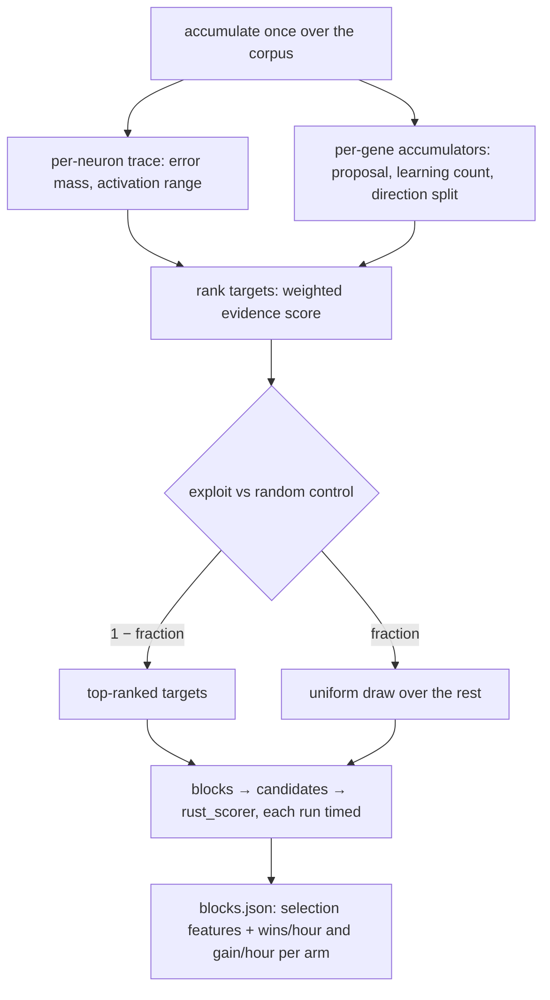

## Summary

`blocks` spent one scorer run per focus target regardless of whether the
accumulation pass left any usable signal there. This adds evidence-driven
target selection: a strategy interface with the uniform random draw retained as
the control arm, a ranking built from the **same single accumulation pass**, a
configurable exploitation vs random-control ratio, per-candidate selection
metadata, and a per-arm wins/hour and score gain/hour comparison. Closes #108.

New `backpropagation/src/targets.rs`:

- `rank_targets` scores each eligible focus neuron on accumulated absolute
  error mass (0.35), proposal magnitude relative to the parameter it moves and
  gated by the absolute move (0.30), activity — records that produced learning,
  and activation range (0.15), per-record direction consistency (0.15) and
  fan-in / fan-out (0.05). Longest-path depth and the trace record count are
  recorded as features but deliberately **not** scored; finite-difference sign
  confidence needs the `gradient-check` probes one accumulation pass does not
  produce, so it is documented as absent rather than faked.
- `TargetSelector` is the strategy interface, with `EvidenceTargets` and
  `UniformRandomTargets`; `select_targets` splits each draw per
  `--random-control-fraction` and validates the plan rather than clamping it.
- `compare_arms` folds the timed scorer runs into `winsPerHour` /
  `scoreGainPerHour` per arm, `None` when an arm spent no scorer time.

Wired into `blocks`: `--target-selection <evidence|random>` (default
`evidence`) and `--random-control-fraction`; every focus candidate in
`blocks.json` carries `selection` (source, rank, score, features) and
`scorerSeconds`; a scored run writes `selectionComparison`.

Two boundaries are stated in the code, the README and the CHANGELOG rather than
left to be discovered: the in-run control arm draws from the targets
exploitation did not take, so `selectionComparison` compares against the
ranking's **tail** and the two-run benchmark script is the unbiased
measurement; and `sparse_ratio < 1.0` accumulates for its own random subset
alone, so the ranking can only rank that subset — `blocks` warns when the two
are combined.

## Evidence

Backend/CLI change with no web interface to screenshot. The evidence is the
measured arm comparison and the test suite.

`scripts/run-target-selection-benchmark.sh` over its generated corpus (1000
records, `y = x + 0.1` with a contradicting 2% minority) and a creature with one
live path beside eleven dormant branches, both arms on the same seed, step scale
and `rust_scorer` binary
(`../NEAT-AI-scorer/target/release/rust_scorer`, 12 targets, 4 blocks per
strategy):

| Arm | Candidates | Wins | Best `scoreDelta` | wins/hour | score gain/hour |
| --- | ---------- | ---- | ----------------- | --------- | --------------- |
| `evidence` | 5 | 5 | `+1.718111e-4` | 18000.0 | `+1.940170` |
| `random` | 4 | 4 | `+8.594748e-5` | 14400.0 | `+1.237644` |

The uniform arm never drew the live path — its best candidate is half the
evidence arm's — and wasted four of its eight blocks on dormant targets that
moved no gene. This is a synthetic smoke run, not a production win: the script
header says so, and `CREATURE=` / `DATA_DIR=` point it at the GRQ creature and
corpus to repeat the measurement there.

The in-run comparison from the same binary, `--random-control-fraction 0.5`:

```text
arm Evidence:      scored=3 wins=3 scorer_seconds=0.061 wins/h=176766.887 gain/h=2.162691e1
arm RandomControl: scored=2 wins=2 scorer_seconds=0.013 wins/h=535131.971 gain/h=4.599324e1
```



`./quality.sh` passes in full after the final edit (shellcheck, actionlint,
workflow validators, codespell, cargo-deny, `cargo fmt --check`, clippy with
warnings denied, 17 test binaries, rustdoc).

## Acceptance Criteria

<!-- vibe-spec-review inputs="diff+issue-body" -->

- **met** — New target-selection strategy interface; existing random strategy
  retained — evidence: `backpropagation/src/targets.rs` `TargetSelector` /
  `EvidenceTargets` / `UniformRandomTargets`, test
  `backpropagation/tests/target_selection.rs::the_random_strategy_draws_every_target_uniformly`
  — reviewer: partial — reason: the reviewer read the doc claim that uniform
  random was the *prior* behaviour and rightly called it false (the prior
  behaviour was a deterministic proposal-magnitude ranking, which survives as
  the proposal term). The claim is corrected in `targets.rs` and the README;
  the interface and the retained uniform strategy the criterion asks for are
  both present.
- **met** — Ranked target/neighbourhood candidates from one accumulation pass —
  evidence: `backpropagation/src/blocks.rs::plan_blocks` ranks once from the
  single `accumulate_creature_learning_report` result passed by
  `blockwise.rs`; test
  `backpropagation/tests/target_selection.rs::planned_blocks_carry_their_selection_evidence`
  — reviewer: met
- **met** — Configurable exploitation vs random-control ratio — evidence:
  `--random-control-fraction` in `backpropagation/src/main.rs`,
  `TargetPlan::control_share`, test
  `backpropagation/tests/target_selection.rs::the_random_control_fraction_splits_the_draw`
  — reviewer: partial — reason: the reviewer flagged that the "at least one
  control target" rule buys a larger share than asked for when the fraction is
  below `1 / blocks_per_strategy`. That rounding is deliberate (a requested
  control arm must not vanish), and it is now documented on `control_share` and
  in the README instead of being silent.
- **met** — Candidate metadata records why a target was selected and its rank
  features — evidence: `BlockCandidateRecord::selection` in
  `backpropagation/src/blockwise.rs`, round-tripped through `blocks.json` by
  `backpropagation/tests/target_selection.rs::a_scored_run_compares_the_evidence_and_control_arms`
  — reviewer: met
- **partial** — Compare scorer wins/hour and score gain/hour against uniform
  random sparse selection — evidence: `targets::compare_arms`,
  `selectionComparison` in `blocks.json`,
  `scripts/run-target-selection-benchmark.sh`, and the measured table above —
  reviewer: partial — reason: the comparison is measured only on the synthetic
  corpus in this PR; the production creature and corpus are a separate run, and
  the in-run arm comparison is against the ranking's tail rather than the full
  pool (documented, with the two-run script as the unbiased measurement).
- **met** — No private GRQ/stock-specific feature logic — evidence: fixed public
  weight constants in `backpropagation/src/targets.rs`; the only GRQ mention is
  an env-var example comment in `scripts/run-target-selection-benchmark.sh`,
  matching `scripts/run-blockwise-benchmark.sh` — reviewer: met
- **unrequested** — `--target-selection` defaults to `evidence` rather than to
  the retained random strategy — reviewer: unrequested — reason: kept, because
  the behaviour being replaced was a proposal-magnitude ranking, so defaulting
  to the uniform draw would be the larger behaviour change; the ranking
  generalises the old one and the control arm is one flag away.
- **unrequested** — the `subgraph` strategy's random start now comes from the
  same target selection instead of a uniform draw over the focus pool —
  reviewer: unrequested — reason: all three focus strategies share one
  selection loop; a `subgraph` walk that ignored the ranking would be a second,
  undocumented selection policy. `--target-selection random` restores the
  uniform start.
- **unrequested** — `ArmThroughput::best_score_delta` beside the two rates —
  reviewer: unrequested — reason: a rate with no best-single-delta cannot say
  whether an arm found one large win or many marginal ones; it is one field on
  a struct the criterion already requires.

## Standards Review

<!-- vibe-standards-review inputs="diff+CODING-STANDARDS.md" -->

- **violation** — `control_share` silently clamped an out-of-range control
  fraction, contradicting its own sibling doc on `validate()` — evidence:
  `backpropagation/src/targets.rs:341` — reason: fixed here.
  `select_targets` now calls `validate()` and returns `Result`, so the primary
  path refuses loudly; the clamp is documented as defence in depth for a
  hand-built plan.
- **violation** — `--random-control-fraction` was silently discarded under
  `--target-selection random` — evidence: `backpropagation/src/main.rs:363` —
  reason: fixed here. `TargetPlan::validate` refuses it, as `train` refuses
  scorer settings on an `--acceptance mse` run; the README flag table says so,
  and `backpropagation/tests/target_selection.rs::a_control_fraction_on_a_random_run_stops_the_run`
  covers the end-to-end refusal.
- **violation** — `.expect_err("fraction {fraction} must be refused")` never
  interpolates the placeholder — evidence:
  `backpropagation/tests/target_selection.rs:288` — reason: fixed here with a
  `let Err(err) = … else { panic!(…) }`, which does interpolate.
- **violation** — the `Neuron` / `Neighbourhood` / `Subgraph` arms triplicated
  the select → build → attach → push sequence — evidence:
  `backpropagation/src/blocks.rs:502` — reason: fixed here; the three share one
  loop, so a focus block cannot lose its selection metadata by a missed edit.
- **violation** — the end-to-end test asserts on measured wall clock
  (`scorer_seconds > 0.0`) — evidence:
  `backpropagation/tests/target_selection.rs:432` — reason: stands. It asserts a
  measurement *exists* rather than a performance budget — a process spawn cannot
  take zero nanoseconds — and the rate arithmetic itself is covered
  deterministically by `arm_throughput_reports_wins_and_gain_per_hour`.
- **violation** — `plan.validate()` reached only after the accumulation pass —
  evidence: `backpropagation/src/blockwise.rs:291` — reason: no change needed;
  `run_blocks` already validates the plan as its first statement
  (`blockwise.rs:237`), so an impossible plan is refused before any corpus read.
- **clean** — Australian English throughout the new Rust, bash and Markdown;
  loud failures (`FAIL:` + exit 2 in the script, `Result` errors in the
  library, `None` rates rather than a division by zero); shellcheck-clean bash
  guarded under `set -euo pipefail` with `${limit[@]+"${limit[@]}"}`; tests call
  real functions and assert on returned values and the round-tripped
  `blocks.json`; `#[serde(default)]` on every new field so old artefacts still
  parse; no hidden paths staged; crate version bumped 0.1.29 → 0.1.30 with the
  lockfile in step.

## Test Plan

New `backpropagation/tests/target_selection.rs` (8 tests):

- `evidence_ranks_the_loud_neuron_first_and_the_unobserved_one_last`
- `the_random_control_fraction_splits_the_draw`
- `the_random_strategy_draws_every_target_uniformly`
- `an_impossible_control_fraction_is_refused`
- `a_control_fraction_on_a_random_run_stops_the_run`
- `planned_blocks_carry_their_selection_evidence`
- `arm_throughput_reports_wins_and_gain_per_hour`
- `a_scored_run_compares_the_evidence_and_control_arms`

New unit tests in `backpropagation/src/targets.rs` (9): weights sum to one,
ranking order, non-finite accumulators cannot rank first, control-share
rounding, over-large draws, empty pool, plan validation, the refusal on the
random strategy, the absolute-move gate, and the learning-record activity
signal.

Updated: `backpropagation/src/blocks.rs` planning tests for the new
`plan_blocks` signature and the invalid-`targets` plan; `backpropagation/src/main.rs`
CLI tests for the two new flags.

Full suite: 17 test binaries, 0 failures. `./quality.sh` green.
