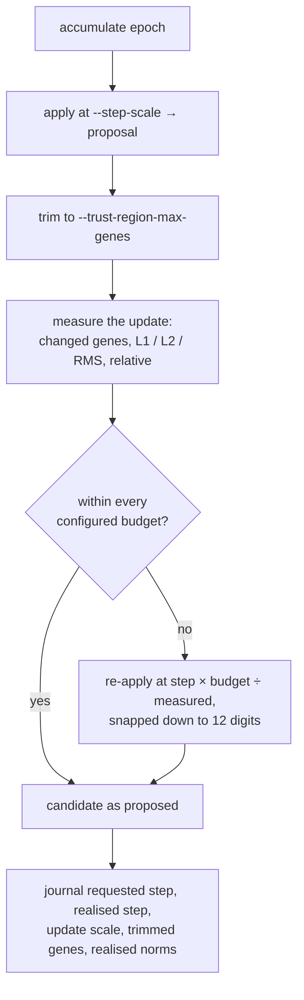

## Summary

`--step-scale` is a **per-gene** factor, so the size of the move the *whole
creature* makes grows with the number and magnitude of the genes that move. The
`0.01` default was justified against a ~16.6k-parameter GRQ network that has
since grown to thousands of neurons and tens of thousands of synapses, so a
fixed step scale no longer describes a stable-sized optimisation step.

`train` now measures the update it is about to apply and, when a budget is
configured, rescales that whole update to fit a trust region before the
candidate is created. Every budget is off by default, which reproduces the
historical fixed-step apply byte for byte. Closes #109.

- New `backpropagation/src/trust_region.rs`: `measure_update` (changed genes,
  L1 / L2 / RMS, relative L2 and relative RMS, reported whole and split by
  bias / weight and hidden / output), `TrustRegion` (`l2`, `rms`,
  `relativeRms`, `biasL2`, `weightL2`, `maxChangedGenes`) and
  `apply_within_trust_region`, which trims to the gene budget, measures,
  rescales and re-applies.
- `train` gains `--trust-region-l2`, `--trust-region-rms`,
  `--trust-region-relative-rms`, `--trust-region-bias-l2`,
  `--trust-region-weight-l2` and `--trust-region-max-genes`; the C ABI gains
  the same budget as `trustRegion`.
- The run header records the configured `trustRegion`; every epoch and
  candidate line records the requested `stepScale`, the `realisedStepScale`
  applied, the `updateScale` the budget imposed, `trimmedGenes` and the
  realised `update` norms. `blocks.json` records the same norms per block
  candidate, so a realised move size sits beside the `scoreDelta` it produced.
- README no longer justifies the defaults by the historical network size, and
  `scripts/run-trust-region-experiment.sh` sweeps budgets against an
  unbudgeted control arm.

## Evidence

Backend/CLI change — no web interface to screenshot. Evidence is the journal
the trainer wrote and the test suite.

**Budget sweep, dense 16-neuron / 81-synapse creature, 6 epochs, `--step-scale
0.01`, `--learning-rate 0.5`** (`train --acceptance mse`, the realised norms
read back out of `journal.jsonl`):

| `--trust-region-l2` | accepted epochs | mean update L2 | max update L2 | realised step (epoch 1) | best MSE |
| ------------------- | --------------- | -------------- | ------------- | ----------------------- | -------- |
| _none (parity)_ | 6 | 5.8088e-02 | 7.5703e-02 | 1.0000e-02 | 0.103086 |
| `0.001` | 6 | 1.0000e-03 | 1.0000e-03 | 1.3210e-04 | 0.136532 |
| `0.01` | 6 | 1.0000e-02 | 1.0000e-02 | 1.3210e-03 | 0.132896 |
| `0.1` (slack) | 6 | 5.8088e-02 | 7.5703e-02 | 1.0000e-02 | 0.103086 |

This is the issue's premise, measured: at a fixed step scale the realised
whole-creature move drifts epoch to epoch (5.8e-02 mean, 7.6e-02 max), while a
budget pins it exactly. A budget the update already fits is inert — the `0.1`
arm reproduces the parity arm's numbers to the last digit.

`scripts/run-trust-region-experiment.sh` was exercised end to end against a
synthetic stand-in scorer (a shell stub, since `NEAT-AI-scorer` is not present
in this environment) and printed each arm's accepted epochs, scorer gain,
realised update norm, wall clock and wins/hour. The stub's scores are synthetic,
so only the realised-norm columns carry meaning there; the production sweep is
recorded as `partial` below.

**Review findings fixed before this summary** (both reviewers ran on the diff;
each finding was reproduced, fixed and covered by a test):

- The changed-gene trim ran *after* the rescale, so keeping only the largest
  moves pushed RMS back over an RMS budget the rescale had just satisfied
  (measured 3× over budget). The trim now runs first —
  `trust_region::tests::a_gene_budget_and_a_norm_budget_hold_together`, which
  fails against the old ordering.
- A budget clips every step above it to the same update, so the backtracking
  line search and the step-scale ladder produced near-identical candidates and
  paid for each of them. The realised step is now snapped down to 12
  significant digits, clipped ladder rungs are scored once
  (`budget_clipped_rungs_are_scored_once`), and the line search halves the step
  it *realised* (`a_backtrack_halves_the_step_that_was_actually_applied`).
- A rescale that underflowed the step to zero would have inverted into a **full**
  step, since `effective_step_scale` reads zero as "no step given". It is now
  refused (`a_budget_that_underflows_the_step_is_refused`).
- A `relativeRms` budget whose norm was unmeasurable read as satisfied; it now
  fails loudly (`a_relative_budget_with_nothing_to_be_relative_to_is_refused`).

## Acceptance Criteria

<!-- vibe-spec-review inputs="diff+issue-body" -->

- **met** — Compute aggregate delta statistics before apply: changed genes, L1/L2/RMS delta, relative delta where meaningful — evidence: `backpropagation/src/trust_region.rs` `UpdateNorms` / `measure_update`, `trust_region::tests::norms_measure_the_genes_that_actually_moved` — reviewer: met
- **met** — Optional configurable global update budget rescales proposals before candidate creation — evidence: `trust_region::apply_within_trust_region`, `tests/trust_region_budget.rs::an_l2_budget_rescales_the_whole_update` — reviewer: met — reason: the reviewer also found the rescale broken when combined with the gene budget and with repeated line-search attempts; both were fixed in this diff and are covered by `a_gene_budget_and_a_norm_budget_hold_together` and `a_backtrack_halves_the_step_that_was_actually_applied`
- **met** — Separate reporting for bias/weight and hidden/output classes — evidence: `UpdateStats { total, biases, weights, hidden, output }`, `tests/trust_region_budget.rs::the_journal_splits_the_update_by_gene_class` — reviewer: met
- **met** — Journal the requested step and realised update norm — evidence: `TrainEpochRecord` / `TrainCandidateRecord` (`stepScale`, `realisedStepScale`, `updateScale`, `trimmedGenes`, `update`), `tests/step_scale_ladder.rs::every_rung_journals_its_realised_update_norm`, `tests/blockwise_candidates.rs::every_block_records_its_realised_update_norm` — reviewer: met
- **met** — Existing fixed-step parity mode remains available — evidence: `tests/trust_region_budget.rs::an_unbudgeted_run_is_the_fixed_step_apply` (identical `best.json`), `trust_region::tests::an_unbudgeted_apply_is_the_plain_apply` — reviewer: met
- **partial** — Sweep several update budgets on a current production-size creature and compare scorer wins/hour — evidence: `scripts/run-trust-region-experiment.sh` and the budget-sweep table above — reviewer: partial — reason: the sweep tooling ships and was run, but this environment has neither the production GRQ creature nor a built `NEAT-AI-scorer`, so the wins/hour comparison on a production-size creature has not been performed; the script takes `CREATURE=` / `DATA_DIR=` to run it where those exist
- **met** — Update README guidance so defaults are not justified by the historical ~16.6k-parameter network size — evidence: `README.md` "Train step size" caveat and the new "Trust-region update budget" section — reviewer: met
- **unrequested** — `TrustRegion::validate` refuses a zero / negative / non-finite budget (and `maxChangedGenes: 0`) before the corpus is read, and refuses to "bound" a non-finite or unmeasurable norm — reviewer: unrequested — reason: kept; the repo's fail-loud standard forbids a configured budget that silently does nothing, and the ladder's own rung validation sets the precedent
- **unrequested** — `measure_update` returns `Result` and fails on a shape mismatch — reviewer: unrequested — reason: kept; a truncating `zip` would under-report the very number a budget is enforced against, which is the silent-failure class the standards forbid
- **unrequested** — journal lines carry the full nested `update` object (five classes) rather than a single norm — reviewer: unrequested — reason: kept; the issue asks for both the aggregate statistics and per-class reporting, and the journal is the only surface an unattended production run can be audited from
- **unrequested** — `run_train`'s two search branches were refactored onto a shared `EpochOutcome` struct — reviewer: unrequested — reason: kept; the ladder and line-search branches now return four more fields each, and a seven-element tuple was the alternative
- **unrequested** — `TrustRegionApply::proposed` / `scale` / `trimmed_genes` were computed but unread — reviewer: unrequested — reason: fixed rather than kept; `scale` and `trimmed_genes` are now journalled as `updateScale` / `trimmedGenes`, and `proposed` (the pre-rescale statistics the first criterion asks for) is asserted in `a_budget_shrinks_the_step_and_the_realised_norms`

## Standards Review

<!-- vibe-standards-review inputs="diff+CODING-STANDARDS.md" -->

- **violation** — `Cargo.lock` left out of sync with the crate version bump — evidence: `backpropagation/Cargo.toml:3` vs `Cargo.lock` — reason: fixed here; the lockfile is committed beside the `0.1.30 → 0.1.31` bump
- **violation** — a `relativeRms` budget silently stopped binding when the norm was unmeasurable — evidence: `backpropagation/src/trust_region.rs:275` (`unwrap_or(0.0)`) — reason: fixed here; the unmeasurable case now returns an error, covered by `a_relative_budget_with_nothing_to_be_relative_to_is_refused`
- **violation** — the CLI-flag tests rebuilt the flag→budget mapping by hand, so a swapped pair would leave them green — evidence: `backpropagation/src/main.rs:1214`, `:1253` — reason: fixed here; both tests now call the production `train_trust_region` helper the CLI itself uses
- **violation** — dead public API on `TrustRegionApply` (`scale`, `trimmed_genes`, `proposed` unread) — evidence: `backpropagation/src/trust_region.rs:302-312` — reason: fixed here; `scale` and `trimmed_genes` are journalled and `proposed` is asserted in a unit test
- **violation** — `CONTRIBUTING.md`'s python3 dependency list did not mention the new script — evidence: `CONTRIBUTING.md:34-39` — reason: fixed here
- **violation** — no PR summary for the issue — evidence: `docs/archive/pr-summaries/pr-summary-109.md` absent — reason: fixed here; this file
- **clean** — Australian English throughout code, comments, README, CHANGELOG and the C header (`realised`, `journalled`, `serialisation`); fail-loud error paths; `deny_unknown_fields` on the ABI budget with validation before any work; tests call real functions and parse the real journal artefacts rather than grepping source; no hidden paths, secrets or credential-shaped files staged; `cargo fmt`, `clippy -D warnings`, `shellcheck` and `markdownlint-cli2` clean

## Test Plan

New:

- `backpropagation/src/trust_region.rs` unit tests (17): norm measurement,
  class partitioning, sub-plank moves, shape mismatch, budget validation, the
  tightest-budget rescale, non-finite refusal, gene-budget trimming and its
  tie determinism, parity with `apply_learnings_with`, joint gene + norm
  budgets, unmeasurable `relativeRms`, step underflow, canonical step snapping
  and identical clipped candidates.
- `backpropagation/tests/trust_region_budget.rs` (7): end-to-end on the
  journal — fixed-step parity, L2 rescale, class budgets, class split against
  the movement counts, the changed-gene cap, refusal of an unusable budget, and
  the header recording the budget.
- `backpropagation/tests/step_scale_ladder.rs` (2): every rung journals its
  realised update norm; budget-clipped rungs are scored once.
- `backpropagation/tests/blockwise_candidates.rs` (1): every block candidate
  records its realised update norm.
- `backpropagation/tests/ffi_abi.rs` (2): the budget is forwarded over the ABI
  and binds; an unusable budget fails the call.
- `backpropagation/src/main.rs` (2): budgets are off by default; the flags map
  onto the library budget through the production helper.
- `backpropagation/src/train.rs` (1): the line search halves the step that was
  actually applied.

Existing `TrainRequest` call sites gained `trust_region: TrustRegion::default()`
— the parity mode — so no existing test changed behaviour. Full gate:
`./quality.sh` passes (fmt, clippy `-D warnings`, cargo-deny, codespell, the
workflow gates and 298 tests).
