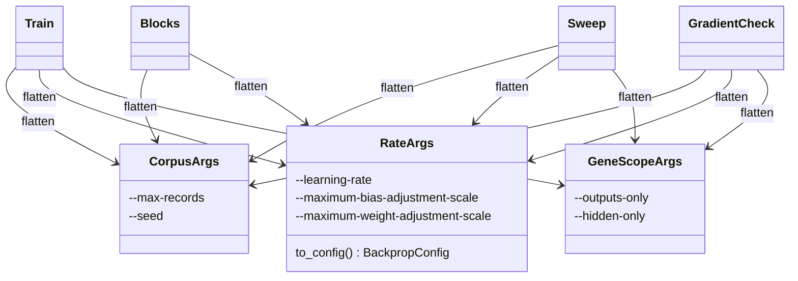

## Summary

`backpropagation/src/main.rs` redeclared the same CLI argument groups in four
`Commands` variants — `--max-records` / `--seed` in `train`, `sweep`, `blocks`
and `gradient-check`; `--learning-rate` plus the two adjustment-scale clamps in
the same four; `--outputs-only` / `--hidden-only` in `train`, `sweep` and
`gradient-check`. Each block repeated the same defaults and near-identical doc
comments hundreds of lines apart, so a new default or a reworded help string had
to be applied by hand four times.

Each group is now declared once as a `#[derive(clap::Args)]` struct and
flattened into every variant that carries it:

- `CorpusArgs` — `--max-records`, `--seed`
- `RateArgs` — `--learning-rate`, `--maximum-bias-adjustment-scale`,
  `--maximum-weight-adjustment-scale`
- `GeneScopeArgs` — `--outputs-only`, `--hidden-only`

`RateArgs::to_config()` also replaces the identical fixed-strategy
`BackpropConfig` literal that `sweep`, `blocks` and `gradient-check` each built
by hand, and `train_backprop_config` now takes the group rather than five loose
scalars. Mechanical refactor: **flag names and defaults are unchanged**.

`--output-dir` is deliberately left inline in all four variants. The issue lists
it as a smaller clump, but it is a single field, and a clump is a *group* of
fields that travel together — wrapping one field in its own `Args` struct buys
no single point of change and only adds a level of indirection. The four
declarations already share their type and default
(`default_value_os_t = default_output_dir()`), so the only thing left to share
is the doc comment — and that is the part which legitimately differs, because
each names its own artefacts (`best.json` / `journal.jsonl` for `train`,
`sweep.json` / `candidates/` for `sweep`, `blocks.json` for `blocks`,
`gradient-check.json` / `genes.jsonl` for `gradient-check`). Flattening it would
trade four accurate help strings for one vague one, which is the reverse of the
win the three shared groups deliver.

Closes #137.

## Evidence

Backend/CLI change — there is no web interface, so the rendered evidence below
is the CLI surface itself, captured with the headless browser from the
before/after `--help` capture. The test suite is the second half of the
evidence.


**The flag/default surface is byte-identical before and after.** Every
subcommand's `--help` was captured from the pre-change binary and again after
the refactor, then reduced to `<subcommand> <flag>` and `<subcommand>
[default: …]` lines and diffed:

```console
$ diff <(surface help-before.txt) <(surface help-after.txt) \
    && echo "CLI SURFACE IDENTICAL (flags + defaults)"
CLI SURFACE IDENTICAL (flags + defaults)
```

The only `--help` change is prose: a shared field carries one description, so
wording that used to differ per subcommand was widened to cover all of them —
e.g. `--maximum-bias-adjustment-scale` reads "per apply / propose" instead of
"per apply" (`train`) and "per propose" (`gradient-check`). The shared
`--max-records` text keeps `train`'s rate-sampling paragraph and now states
explicitly that the other subcommands read each file's leading records, which
is what `compute_mse`'s `RecordSelection::Prefix` does. Because that shared
description spans two paragraphs, clap renders `sweep`, `blocks` and
`gradient-check` help in the same expanded layout `train` already used.



**Quality gate.** `./quality.sh` was run in the foreground and stops at the
`check-neat-core-version.sh` stage, which fails for a pre-existing reason that
has nothing to do with this diff:

```console
FAIL: breaking neat-core bump: 0.11.1 exceeds handled baseline 0.10.0 (pre-1.0 minor increased)
```

That stage compares only `neat-core.expected-version` (`0.10.0`) against the
sibling `NEAT-AI-core` manifest, and never reads the PR diff. Both inputs are
byte-identical on `origin/Develop` and on this branch — `git diff --name-only
origin/Develop HEAD` does not list `neat-core.expected-version` — so the stage
fails on the base branch too. Clearing it means handling the breaking
`neat-core` bump in its own deliberate PR, which is
[#141](https://github.com/stSoftwareAU/NEAT-AI-Backpropagation/issues/141), not
this one.

Every other stage was then run individually and **all passed**: bash syntax,
shellcheck (39 scripts), the auto-format / version-increment / CodeQL /
Gitleaks / Semgrep / Markdown-Lint workflow validators plus their own test
scripts, `actionlint` and its gate check, the build-affecting-version-bump and
crate-version-no-downgrade gates, the Renovate and dependency-review
validators, the live branch-protection policy check (all five rules OK),
codespell, `cargo deny check`, `cargo fmt --all -- --check`,
`cargo clippy --workspace --all-targets --all-features -- -D warnings
-D clippy::filter_next -D clippy::collapsible_if`,
`cargo test --workspace --all-features -- --test-threads=2` (every suite
green — 159 in the library, 21 in the CLI binary, plus the integration suites,
0 failures) and `RUSTDOCFLAGS="-D warnings" cargo doc --workspace --no-deps`.

The crate version is bumped `0.1.31` → `0.1.32` (`backpropagation/src/**` is a
build-affecting path, issue #95) and `Cargo.lock` re-synced to the sibling
`neat-core` checked out beside this worktree.

## Test Plan

Added to `backpropagation/src/main.rs` (`mod tests`) — each drives the real
clap parser and asserts on parsed values, and each failed to compile against
the pre-refactor enum:

- `the_corpus_group_parses_identically_in_every_subcommand` — `--max-records` /
  `--seed` defaults (`None`, `1`) and explicit values (`7`, `42`) across
  `train`, `sweep`, `blocks` and `gradient-check`.
- `the_rate_group_parses_identically_in_every_subcommand` — `--learning-rate`
  (`0.01`) and both adjustment clamps (`1.0`) default and parse the same way in
  the same four subcommands.
- `the_gene_scope_group_parses_identically_in_every_subcommand` —
  `--outputs-only` / `--hidden-only` default to `false` and set independently
  in `train`, `sweep` and `gradient-check`.
- `the_rate_group_builds_the_fixed_strategy_config` — `RateArgs::to_config()`
  carries every field onto `BackpropConfig`, keeps `initial_learning_rate` in
  step with `learning_rate`, and leaves the `Fixed` strategy and
  `normalise_gradients: false` untouched.

Modified (no test was removed or weakened — the assertions are unchanged, only
the field path through the new groups):

- `train_clamps_default_to_one_not_ten`, `train_learning_rate_defaults_to_fixed_schedule`
  and `record_sampling_is_random_unless_disabled` now read `rate.*` / `corpus.*`
  instead of the flattened-away variant fields.
- `train_config_carries_schedule_and_normalisation` builds a `RateArgs` and
  passes it to `train_backprop_config`, whose signature dropped the three loose
  rate scalars.
