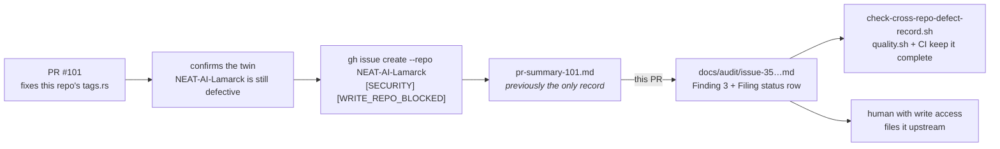

## Summary

The confirmed, test-asserted `uuid`-dedup defect in the sibling
`NEAT-AI-Lamarck` copy of `tags.rs` — found while PR #101 fixed this repo's own
copy — was recorded only in `docs/archive/pr-summaries/pr-summary-101.md`.
Nothing linked to it, and that summary can be pruned once its PR number ages
out, so the only record of "the Lamarck bug is confirmed, not just suspected"
was one prune away from being lost.

Folded that detail into `docs/audit/issue-35-neat-ai-core-duplication.md` beside
Finding 3, which until now rated the `tags.rs` duplication a purely *structural*
risk, and added a gate so such records cannot silently decay. Closes #140.

## Evidence

Backend/docs change — no web interface to screenshot. The evidence is the new
gate, run against the real audit doc and against fixtures.

What changed:

- **`docs/audit/issue-35-neat-ai-core-duplication.md`** — new
  `#### Confirmed cross-repo defect — Lamarck's copy is live and test-asserted (PR #101)`
  subsection under Finding 3, recording the defective site
  (`NEAT-AI-Lamarck/lamarck/src/tags.rs:300-302`, fed by `tags.rs:58` and
  `tags.rs:77-80`), the tests that pin the buggy behaviour in place
  (`lamarck/src/tags.rs:432`, `lamarck/candidates.rs:2712`), why it is a
  scoring-integrity defect rather than a maintenance hazard (NEAT-AI's
  `Fitness.calculate` deduplicates its evaluation queue by `uuid`, so an
  inherited `uuid` can win a score that was never earned), that the two files
  have diverged so it is not a copy-paste of this repo's patch, and that filing
  it upstream is still blocked pending a human with write access to
  `stSoftwareAU/NEAT-AI-Lamarck`. A `NEAT-AI-Lamarck` row was added to that
  document's Filing status table.
- **`docs/archive/pr-summaries/pr-summary-101.md`** — a pointer to the audit doc
  so the two records stay linked. The summary itself is untouched otherwise and
  is **not** deleted.
- **`scripts/check-cross-repo-defect-record.sh`** — new gate. Every "Confirmed
  cross-repo defect" section must stay complete enough to re-file the issue
  upstream from the audit doc alone: ≥2 `file:line` citations (the defect site
  *and* the test asserting it), wording saying how it was confirmed, the PR or
  PR summary it was folded in from, its upstream filing status, and a Filing
  status row for every sibling repo it names.
- **`scripts/test-check-cross-repo-defect-record.sh`**, **`quality.sh`**,
  **`.github/workflows/ci.yml`**, **`CONTRIBUTING.md`**, **`CHANGELOG.md`** —
  fixture-driven tests for the gate, and the gate wired into the local gate, CI
  and the contributor docs.

Where the record lives now:



Gate output against the committed audit doc:

```text
OK   issue-35-neat-ai-core-duplication.md: 1 confirmed cross-repo defect section(s) recorded
OK   … cites 5 source sites
OK   … says how the defect was confirmed
OK   … names the PR summary it was folded in from
OK   … records the upstream filing status
OK   'NEAT-AI-Lamarck' has a Filing status row
```

`./quality.sh < /dev/null` passes in full, including the new stage, `codespell`,
`markdownlint-cli2`, `actionlint`, `cargo deny check`, `cargo fmt --check`,
`cargo clippy -D warnings`, the workspace test suite and `cargo doc`.

## Test Plan

Added `scripts/test-check-cross-repo-defect-record.sh` — 11 cases, each writing
a fixture audit doc to a temp directory and running the real checker against it:

- `accepts a fully recorded confirmed cross-repo defect` — the happy path.
- `accepts a filed-upstream record with TypeScript citations` — a different
  heading level, `.ts` citations and a filed upstream issue, so the gate
  enforces the policy rather than one hand-written section.
- `reports a missing audit doc with exit 2` — the doc cannot be read.
- `rejects an audit doc with no confirmed-defect section` — the exact state this
  repo was in before this PR; it is the case that failed against the unmodified
  audit doc and passes after the fold.
- `rejects a record citing the defect but not the test pinning it`,
  `rejects a record that never says how the defect was confirmed`,
  `rejects a record with no source PR or PR summary`,
  `rejects a record with no upstream filing status`,
  `rejects a named sibling repo with no Filing status row`,
  `rejects an audit doc with no Filing status section` — one per rule, each
  asserting the failure names the rule that broke.
- `the committed audit doc records its confirmed cross-repo defect` — the real
  doc must satisfy every rule.

Order of work: the gate and its tests were written first and run red against the
unmodified audit doc (`no 'Confirmed cross-repo defect' section`, exit 1); the
doc fold turned that case green with the other ten already passing.
