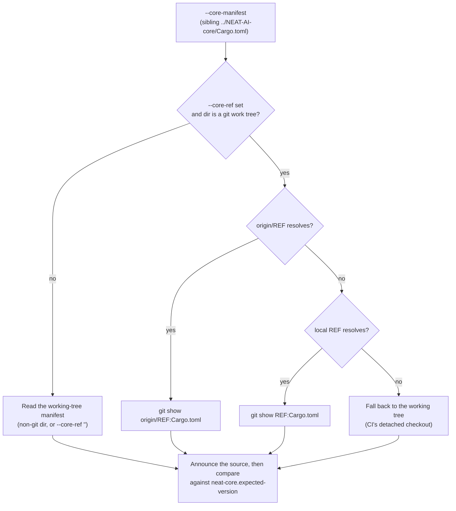

## Summary

The neat-core breaking-bump gate read the sibling `NEAT-AI-core` **working
tree**. That tree is a shared developer checkout that may sit on any unmerged
branch, so a local branch carrying `0.12.0` failed `./quality.sh` on every run
in this repo — while neat-core's `Develop` was `0.11.3`, comfortably inside the
recorded `0.11.2` baseline. CI clones neat-core at `Develop`, so CI was green
and only local runs broke.

`scripts/check-neat-core-version.sh` now resolves the version from the branch
that **governs** neat-core (`--core-ref`, default `Develop`; `origin/REF` wins
over a local `REF`), falling back to the working-tree manifest when no such ref
resolves — the shape of CI's shallow detached checkout — and announcing which
source it read either way. Divergence is never silent: because the unpinned
`path` dependency compiles the working tree rather than the branch, the gate
**warns** when the two versions differ, and warns again when it falls back to
the working tree because no such branch resolves.

The recorded baseline moves `0.11.2 -> 0.11.3` — neat-core's current `Develop`
— with that review written into `neat-core.expected-version` (the bump touches
no Rust source at all: `bump-deps.sh`, its bats tests, `SECURITY.md`, a PR
summary and the version line). It is deliberately **not** moved to `0.12.0`,
which exists only on an unmerged neat-core branch; acknowledging it would
pre-silence the gate for a breaking change that has not landed. Closes #141.

## Evidence

Backend/CLI only — no web interface to screenshot. The evidence is the gate
itself, before and after, against the live sibling checkout.

Before (sibling working tree parked on `milestone/604-…` at `0.12.0`):

```text
FAIL: breaking neat-core bump: 0.12.0 exceeds handled baseline 0.11.2 (pre-1.0 minor increased)
```

After — the gate passes, and says plainly that the local build still compiles
the parked `0.12.0`:

```text
INFO neat-core version read from ref 'origin/Develop' in /home/vibe/auto-issue-work/NEAT-AI-core
WARN the sibling working tree is at 0.12.0, not 0.11.3.
     The unpinned path dependency compiles the working tree, so a local
     build here does NOT match the version this gate just checked.
OK   neat-core 0.11.3 matches handled baseline 0.11.3 (patch-level drift allowed)
```

Full `./quality.sh` run: **All quality checks passed!** (exit 0), including the
stage that previously stopped the gate:

```text
Validating the neat-core breaking-bump gate...
Passed: 38  Failed: 0
Gating on unhandled breaking neat-core bump...
INFO neat-core version read from ref 'origin/Develop' in /home/vibe/auto-issue-work/NEAT-AI-core
WARN the sibling working tree is at 0.12.0, not 0.11.3.
OK   neat-core 0.11.3 matches handled baseline 0.11.3 (patch-level drift allowed)
```

How the version source is chosen:



## Reproduction

- **symptom** — `./quality.sh` stopped at `check-neat-core-version.sh` with
  `FAIL: breaking neat-core bump: 0.12.0 exceeds handled baseline …`, on every
  PR, independently of any change in this repo
- **status** — `verified` — the regression case
  (`parked feature branch does not fail the gate`) was observed failing against
  the unfixed script (`expected exit 0, got 1`, alongside 16 other reds) and
  passing after the fix; the live gate was also observed failing before the
  change and passing after it, against the same sibling checkout
- **regression test** —
  `scripts/test-check-neat-core-version.sh::parked feature branch does not fail the gate`

## Test Plan

- Added `scripts/test-check-neat-core-version.sh` — 38 cases against the real
  script, driving temporary git fixtures and asserting exit codes and output:
  - **Version comparison** (pinned with `--core-ref ''`): equal, patch drift,
    core behind baseline, pre-release suffix → pass; pre-1.0 minor bump,
    pre-1.0 major bump, post-1.0 major bump → fail; post-1.0 minor bump → pass
    (additive); missing baseline, missing manifest, empty baseline, malformed
    baseline, malformed core version, no `[workspace.package]` version, a
    `version` outside that table, and an unknown argument → usage error.
  - **Ref resolution** (the Issue #141 regression): a clone parked on an
    unmerged branch at `0.12.0` while `origin/Develop` is `0.11.3` → pass, and
    the output names the ref and the governing version; a genuine breaking bump
    pushed to `Develop` → still fails; a local `Develop` with no remote → used;
    a manifest nested below the repo root → resolved via its git-relative path;
    a detached checkout with no such branch → falls back to the working tree
    and says so; a non-git manifest directory → falls back to the working tree.
  - `--core-ref ''` still reads the parked working tree, so the previous
    behaviour remains reachable on purpose.
  - **Loud fallback and divergence** (added after review): the working-tree
    fallback warns rather than passing itself off as the ordinary path; a
    manifest present in the working tree but absent on the governing branch
    fails loudly (exit 2) instead of falling back; the working-tree/branch
    divergence warning is asserted; a non-default `--core-ref` selects that
    branch; `--core-ref`, `--baseline` and `--core-manifest` with no value are
    usage errors; `--help` succeeds.
- Wired that test into `quality.sh` and `.github/workflows/ci.yml` beside the
  checker, matching the pairing every other gate in this repo already uses —
  this gate was the only one with no test companion.
- Full `./quality.sh` run passes (shellcheck, workflow validators, actionlint,
  codespell, `cargo deny check`, `cargo fmt --check`, `cargo clippy -D
  warnings`, `cargo test --workspace --all-features`, `cargo doc -D warnings`).

## Acceptance Criteria

<!-- vibe-spec-review inputs="diff+issue-body" -->

- **partial** — "Review the breaking neat-core changes between `0.10.0` and the
  current version, and update `backpropagation` for anything it actually
  names" — evidence: `neat-core.expected-version` (the new `0.11.2 -> 0.11.3`
  block records the review; the `0.10.0 -> 0.11.2` review already landed in PR
  #142) — reviewer: missing — reason: the reviewer correctly saw no Rust change
  in the diff and no `0.10.0`-range review, and read that as the requirement
  unmet. I depart in part: the `0.10.0 -> 0.11.2` half of the range was
  reviewed and recorded before this branch, and `0.11.2 -> 0.11.3` is reviewed
  and recorded here — the diff `0.11.2..0.11.3` is `bump-deps.sh`, its bats
  tests, `SECURITY.md`, a PR summary and the version line, so there is no API
  surface for this crate to name. It stays `partial`, not `met`, because the
  `0.12.0` range is genuinely not reviewed — see the next entry.
- **missing** — "Bump the baseline in `neat-core.expected-version`" to the
  version the issue names (`0.12.0`) — evidence: `neat-core.expected-version`
  moves to `0.11.3`, not `0.12.0` — reviewer: missing — reason: agreed that the
  issue's literal ask is not done, and it should not be. `0.12.0` exists only
  on an unmerged neat-core branch (`milestone/604-…`); `origin/Develop` is
  `0.11.3`. Bumping to `0.12.0` would acknowledge a breaking change that has
  not landed and pre-silence the gate for it. The baseline is moved to the
  current governing version instead, with the reason recorded in the file.
- **met** — the gate stops failing every PR independently of any change in this
  repo — evidence: `./scripts/check-neat-core-version.sh` exits 0 against the
  live sibling, and the full `./quality.sh` passes; regression covered by
  `scripts/test-check-neat-core-version.sh::parked feature branch does not fail
  the gate` — reviewer: partial — reason: the reviewer noted the CI half was
  already green (CI clones `Develop`) so the change is a no-op there. That is
  correct and is exactly the diagnosis — the failure was local-only, and the
  fix makes the local gate read what CI reads.
- **unrequested** — changing the gate script at all (`--core-ref`, ref
  resolution, the new test harness, the `quality.sh` / `ci.yml` wiring, the
  README and CONTRIBUTING updates) — reviewer: unrequested — reason: the issue
  proposed a baseline bump and a maintainer comment called the script
  "behaving as designed". Kept deliberately: the issue's own remedy is not
  applicable (`0.12.0` is unmerged), so the only way to stop the gate failing
  on a branch nobody in this repo chose is to fix what it reads. The test
  harness, gate wiring and docs are the standing requirements that ride with a
  script change in this repo, not extra features.
- **unrequested** — the working-tree divergence and fallback warnings — reviewer:
  unrequested — reason: added in response to the reviewer's own strongest
  finding, that reading the branch leaves the gate blind to the `0.12.0` the
  `path` dependency actually compiles. The warnings keep that visible without
  restoring the deadlock.

## Standards Review

<!-- vibe-standards-review inputs="diff+CODING-STANDARDS.md" -->

- **violation** — no `[Unreleased]` entry, which CONTRIBUTING.md requires —
  evidence: `CHANGELOG.md:422` — reason: fixed here; an entry now sits under
  `### Fixed`.
- **violation** — silent fallback to the parked working tree when neither
  `origin/Develop` nor `Develop` resolves, re-arming the bug for a
  `--single-branch` clone — evidence:
  `scripts/check-neat-core-version.sh:165` — reason: fixed here; the fallback
  now emits a `WARN` naming both refs it tried, and the test asserts it.
- **violation** — `origin/REF` read without a fetch, so a stale checkout can
  report `OK` over a real breaking bump — evidence:
  `scripts/check-neat-core-version.sh:159` — reason: stands, documented rather
  than fixed. Adding network I/O to a local gate is the wrong trade; the script
  header now states the limitation and that CI, which clones neat-core fresh
  every run, is the enforcing copy.
- **violation** — new code paths untested: non-default `--core-ref`, the
  missing-value exit 2 branches, and the loud `cannot read … at ref` failure —
  evidence: `scripts/check-neat-core-version.sh:83-87`, `:171-174` — reason:
  fixed here; ten cases added, taking the harness from 28 to 38.
- **violation** — README and CONTRIBUTING state the comparison is against
  `Develop` without mentioning the working-tree fallback — evidence:
  `README.md:30`, `CONTRIBUTING.md:136-140` — reason: fixed here; both now
  name the fallback, the divergence warning and the fetch-staleness limit.
- **violation** — bare `mktemp` with no template, which BSD `mktemp` on macOS
  may reject — evidence: `scripts/check-neat-core-version.sh:168` — reason:
  fixed here; now `mktemp "${TMPDIR:-/tmp}/neat-core-manifest.XXXXXX"`.
- **clean** — cross-platform bash 3.2 under `set -euo pipefail` (no new arrays,
  no GNU-only flags); `shellcheck -x -s bash` clean on both scripts and
  `quality.sh`, with each `SC2329` disable justified; tests invoke the real
  checker and assert real exit codes and output against genuine git fixtures,
  with no source-text grepping; test-then-check wiring consistent with every
  other validator; no crate version bump owed (`scripts/**`, docs and CI config
  are outside `BUILD_AFFECTING_PATHS`); Australian English throughout; no
  hidden or secret paths staged; `trap cleanup EXIT` installed before any
  `mktemp`; exit codes 0/1/2 unchanged.
