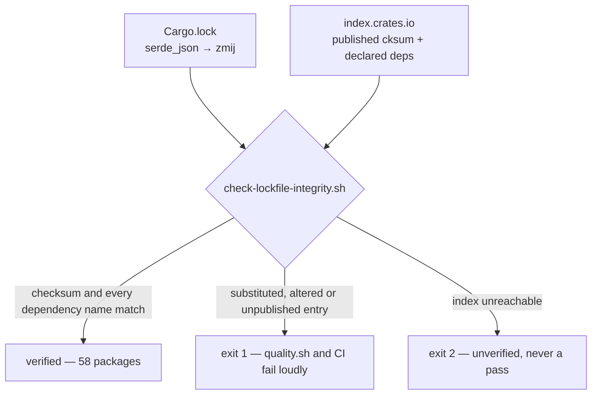

## Summary

Issue #148 reported that `Cargo.lock` records `serde_json` 1.0.151 depending on
`zmij` where `ryu` was expected, and rated it a possible supply-chain
substitution (severity high, confidence medium, "static-only: this scan has no
registry access").

**With registry access, it is a false positive.** `zmij` is `ryu`'s legitimate
successor, published by the same author, and the committed lockfile matches what
crates.io serves byte for byte:

| Checked against crates.io (2026-09-10) | Result |
| --- | --- |
| `zmij` owner | `dtolnay` (David Tolnay) — author of `ryu`, `serde`, `serde_json` |
| `zmij` repository / purpose | `github.com/dtolnay/zmij` — "A double-to-string conversion algorithm based on Schubfach and xjb" |
| `zmij` 1.0.23 `cksum` | `29666d0a…fc1b` — identical to `Cargo.lock:509` |
| `serde_json` 1.0.151 `cksum` | `c841b55e…3f14` — identical to `Cargo.lock:339` |
| `serde_json` 1.0.151 built deps, per its published manifest | `indexmap` (optional), `itoa`, `memchr`, `serde`, `serde_core`, **`zmij`** — no `ryu` |

So `Cargo.lock` is **unchanged**, and `zmij` was **not** added to `deny.toml`'s
ban list — banning it would ban `serde_json`. Regenerating the lockfile, as the
issue suggested, would reproduce it exactly.

What was actually wrong is that the finding was undecidable from the repository
alone, and nothing in the repository could decide it. A genuine substitution and
a legitimate upstream rename read identically. **`cargo` is not the exploitable
gap the issue assumed** — measured here, it answers a substituted entry by
re-resolving against the crate's real manifest and *silently rewriting the
lockfile back* (with the network, and offline from its cached manifests), and
under `--locked` it refuses with `error: cannot update the lock file … because
--locked was passed`, naming no crate. Neither response tells a reviewer which
of the two they are looking at, and one of them quietly edits the working tree.

This PR makes the comparison explicit: `scripts/check-lockfile-integrity.sh`
fetches the crates.io sparse index for every registry package in `Cargo.lock`
and fails loudly, naming the crate and the divergence, when a checksum or a
recorded dependency name disagrees with the published record. A future
substitution fails CI with a message that says what it is; a future `zmij`
verifies clean and costs nobody a triage run. Closes #148.

## Evidence

Backend/CI change — no web interface to screenshot. The evidence is the gate,
run against the real lockfile and against fixtures.

What changed:

- **`scripts/lockfile_integrity.py`** — the verification. Parses the
  `[[package]]` blocks of a lockfile and, against a sparse-index snapshot,
  asserts: the recorded sha256 equals the registry's `cksum` for that exact
  version; every recorded dependency is genuinely declared (normal or build
  kind, honouring `package` renames) by that version's published manifest; every
  dependency name resolves to a `[[package]]` block; every registry package
  carries a 64-hex checksum and the one registry `deny.toml` allows. Path
  packages (the workspace member and the `neat-core` sibling) have no registry
  entry, so only the last two rules apply to them.
- **`scripts/check-lockfile-integrity.sh`** — fetches the index snapshot and
  runs the verification. An unreachable index is exit 2, never a pass: an
  unverified lockfile must not look like a verified one.
- **`scripts/test-check-lockfile-integrity.sh`** — 11 fixture-driven cases, all
  offline via `--index-dir`.
- **`quality.sh`, `.github/workflows/ci.yml`** — the gate wired into the local
  gate and the CI `validation` job, test first, as every other check pair here
  is.
- **`docs/audit/issue-148-serde-json-zmij-dependency.md`** — the registry
  evidence recorded durably so the finding is not re-filed and re-triaged.
- **`README.md`, `CONTRIBUTING.md`, `CHANGELOG.md`** — the gate documented
  beside the existing dependency-supply-chain sections.

The committed `Cargo.lock`, verified live against `index.crates.io`:

```text
OK   serde_json 1.0.151: checksum and 5 dependencies match the registry
OK   zmij 1.0.23: checksum and 0 dependencies match the registry
lockfile integrity: 58 packages verified
```

The same real lockfile with one substitution applied (`zmij` swapped for
`wit-bindgen`, itself a real, correctly-checksummed package already in the
lockfile — exactly the issue's attacker model):

```text
FAIL serde_json 1.0.151: records dependencies ['wit-bindgen'] that the published
manifest never declares (it declares ['indexmap', 'itoa', 'memchr', 'serde',
'serde_core', 'zmij']) — the lockfile does not describe the crate crates.io published
lockfile integrity: 1 violation(s) across 58 packages
```

For comparison, on that same substituted lockfile: `cargo metadata` exits 0 and
silently rewrites `wit-bindgen` back to `zmij` (identically with `--offline`),
and `cargo metadata --locked` exits 101 with `error: cannot update the lock
file … because --locked was passed`. Both were run for this PR.



**The original trigger is closed, with no trivial bypass.** The issue's trigger
was "any `cargo build` / `cargo test` / `cargo deny check` against this committed
lockfile compiles whatever `zmij` contains". Two things close it. First, on the
facts: `zmij` 1.0.23 is what `serde_json` 1.0.151 declares and its checksum
matches the registry, so what those commands compile is the published crate —
the trigger describes a legitimate dependency. Second, on the class: the trigger
is now preceded, in both `quality.sh` and the CI `validation` job that gates
every PR, by the comparison no build step reports — each package's recorded
dependency names and checksum against the manifest crates.io actually published
for that exact version — so the same finding on a future lockfile is answered by
a gate rather than by a triage run, and a divergence is named rather than
silently re-resolved away. The evasions available to an editor of the lockfile
are each closed by a rule rather than by a name list — substituting a real,
published,
correctly-checksummed crate fails rule 4 (the manifest does not declare it);
altering a checksum fails rule 3; inventing a version fails the index lookup;
pointing at a git or alternative-registry source fails rule 1; deleting the
checksum fails rule 1; naming a crate absent from the lockfile fails rule 2;
smuggling in a crate the upstream declares only as a `dev` dependency fails rule
4 as well. Nothing is allowlisted by name — `zmij` passes only because the
registry says `serde_json` declares it, so a hijacked future `zmij` release
would be caught by its checksum. The one remaining way to reach a build
unverified is an unreachable index, and that path exits 2 rather than passing.

What this gate does **not** claim: it is not the only thing standing between
this repository and a compiled substituted crate — `cargo`'s own re-resolution
already prevents that. It is what makes the divergence *visible and named*
instead of silently corrected, which is the gap that produced this issue.

Not fixed here, and pre-existing: `./quality.sh` fails one earlier stage in this
environment — `check-neat-core-version.sh`, because the sibling `NEAT-AI-core`
Develop head is 0.15.4 against a recorded baseline of 0.13.0. That gate blocks
every PR in this repository and its own message says it must be cleared in a
single deliberate PR, so it is filed as
[#149](https://github.com/stSoftwareAU/NEAT-AI-Backpropagation/issues/149) rather
than folded in here. This PR touches no Rust source and no `Cargo.*`. Every other
stage was run and passes: `shellcheck`, `actionlint`, `codespell`,
`markdownlint-cli2`, every check/test script pair including the new one,
`cargo deny check`, `cargo fmt --check`, `cargo clippy -D warnings`,
`cargo test --workspace --all-features` and `cargo doc`.

## Test Plan

Added `scripts/test-check-lockfile-integrity.sh` — 11 cases, each writing a
fixture lockfile and a fixture crates.io index snapshot to a temp directory and
running the real checker against them offline:

- `scripts/test-check-lockfile-integrity.sh::rejects a dependency the published manifest never declares`
  — **the regression test for this issue.** It builds the exact attack the issue
  describes: a real, published, correctly-checksummed crate substituted into
  `serde_json`'s dependency list, with a valid `[[package]]` block of its own so
  every other signal looks normal. Against the unfixed code the substituted
  lockfile is reported as *fine*: there is no `check-lockfile-integrity.sh` for
  the test to invoke before this branch, and nothing else in `quality.sh` or CI
  compares a lockfile against upstream manifests — `cargo metadata` on the same
  substitution exits 0 and quietly rewrites it away. With the fix the test goes
  red on the substituted fixture (exit 1, naming the substituted crate) and
  green on the unmodified one; both were observed, in that order.
- `accepts a lockfile matching the published crates.io index` — the happy path,
  and the assertion that `serde_json` → `zmij` verifies clean.
- `rejects a checksum that disagrees with the registry`
- `rejects a dependency with no [[package]] entry`
- `rejects a version absent from the crates.io index`
- `rejects a package sourced outside the allowed registry`
- `rejects a registry package with no sha256 checksum`
- `accepts a dependency the manifest declares under a rename` — the rule
  compares crate identity, not the alias, so a `package` rename is not a
  false positive.
- `rejects a dependency the manifest declares only for dev`
- `reports a missing lockfile with exit 2`, `reports a missing index snapshot
  with exit 2` — unusable input is never a pass.

Run as part of the gate:

```text
check-lockfile-integrity tests: 11 passed, 0 failed
lockfile integrity: 58 packages verified
```
