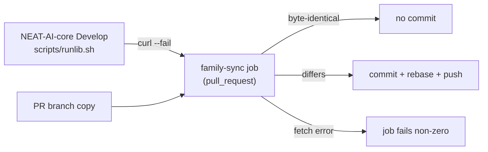

## Summary

`scripts/runlib.sh` is now the **canonical NEAT-AI-core copy** — byte-identical
to `scripts/runlib.sh` on NEAT-AI-core `Develop` (core #680) — and
`.github/workflows/family-sync.yml` keeps it that way: on every PR it fetches
core's `Develop` copy with `curl --fail` and, when the branch's copy differs,
commits the refreshed file, rebases and pushes it back onto the PR branch. A
fetch error fails the job rather than passing a stale copy off as synced.
`scripts/check-family-sync-workflow.sh` fails CI when that job is misdeclared,
and `scripts/check-runlib-canonical.sh` fails CI when the committed copy has
drifted from core `Develop` by a single byte — the sync job is skipped on fork
PRs, so the file's *content* is gated separately from the workflow's *shape*.
Both, with their test suites, run from `quality.sh` and the CI `validation`
job. Closes #152.

Refreshing the script is not a source change — `scripts/runlib.sh` is absent
from `scripts/build-affecting-paths.sh`, so neither this PR nor a future sync
commit bumps the crate version.

## Evidence

Backend/CLI change — no web interface to screenshot. Verified by running the
real script and the real workflow step body.

**Byte-identity with NEAT-AI-core `Develop`** (sha256 of the committed copy vs
the fetched canonical file):

```text
56af6127ec398c1558b2dab4356111caa13d0bc943e0cb06fd581cfb004e8989  <fetched from core Develop>
56af6127ec398c1558b2dab4356111caa13d0bc943e0cb06fd581cfb004e8989  scripts/runlib.sh
```

**End-to-end install contract** — a real cold build then a warm run, with a
wrapper logging every cargo invocation and `CARGO_HOME` pointed at a scratch
directory:

```text
=== RUN 1 (cold) ===
    Finished `release` profile [optimized] target(s) in 49.30s
[neat_ai_backpropagation] removed .../NEAT-AI-Backpropagation/target (freed 122990592 bytes)
stdout1: /tmp/runlib-verify/cargo/bin/neat_ai_backpropagation
--- installed tree ---
/tmp/runlib-verify/cargo/bin: neat_ai_backpropagation
/tmp/runlib-verify/cargo/lib: libneat_ai_backpropagation.so
--- stamps ---  0.1.36  /  0.1.36
--- target/ present? --- target/ removed
=== RUN 2 (warm) ===
stdout2: /tmp/runlib-verify/cargo/bin/neat_ai_backpropagation
[neat_ai_backpropagation] already installed v0.1.36
--- cargo calls run 2 ---
metadata --no-deps --format-version 1
count=1
```

Both artefacts install and are stamped, stdout is the CLI path, `target/` is
removed, and the warm run compiles nothing. It still costs **one**
`cargo metadata` call: today's canonical copy declines its no-cargo fast path on
a manifest with an explicit `[[bin]]` table, which is this crate's shape. That
is fixed upstream by the open
[NEAT-AI-core#690](https://github.com/stSoftwareAU/NEAT-AI-core/pull/690), and
the family sync brings it in automatically once it lands — tracked here as
#157.

**Workflow step body, run verbatim against a deliberately stale copy:**

```text
scripts/runlib.sh refreshed from NEAT-AI-core Develop
changed=true
56af6127ec398c1558b2dab4356111caa13d0bc943e0cb06fd581cfb004e8989  scripts/runlib.sh
--- second pass over the now-fresh copy --- changed=false
```

And the fetch-error path: `curl --fail` on a missing path exits 22, so the job
fails non-zero instead of continuing.



### Quality gate

`./quality.sh` stops early on a **pre-existing** failure unrelated to this
change: the neat-core breaking-bump gate reads baseline `0.17.0` from
`neat-core.expected-version` while NEAT-AI-core `Develop` is `0.20.0`. That
baseline is `0.17.0` on `Develop` too, so every PR in this repo hits it; filed
as #156. To prove nothing else in the gate is red, `./quality.sh` was re-run
with that baseline temporarily raised to `0.20.0` — it reached
`All quality checks passed!` and exited 0, covering shellcheck, every
`check-*` validator (including both new ones), actionlint, codespell,
`cargo deny`, the lockfile-integrity gate, `scripts/test-runlib.sh`,
`cargo fmt --check`, clippy with `-D warnings`,
`cargo test --workspace --all-features` and `cargo doc` with
`RUSTDOCFLAGS="-D warnings"`. The temporary edit was reverted immediately;
`neat-core.expected-version` is unchanged in this diff, and the working tree
was verified clean afterwards.

## Acceptance Criteria

<!-- vibe-spec-review inputs="diff+issue-body" -->

- **met** — Byte-identical copy; a stale copy on a PR branch is refreshed by CI — evidence: `scripts/check-runlib-canonical.sh` passes against the sibling (`scripts/test-check-runlib-canonical.sh::the committed scripts/runlib.sh matches the NEAT-AI-core sibling`), sha256 match above, and `.github/workflows/family-sync.yml:54-90` refreshes the branch copy — reviewer: met
- **partial** — Both artefacts installed and stamped; `target/` removed after success; a second run prints `[neat_ai_backpropagation] already installed v<x>` and runs no cargo command — evidence: `scripts/test-runlib.sh::a cold run installs both artefacts, stamps them and removes target/` plus the end-to-end transcript above — reviewer: partial — reason: install, stamping, `target/` removal and the already-installed line are all met, but the warm run still costs one `cargo metadata` call because the canonical copy declines its fast path on this crate's explicit `[[bin]]` table (`scripts/runlib.sh:251-254` vs `backpropagation/Cargo.toml:21`); the fix is the open NEAT-AI-core#690, which family-sync will copy in automatically — tracked as #157
- **met** — Tests and quality checks pass — evidence: `scripts/test-runlib.sh` (22), `scripts/test-check-family-sync-workflow.sh` (17), `scripts/test-check-runlib-canonical.sh` (7), plus shellcheck, actionlint, codespell, markdownlint, `cargo deny`, `cargo fmt --check`, clippy `-D warnings`, `cargo test --workspace --all-features` and `cargo doc` — reviewer: met — reason: the reviewer could not run `cargo test` in its worktree (absent `../../NEAT-AI-core` path dependency); it was run here and passed. `./quality.sh` itself stops earlier on the pre-existing neat-core baseline failure filed as #156
- **unrequested** — `scripts/check-family-sync-workflow.sh` and its test suite — reviewer: unrequested — reason: the issue asked to "register the job in whichever `scripts/check-*-workflow.sh` enumerates workflows", but no script in this repo enumerates workflows — each hard-codes one `WORKFLOW=` default — so a dedicated checker is the repo's actual convention
- **unrequested** — `scripts/check-runlib-canonical.sh`, its test suite and the CI step that runs it — reviewer: unrequested — reason: added after the review round to close the Standards reviewer's violation 4 (nothing verified the copy's content, and the sync job is skipped on fork PRs); the Spec reviewer did not see it
- **unrequested** — README's mermaid sync flow, the "Canonical copy and family sync" subsection and the `#690` caveat — reviewer: unrequested — reason: the issue asked only that "README notes the install paths", but a code change owes a docs change: the copy contract, the cwd requirement and the residual `cargo metadata` call are all new facts a reader needs
- **unrequested** — the `scripts/test-runlib.sh` rewrite beyond a rename — reviewer: unrequested — reason: the old suite asserted the bespoke script's internals (a metadata shim with no targets, a hard-coded `9.9.9`) and aborted outright against the canonical copy, so it had to be rewritten to assert the contract

## Standards Review

<!-- vibe-standards-review inputs="diff+CODING-STANDARDS.md" -->

- **violation** — GNU-only `sed -i` with no backup suffix breaks the macOS/bash 3.2 requirement — evidence: `scripts/test-check-family-sync-workflow.sh:83` — reason: fixed here — the fixture mutation now writes to a new file and moves it into place, matching the repo's portable convention
- **violation** — `\n` in a `sed` replacement is a GNU extension, so two fixtures would be built wrong on BSD sed and pass or fail for the wrong reason — evidence: `scripts/test-check-family-sync-workflow.sh:118,126` — reason: fixed here — both multi-line mutations are now built with shell redirection instead of `sed`
- **violation** — the rebase rule was satisfied by the workflow's own prose, so the gate reported green over a workflow with no rebase at all — evidence: `scripts/check-family-sync-workflow.sh:102` — reason: fixed here — comment lines are stripped before the match, and `scripts/test-check-family-sync-workflow.sh::rejects a rebase that exists only in a comment` locks it in (verified: deleting the real `rebase FETCH_HEAD` from the committed workflow now fails the checker)
- **violation** — nothing verified the copy is actually identical to core, and the only enforcement is skipped on fork PRs, so a downstream edit could merge with every check green — evidence: `.github/workflows/family-sync.yml:37` — reason: fixed here — `scripts/check-runlib-canonical.sh` compares content and runs in CI against the NEAT-AI-core checkout `setup-rust-workspace` already makes, covering forks
- **violation** — third verbatim copy of the commit-and-push block (DRY) — evidence: `.github/workflows/family-sync.yml:92-123`, duplicating `.github/workflows/version-increment.yml:93-113` and `.github/workflows/auto-format.yml:94-105` — reason: stands — extracting it into a composite action means editing two workflows this issue does not touch; the issue explicitly asked for "the push pattern of `version-increment.yml`", and the duplication is recorded here rather than hidden
- **clean** — canonical copy fidelity (byte-identical, not edited downstream, correctly absent from `scripts/build-affecting-paths.sh` so no version bump); Actions hardening (both `uses:` SHA-pinned with version comments — `actions/checkout@93cb6efe…` resolves to `v5.0.1`, `create-github-app-token@bcd2ba49…` to `v3`; top-level `contents: read` with job-scoped `contents: write`; `persist-credentials: false`; `milestone/**` in the branch filter; `timeout-minutes` and `concurrency`; strict bash in every `run:`); injection surface (no inline `${{ github.* }}` in `run:` — `PR_HEAD_REF` and `GH_PAT` come through `env:` and are quoted); fail-loud behaviour in the sync step (empty and non-script payloads each `::error::` + `exit 1`, missing workflow exits 2); tests exercise real code rather than grepping source; Australian English throughout; no hidden or secret paths staged

## Test Plan

- `scripts/test-check-family-sync-workflow.sh` (new, 17 cases) — runs the real
  checker against fixture workflows: one satisfying every rule, the committed
  workflow itself, and one fixture per rule broken in isolation (no
  `pull_request` trigger, a push trigger, a filter skipping `milestone/**`,
  `write-all`, a non-canonical source URL, `curl` without `--fail`, an
  unconditional commit/push, a push with no rebase, a missing fork guard,
  `persist-credentials: true`, a tag-pinned action, a missing `ACTIONS_PUSH`
  fallback, non-strict bash, and a rebase mentioned only in a comment) plus the
  missing-file exit 2.
- `scripts/test-check-runlib-canonical.sh` (new, 7 cases) — runs the real drift
  gate over real files: a byte-identical copy passes; an extra line and a
  single changed byte each fail with "has drifted" and name the copy contract;
  an unreadable canonical copy and a missing copy each exit 2; and the
  committed `scripts/runlib.sh` is compared against the NEAT-AI-core sibling at
  `origin/Develop` (announced as skipped, never silently, when no sibling
  checkout is present).
- `scripts/test-runlib.sh` (rewritten, 22 assertions) — drives the real script
  with a cargo shim that answers `metadata` and fails loud on anything else:
  already-installed exits 0, prints the CLI path on stdout and the
  already-installed line on stderr, runs no build and at most one cargo call; a
  missing stamp, a missing cdylib and a stale stamp each rebuild rather than
  reporting complete. A hermetic install case then drives the real staging,
  commit, stamp and clean-up path against a synthetic checkout with this
  crate's shape and a cargo shim whose "build" drops the artefacts: both
  artefacts land, the binary is executable, both stamps carry the crate
  version, `target/` is removed and the removal names the freed bytes — the
  half of the contract nothing in CI covered before.
  *Documented test change:* the old suite asserted the bespoke script's
  internals (a metadata shim with no targets, a hard-coded `9.9.9` version). It
  could not describe the canonical copy, so it was rewritten to assert the
  contract instead — no case was dropped; both original cases survive alongside
  three new ones, and the version now comes from the crate manifest so the fast
  path and the metadata path must agree.
