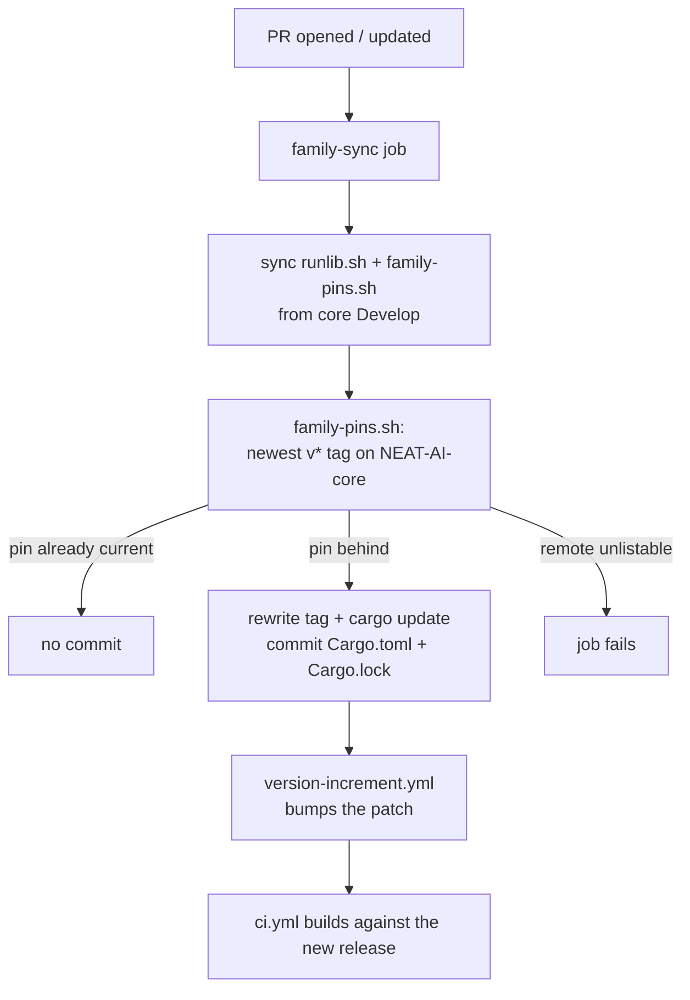

## Summary

`neat-core` is now a **git dependency pinned to a NEAT-AI-core release tag**
instead of an unpinned sibling path dependency, and the pin is refreshed
automatically on every pull request. Closes #153.

- `backpropagation/Cargo.toml` pins
  `neat-core = { git = "https://github.com/stSoftwareAU/NEAT-AI-core", tag = "v0.22.2" }`
  (core's newest release) and `Cargo.lock` records the resolved commit.
- `scripts/family-pins.sh` is copied byte-for-byte from NEAT-AI-core `Develop`
  (core #681). `.github/workflows/family-sync.yml` now syncs **both** canonical
  helpers (`runlib.sh`, `family-pins.sh`), runs `family-pins.sh`, and commits
  the refreshed helpers together with a moved tag and `Cargo.lock`. Both those
  paths are build-affecting, so `version-increment.yml` bumps the patch behind
  the move — the pin never moves at an unchanged version.
- Nothing checks NEAT-AI-core out beside the repository any more: the
  `setup-rust-workspace` composite installs the toolchain alone, and the
  content-drift gate reads core `Develop` over https.
- `scripts/check-runlib-canonical.sh` is generalised to
  `scripts/check-canonical-copies.sh`, covering both copied helpers.
- The `neat-core.expected-version` breaking-bump gate is **retired** (gate,
  test twin and baseline file). It acknowledged breaking bumps of an unpinned
  dependency on paper and went red on every PR whenever core released a new
  pre-1.0 minor (#156); with the pin, a core release this crate cannot consume
  fails the build and tests of the PR that moves the pin.
- `scripts/lockfile_integrity.py` verifies a git package by its immutable
  `?tag=…#<40-hex>` pin instead of a registry record; `deny.toml` allows the one
  NEAT-AI-core git source.



## Evidence

Backend/CLI change — no web interface to screenshot. Verified by running the
real commands:

**The workspace builds with no sibling checkout.** A fresh clone in
`/tmp/nosibling/NEAT-AI-Backpropagation`, with no `NEAT-AI-core` beside it:

```text
$ ls /tmp/nosibling/          # only the repo — no sibling
NEAT-AI-Backpropagation
$ cargo test --workspace --all-features -- --test-threads=2
test result: ok. 15 passed; 0 failed …   (13 suites, 0 failures)
```

**A stale pin is moved, and the move is idempotent** (same isolated clone):

```text
$ sed -i 's|tag = "v0.19.0"|…|' backpropagation/Cargo.toml   # rewind the pin
$ ./scripts/family-pins.sh
[family-pins] neat-core v0.19.0 → v0.22.2 (backpropagation/Cargo.toml)
[family-pins] 1 pin(s) moved; Cargo.lock updated
exit=0
$ ./scripts/family-pins.sh        # second run
exit=0                            # no output, no diff
```

**The patch bump follows the moved pin** — the same script
`version-increment.yml` runs:

```text
$ ./scripts/bump-backpropagation-version.sh --base-ref origin/Develop
OK   build-affecting changes vs origin/Develop:
       Cargo.lock
       backpropagation/Cargo.toml
       backpropagation/src/gradient_check.rs
OK   bumped neat_ai_backpropagation 0.1.38 -> 0.1.39
```

**Gates green.** `./quality.sh` → `All quality checks passed!` (shellcheck,
actionlint, codespell, markdownlint, `cargo deny check`, lockfile integrity —
`58 packages verified`, with `neat-core 0.22.2: git package pinned at v0.22.2
9b26d47c`, `cargo fmt --check`, clippy `-D warnings`, `cargo test --workspace
--all-features`, `cargo doc`).

## Acceptance Criteria

<!-- vibe-spec-review inputs="diff+issue-body" -->

- **met** — The workspace builds with no `NEAT-AI-core` checkout beside the repo
  — evidence: `backpropagation/Cargo.toml:29`, `Cargo.lock:195-197`
  (`source = "git+…?tag=v0.22.2#9b26d47c…"`), the deleted checkout/symlink steps
  in `.github/actions/setup-rust-workspace/action.yml`, and the isolated-clone
  test run above — reviewer: met
- **met** — A PR whose pin is behind core's latest release receives a CI commit
  moving the tag and `Cargo.lock`, followed by the patch bump — evidence:
  `.github/workflows/family-sync.yml:64-150` (sync, run, stage
  `backpropagation/Cargo.toml` + `Cargo.lock`), the rules asserting both in
  `scripts/check-family-sync-workflow.sh:104-131`
  (`scripts/test-check-family-sync-workflow.sh::rejects a workflow that never
  runs family-pins.sh`, `::rejects a commit that does not stage Cargo.lock`),
  and the pin-move / bump transcripts above — reviewer: met — reason: the
  reviewer flagged that a `GITHUB_TOKEN` fallback push would not fire
  `pull_request: synchronize` and so would not trigger the bump; that
  App-token → `ACTIONS_PUSH` → `GITHUB_TOKEN` ladder is the pre-existing pattern
  copied from `version-increment.yml:100` and is unchanged here
- **met** — Tests and quality checks pass — evidence: `./quality.sh` end to end
  (above), `cargo test --workspace --all-features` 13 suites green,
  `scripts/test-check-canonical-copies.sh` 11/11,
  `scripts/test-check-family-sync-workflow.sh` 20/20,
  `scripts/test-check-lockfile-integrity.sh` 16/16 — reviewer: met
- **unrequested** — `scripts/runlib.sh` refreshed from core `Develop` (core
  #699, +188 lines) — reviewer: unrequested — reason: the drift gate now reads
  `Develop` live, and core had moved, so the committed copy was stale; this is
  the mechanical re-copy the family-sync job would itself have pushed, and
  without it CI is red on its first run
- **unrequested** — the git-package rules in `scripts/lockfile_integrity.py`
  (immutable tag + commit, tag/version agreement, no checksum) —
  reviewer: unrequested — reason: the minimum was to stop classifying a `git+`
  source as a registry package, which would have left a git dependency
  *unverified*; the rules keep the gate's "never pass an unverified lockfile"
  contract, with five cases covering them
- **unrequested** — `scripts/check-canonical-copies.sh` fetches core `Develop`
  over https with a loud sibling fallback, rather than only reading a sibling —
  reviewer: unrequested — reason: a sibling is only as current as its last
  fetch, so a local run and CI disagreed about what "canonical" means; the
  fallback is announced and "neither available" exits 2, never 0
- **unrequested** — `backpropagation/src/gradient_check.rs` reads
  `neatCoreBaseline` from the manifest pin, and `GRADIENT_CHECK_SCHEMA` goes
  `2` → `3` — reviewer: unrequested — reason: the crate `include_str!`d the
  deleted baseline file, so it no longer compiled; the field keeps its shape but
  changes meaning, which the schema bump is what tells a consumer
- **unrequested** — comment/description-only edits to
  `.github/codeql/codeql-config.yml`, `renovate.json`, `scripts/auto-format.sh`
  and `scripts/check-renovate-config.sh` — reviewer: unrequested — reason: each
  described the retired path dependency or sibling checkout; a code change owes
  its docs change

## Standards Review

<!-- vibe-standards-review inputs="diff+CODING-STANDARDS.md" -->

- **violation** — the auto-format commit message and change-detection comment
  still described the path dependency and a sibling checkout — evidence:
  `scripts/auto-format.sh:18`, `scripts/auto-format.sh:74` — reason: fixed here
- **violation** — the Renovate gate's rule text and messages still called
  `neat-core` a path dependency synced by Auto Format, contradicting the
  `renovate.json` this diff rewrote — evidence:
  `scripts/check-renovate-config.sh:10`, `:220`, `:224`,
  `scripts/test-check-renovate-config.sh:170` — reason: fixed here
- **violation** — the CodeQL call-site comment still asserted a sibling checkout
  exists — evidence: `.github/workflows/codeql.yml:58` — reason: fixed here
- **violation** — `family-sync.yml` executes `scripts/family-pins.sh` seconds
  after fetching it from a mutable remote branch, validated only by non-empty
  and a `#!` line — evidence: `.github/workflows/family-sync.yml:98-101` —
  reason: stands, and is the copy contract the issue mandates ("the family-sync
  job keeps it byte-identical and runs it before pushing"); it is mitigated as
  the reviewer notes — the step carries no token, the push token is minted
  later, and `scripts/check-canonical-copies.sh` fails CI if the committed copy
  ever differs from the same source
- **violation** — `test_rejects_a_package_sourced_outside_the_allowed_registry`
  was rewritten from a `git+` to a `registry+` foreign source, so no case in
  that suite now rejects a well-formed git pin to an unrelated host —
  evidence: `scripts/test-check-lockfile-integrity.sh:233`,
  `scripts/lockfile_integrity.py:49` — reason: stands, deliberately;
  `deny.toml:37-42` (`unknown-git = "deny"` plus `allow-git`) is the single
  source of truth for which git remotes are permitted, and duplicating that
  allowlist in the lockfile gate would be two policies to keep in step. The
  rewritten case still exercises the "not the crates.io registry" rule it was
  written for, and the git branch gained five cases of its own
- **clean** — Australian English throughout; bash 3.2 portability (no
  `mapfile`/associative arrays/GNU-only flags, safe empty-array expansion,
  `set -euo pipefail` everywhere); every `uses:` pinned to a 40-char SHA with a
  version comment, least-privilege `permissions:`, credential persistence
  disabled on every checkout, no `${{ github.* }}` interpolated into `run:`; tests run real scripts and
  assert exit codes and messages; fail-loud behaviour (exit 2 for an unverified
  comparison, non-zero for an unresolvable pin); no secrets or hidden files
  staged; the deleted `test-check-runlib-canonical.sh` cases are all carried
  into `test-check-canonical-copies.sh`

Two reviewer notes were also acted on after the reviews: the
`neatCoreBaseline` parser now reads the `[dependencies.neat-core]` table form
that `family-pins.sh` also rewrites and matches the dependency name exactly
(it previously would have matched `neat-core-anything` and degraded to
`"unknown"` on the table form), and `GRADIENT_CHECK_SCHEMA` was bumped for the
field's change of meaning.

## Test Plan

- `scripts/test-check-canonical-copies.sh` (new, 11 cases) — replaces
  `scripts/test-check-runlib-canonical.sh`: byte-identical copies, drift in
  either copy, a single-byte difference, the copy-contract message, missing
  canonical, missing copy, plus the new resolution order — fetch from the base
  URL (a real `curl` against a `file://` fixture), drift caught against a
  fetched copy, the announced sibling fallback, and exit 2 when neither source
  can supply the copies. The removed "committed copies vs the sibling" case is
  replaced by the deterministic `file://` cases plus the real gate run in
  `quality.sh` / `ci.yml`.
- `scripts/test-check-family-sync-workflow.sh` (20 cases, 4 new) — the fixture
  workflow now syncs both helpers, runs `family-pins.sh` and stages
  `Cargo.lock`; new cases reject a workflow that never fetches `runlib.sh`,
  never fetches `family-pins.sh`, never runs `family-pins.sh`, or commits
  without staging `Cargo.lock`.
- `scripts/test-check-lockfile-integrity.sh` (16 cases, 5 new) — a git package
  pinned to a tag and commit is accepted with no registry entry; an unpinned git
  source, a tag that disagrees with the locked version, a git package carrying a
  checksum, and a dangling dependency of a git package are each rejected.
  Modified: `test_rejects_a_package_sourced_outside_the_allowed_registry` now
  uses a foreign **registry** source, because a foreign git source is judged by
  the new pin rule (documented under Standards Review above).
- `backpropagation/src/gradient_check.rs` (5 unit tests, 4 new) — the baseline
  is the pinned release tag; the inline form, the `[dependencies.neat-core]`
  table form, a commented-out pin, a similarly-named dependency and an unpinned
  dependency (`"unknown"`). Modified:
  `the_neat_core_baseline_is_read_from_the_committed_file` became
  `the_neat_core_baseline_is_the_pinned_release_tag` — the file it read is
  retired.
- Removed with the gate they tested: `scripts/test-check-neat-core-version.sh`
  and `scripts/check-neat-core-version.sh` (see Summary for why).
- Full suite: `cargo test --workspace --all-features` (13 suites) and
  `./quality.sh` end to end, both green, and the same suite green in an isolated
  clone with no `NEAT-AI-core` sibling.
