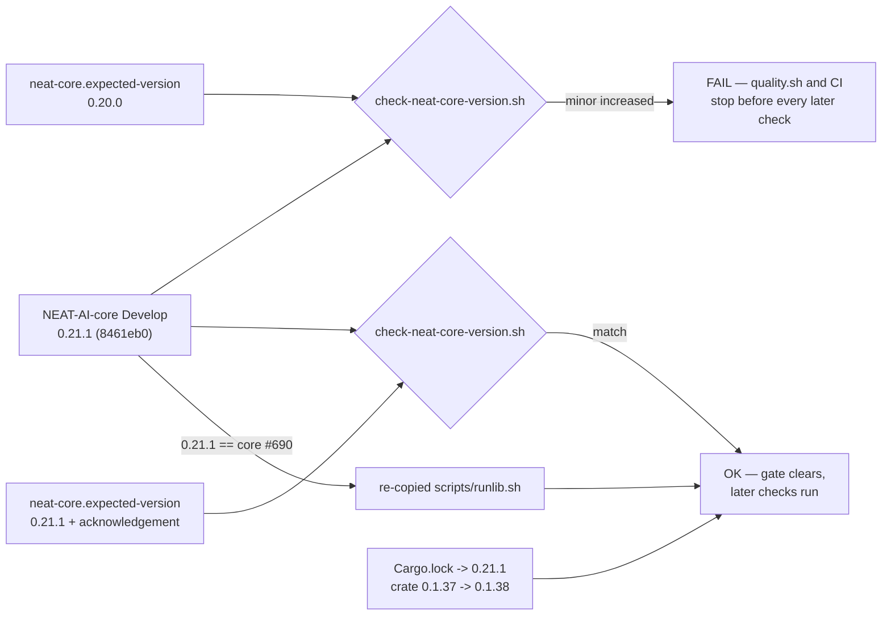

# Handle the neat-core 0.20.0 -> 0.21.1 bump (Issue #156)

## Summary

`./scripts/check-neat-core-version.sh` failed on every PR and on a clean
`Develop`, so `quality.sh` and the CI `validation` job stopped before every
check that follows it. The recorded baseline in `neat-core.expected-version`
sat behind neat-core `Develop`, and nothing in a feature branch can clear that
— the gate's own remediation asks for a single deliberate PR. This is it.

The issue was filed when the gap was `0.17.0` vs `0.20.0`; neat-core `Develop`
has since moved to **0.21.1**, so the same gate still failed with the same
message at the newer pair. The fix closes the gap as it stands today:

1. **Reviewed the breaking range for code impact — none.** `0.21.0`
   (core `#698`, "Milestone: Scan 20260911") is a roll-up of five internal PRs:
   the packed batch scan's parameter bundle (`#671`), one declarative
   per-variant list behind `apply_get_range` and `apply_safe_zone_adjustment`
   (`#673`), a *declined* `SynapseExport` endpoint newtype (`#672`), and
   dependency-containment policy (`#676`, `#677`). Every public and
   WASM-exported signature is unchanged. `0.21.1` (core `#690`) touches no
   `.rs` file at all.
2. **Re-locked `Cargo.lock`** onto neat-core `0.21.1` and bumped the crate
   patch version `0.1.37 -> 0.1.38` — `Cargo.lock` is in
   `scripts/build-affecting-paths.sh`, so remotes must be told to rebuild
   (issue #95). Applied with the repo's own
   `scripts/bump-backpropagation-version.sh`.
3. **Re-copied the canonical `scripts/runlib.sh`** from neat-core `Develop`.
   Core `#690` *is* the whole of `0.21.1`, so handling that version means
   adopting the refreshed copy; `scripts/check-runlib-canonical.sh` went from
   FAIL to byte-identical.
4. **Bumped the recorded baseline** to `0.21.1` with the acknowledgement note
   recording what was reviewed and how it was verified.

Docs were swept for the same change: the README and CHANGELOG both carried a
"while core `#690` is open" caveat saying an already-installed run still costs
a `cargo metadata` call. `#690` has landed and is committed here, so both now
state the settled behaviour.

Closes #156.

## Evidence

Backend/CLI change with no web interface to screenshot. The evidence is the
gate's own exit codes, before and after, against the sibling neat-core checkout
at `origin/Develop` (`8461eb0`, version `0.21.1`).

**Before** — the symptom exactly as reported, at today's versions:

```text
$ ./scripts/check-neat-core-version.sh
INFO neat-core version read from ref 'origin/Develop' in .../NEAT-AI-core
FAIL: breaking neat-core bump: 0.21.1 exceeds handled baseline 0.20.0 (pre-1.0 minor increased)
       neat-core has presented a breaking bump this crate has not handled.
exit=1

$ ./scripts/check-runlib-canonical.sh
FAIL .../scripts/runlib.sh has drifted from the canonical NEAT-AI-core copy
exit=1
```

**After**:

```text
$ ./scripts/check-neat-core-version.sh
INFO neat-core version read from ref 'origin/Develop' in .../NEAT-AI-core
OK   neat-core 0.21.1 matches handled baseline 0.21.1 (patch-level drift allowed)
exit=0

$ ./scripts/check-runlib-canonical.sh
OK   .../scripts/runlib.sh is byte-identical to the canonical NEAT-AI-core copy
exit=0
```

**Full gate** — `./quality.sh < /dev/null` → `All quality checks passed!` in
37s, which includes a clean `cargo build --all-targets`, `cargo clippy
--workspace --all-targets --all-features -- -D warnings` and the whole test
suite (18 test binaries, 0 failures) compiled against neat-core `0.21.1`. That
build is the proof that no signature this crate names changed across the range.



## Reproduction

- **symptom** — `./scripts/check-neat-core-version.sh` exits 1 with
  `FAIL: breaking neat-core bump: <core> exceeds handled baseline <baseline>
  (pre-1.0 minor increased)`, on every PR and on a clean `Develop`, stopping
  `quality.sh` and the CI `validation` job before every later check.
- **status** — `verified` — the gate was run against the real sibling
  neat-core checkout at `origin/Develop` before the change and observed
  failing with exactly that message (`0.21.1` vs baseline `0.20.0`, exit 1),
  and run again after the change and observed passing (exit 0). The
  companion `scripts/check-runlib-canonical.sh` failure, which the same
  version drift caused, was observed going red then green the same way.
- **regression test** — `./scripts/check-neat-core-version.sh` and
  `./scripts/check-runlib-canonical.sh`, both run from `quality.sh` and the CI
  `validation` job on every PR, so the symptom cannot return unnoticed. The
  gate scripts' own unit suites —
  `scripts/test-check-neat-core-version.sh` and
  `scripts/test-check-runlib-canonical.sh` — continue to pass unchanged.

## Test Plan

No test was added or modified: the defect is stale recorded state, not code,
and the gate that detects it plus its unit suite already exist and already run
on every PR. Re-running them is the regression check.

- `./scripts/check-neat-core-version.sh` — red before, green after (above).
- `./scripts/check-runlib-canonical.sh` — red before, green after (above).
- `./scripts/test-check-neat-core-version.sh`,
  `./scripts/test-check-runlib-canonical.sh`, `./scripts/test-runlib.sh`,
  `./scripts/test-bump-backpropagation-version.sh` — pass, run by `quality.sh`.
- `cargo test --workspace --all-features` — 18 test binaries, 0 failures,
  against neat-core `0.21.1`.
- `./quality.sh < /dev/null` — `All quality checks passed!`
