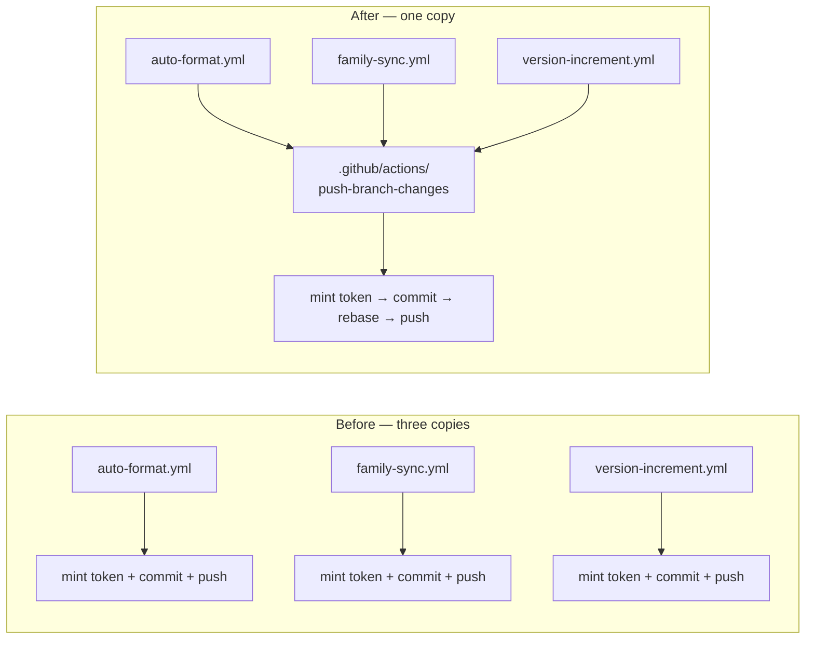

# Share one push-credential recipe across the three pushing workflows

## Summary

`auto-format.yml`, `family-sync.yml` and `version-increment.yml` each carried
their own "Mint repo-scoped push token" step followed by a near-identical
commit-and-push block, so a change to the credential chain — the token
fallback, the auth header, the push target — had to be made and re-verified
three times. This PR extracts that sequence into the local composite action
`.github/actions/push-branch-changes` (mirroring the existing
`.github/actions/setup-rust-workspace` pattern) and calls it from all three.
Closes #164.

Secrets cannot be read inside a composite action, so each caller passes the App
credentials and its `secrets.ACTIONS_PUSH || secrets.GITHUB_TOKEN` fallback in
as inputs; the fallback *chain* (App token → that input) and everything after
it live in the action.

Consolidating three copies means the callers converge on one behaviour, which
is the point — the action is the union of what the three did:

- **fail loud with no credential** (new): an empty token used to reach
  `git push` as an anonymous push; it is now refused before the commit.
- **skip a deleted head branch**: family-sync and version-increment had this;
  auto-format now has it too.
- **rebase before pushing**: only family-sync had this; all three now survive a
  branch that another job pushed to while they ran.

## Evidence

Backend/CI change — no web interface to screenshot. The evidence is the
behaviour suite below plus a clean `./quality.sh` (full gate, exit 0), which
now runs the new checks.

A defect was found and fixed by the behaviour suite rather than by review: with
`paths:` given, an unrelated modification left in the working tree made
`git rebase` refuse ("cannot rebase: You have unstaged changes"), which would
have failed the job. The rebase now uses `--autostash`, and
`scripts/test-push-branch-changes-action.sh` case 2 covers it.

## Test Plan

Added `scripts/test-push-branch-changes-action.sh` — extracts the action's own
`run:` block and executes it against a throwaway repository whose `origin` is a
local bare repository, asserting on what actually landed:

- commits every tracked change when no `paths` are given;
- stages only the paths it was given, leaving other files alone;
- stages every path in a whitespace-separated list;
- refuses to push with no credential (non-zero, remote unmoved);
- skips the push when the head branch has been deleted (exit 0, `::notice`);
- rebases onto a branch that moved, keeping the other job's commit;
- fails loudly on a rebase conflict, leaving no rebase in progress and the
  remote untouched.

Added `scripts/check-push-branch-changes-action.sh` and its self-test
`scripts/test-check-push-branch-changes-action.sh` (17 cases) — the regression
gate for this issue: the action must stay SHA-pinned, scoped, fail-loud and
free of `${{ }}` interpolation inside `run:`, **and no workflow may mint its
own push token again**. A workflow that re-inlines
`actions/create-github-app-token` fails the check by name.

Updated `scripts/check-family-sync-workflow.sh` (and its self-test, +2 cases)
so its "stages `Cargo.lock`" and "rebases before pushing" rules follow the
delegation: satisfied inline, or by the shared action's `paths:` input and its
rebase. Both new scripts run in `quality.sh` and in `ci.yml`.

Full gate: `./quality.sh < /dev/null` → `All quality checks passed!`
(includes `actionlint`, shellcheck, codespell, cargo clippy/test/doc).
