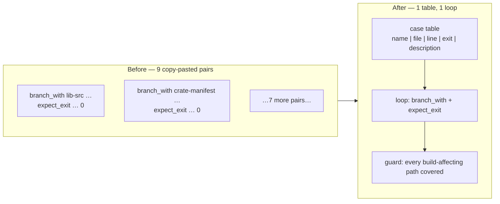

# Collapse the near-duplicate build-affecting `--check` cases into one table

Closes #167

## Summary

`scripts/test-bump-backpropagation-version.sh` carried nine near-identical
`branch_with NAME FILE LINE` + `expect_exit DESCRIPTION EXIT "$BUMPER" …`
pairs. Seven asserted the same shape — touch one build-affecting path, run the
bumper in `--check` mode, expect exit `0` — and the `docs-only` / `tests-only`
pair only flipped the expected exit to `1`. Every case differed in four
literals, yet each needed its own copy of the call pair, so adding the next
path from `scripts/build-affecting-paths.sh` meant copy-pasting a block and any
change to the shared assertion had to be made nine times.

The nine cases are now one row each in a single table, driven by one loop:

```text
NAME|FILE|APPENDED LINE|EXPECTED EXIT|DESCRIPTION
```

`|` separates rather than the `:` sketched in the issue, because the appended
lines carry colons, quotes, spaces and equals signs (`rand = "0.9"`), and a
colon-separated read would mis-split them.

Two behaviours make the loop fail loud rather than pass vacuously:

- **A malformed row aborts the run.** A row missing a field exits `2` naming
  the offending row, instead of feeding an empty expected-exit into the
  comparison.
- **The table is checked against the canonical path list.** After the loop the
  test sources `scripts/build-affecting-paths.sh` and asserts every
  `build_affecting_pathspecs` entry is touched by a case expecting a bump. A
  path added to that list now fails this test until a row covers it — which is
  exactly the copy-paste step the issue flagged. An emptied or mis-parsed table
  fails the same assertion.

The trailing `real-bump` case is untouched and stays standalone: it is a
non-`--check` run with different setup and different assertions (manifest and
lockfile rewritten, then re-run as a no-op), so it is not part of this
duplication.



## Evidence

This is a bash test-harness change with no web interface, so there is nothing
to screenshot; the test output is the evidence.

Before (on `Develop`) — 13 assertions, nine of them from copy-pasted blocks:

```text
OK   src change bumps
OK   crate Cargo.toml dependency change bumps
OK   workspace Cargo.toml profile change bumps
OK   Cargo.lock dependency change bumps
OK   .cargo/config.toml rustflags change bumps
OK   rust-toolchain.toml change bumps
OK   include/ FFI header change bumps
OK   docs-only change skips
OK   integration-test-only change skips
OK   real run bumps
OK   manifest patched to 0.1.11
OK   lockfile patched to 0.1.11
OK   re-run after a bump is a no-op

Passed: 13  Failed: 0
```

After — the same 13 assertions with the same names and expected exits, plus the
new coverage assertion:

```text
OK   src change bumps
OK   crate Cargo.toml dependency change bumps
OK   workspace Cargo.toml profile change bumps
OK   Cargo.lock dependency change bumps
OK   .cargo/config.toml rustflags change bumps
OK   rust-toolchain.toml change bumps
OK   include/ FFI header change bumps
OK   docs-only change skips
OK   integration-test-only change skips
OK   every build-affecting path has a bump case
OK   real run bumps
OK   manifest patched to 0.1.11
OK   lockfile patched to 0.1.11
OK   re-run after a bump is a no-op

Passed: 14  Failed: 0
```

No test was removed, commented out or renamed — every original description and
expected exit survives verbatim as a table row.

## Test Plan

1. **Baseline** — `./scripts/test-bump-backpropagation-version.sh` on the
   unchanged file: 13 passed, 0 failed.
2. **After the refactor** — same command: 14 passed, 0 failed (the 13 originals
   plus the coverage assertion).
3. **Mutation check — an uncovered build-affecting path fails loud.** A scratch
   copy with the `ffi-header` row deleted reported
   `FAIL: build-affecting paths with no bump case: include` and exited `1`
   (12 passed, 1 failed). The scratch copy was deleted.
4. **Mutation check — a malformed row fails loud.** A scratch copy whose
   `toolchain` row was truncated to three fields printed
   `FAIL: malformed case row: 'toolchain|rust-toolchain.toml|0|x'` and exited
   `2`, rather than silently skipping the case. The scratch copy was deleted.
5. **Static checks** — `bash -n` and `shellcheck -x -s bash` on the changed
   script: clean.
6. **Full gate** — `./quality.sh < /dev/null` in the foreground: `All quality
   checks passed!`
