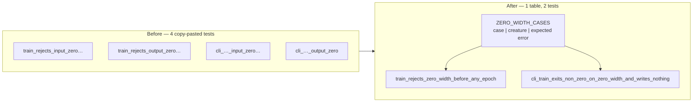

# Collapse the near-duplicate zero-width reject tests into one table

Closes #168

## Summary

`backpropagation/tests/observation_width.rs` carried two pairs of hand-copied
`#[test]` bodies. Within each pair the setup, structure and assertions were
identical — only the fixture (`INPUT_ZERO` / `OUTPUT_ZERO`) and the expected
error (`INPUT_ERR` / `OUTPUT_ERR`) differed:

- `train_rejects_input_zero_before_any_epoch` /
  `train_rejects_output_zero_before_any_epoch`
- `cli_train_exits_non_zero_on_input_zero_and_writes_nothing` /
  `cli_train_exits_non_zero_on_output_zero`

Each pair is now one test walking a shared table:

```rust
const ZERO_WIDTH_CASES: [(&str, &str, &str); 2] = [
    ("input 0", INPUT_ZERO, INPUT_ERR),
    ("output 0", OUTPUT_ZERO, OUTPUT_ERR),
];
```

A third zero-width source is one row, and a change to the shared assertion
shape (`assert_no_run_artifacts`, or the CLI argument list) is now a single
edit instead of two.

Two details keep the collapsed tests as loud as the copies they replace:

- **Every assertion names its case.** `assert_eq!(err, expected_err, "{case}")`
  and `"{case} stderr: {stderr}"` mean a failure still says which row broke,
  which a bare loop would have lost.
- **A rejection that did not happen panics with the case.** The library test
  uses `let Err(err) = train(...) else { panic!("{case} must be rejected") }`
  rather than a fixed `expect_err` message, so a creature that trains when it
  should have been refused fails loud and identifiably.

No test was deleted or weakened: both widths are still exercised through both
surfaces (library `run_train`, and the CLI process via exit code and stderr),
and the remaining tests in the file are untouched.



## Evidence

This is a Rust test-file change with no web interface, so there is nothing to
screenshot; the test output is the evidence.

Before (on `Develop`):

```text
running 9 tests
test ffi_train_rejects_a_widthless_creature ... ok
test sibling_loaders_reject_a_widthless_creature ... ok
test train_rejects_input_zero_before_any_epoch ... ok
test write_guard_rejects_a_mismatched_or_widthless_creature ... ok
test train_rejects_output_zero_before_any_epoch ... ok
test a_valid_source_round_trips_its_width_into_best_json ... ok
test width_is_checked_before_the_forward_only_rule ... ok
test cli_train_exits_non_zero_on_input_zero_and_writes_nothing ... ok
test cli_train_exits_non_zero_on_output_zero ... ok

test result: ok. 9 passed; 0 failed
```

After — the same coverage in 7 tests, the two pairs now one each:

```text
running 7 tests
test sibling_loaders_reject_a_widthless_creature ... ok
test ffi_train_rejects_a_widthless_creature ... ok
test train_rejects_zero_width_before_any_epoch ... ok
test width_is_checked_before_the_forward_only_rule ... ok
test a_valid_source_round_trips_its_width_into_best_json ... ok
test write_guard_rejects_a_mismatched_or_widthless_creature ... ok
test cli_train_exits_non_zero_on_zero_width_and_writes_nothing ... ok

test result: ok. 7 passed; 0 failed
```

**Mutation check — both rows are genuinely exercised.** With the `output 0`
row's expected error temporarily swapped to `INPUT_ERR`, both collapsed tests
failed and named the offending case:

```text
---- train_rejects_zero_width_before_any_epoch stdout ----
assertion `left == right` failed: output 0
  left: "Must have at least one output neurons was: 0"
 right: "Must have at least one input neurons was: 0"

---- cli_train_exits_non_zero_on_zero_width_and_writes_nothing stdout ----
output 0 stderr: error: Must have at least one output neurons was: 0

test result: FAILED. 5 passed; 2 failed
```

The mutation was reverted; the committed table is unchanged.

## Test Plan

1. **Baseline** — `cargo test --test observation_width`: 9 passed, 0 failed.
2. **After the collapse** — same command: 7 passed, 0 failed, with both widths
   still covered on both surfaces.
3. **Mutation check** — one table row's expected error flipped: both collapsed
   tests fail and name `output 0` (output above). Reverted afterwards.
4. **Full gate** — `./quality.sh < /dev/null` in the foreground:
   `All quality checks passed!`
