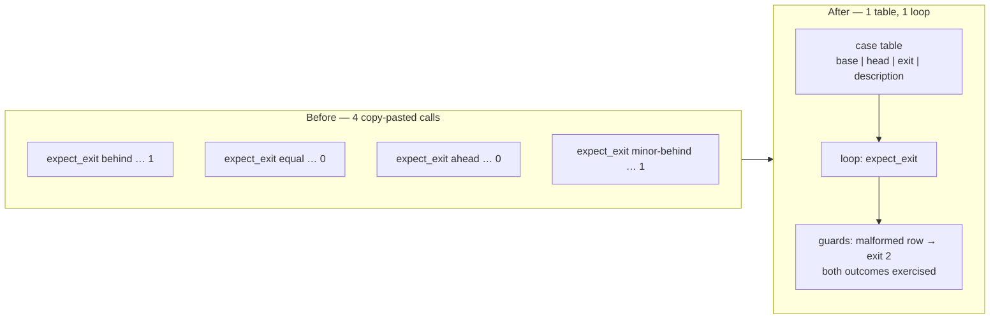

# Collapse the near-duplicate checker exit-code cases into one table

Closes #169

## Summary

`scripts/test-check-crate-version-no-downgrade.sh` opened with four
consecutive `expect_exit "checker: …" N "$CHECKER" --base-version … --head-version …`
calls. Every one had the same shape — run the real checker against a
`(base, head)` version pair and assert its exit code — and differed only in
the two version literals and the expected exit, so a fifth version-comparison
edge case meant copy-pasting another call rather than appending a row.

The four cases are now one row each in a single table, driven by one loop:

```text
BASE|HEAD|EXPECTED EXIT|DESCRIPTION
```

`|` separates rather than the `:` sketched in the issue, matching the
convention the bump-script table established in #167 so both tables in this
repository read the same way; a description is free-form text and would
mis-split on a punctuation-sensitive separator.

Two guards keep the loop from passing vacuously — the same fail-loud shape
used by the #167 table:

- **A malformed row aborts the run.** A row missing a field exits `2` naming
  the offending row, instead of feeding an empty expected-exit into the
  comparison.
- **Both sides of the contract must run.** After the loop the test asserts it
  saw at least one accepted pair and at least one rejected pair. An emptied or
  mis-parsed table now fails here instead of reporting a pass having run no
  checker cases at all.

The three `bump:` cases further down are untouched: each drives a different
git fixture branch through a different code path, so they are not part of this
duplication.



## Evidence

This is a bash test-harness change with no web interface, so there is nothing
to screenshot; the test output is the evidence.

Before (on `Develop`):

```text
OK   checker: behind fails
OK   checker: equal passes
OK   checker: ahead passes
OK   checker: minor-behind fails (sort -V)
OK   bump: behind fails (exit 2, not skip)
OK   bump: ahead skips without further bump
OK   bump: equal with src changes would bump

Passed: 7  Failed: 0
```

After — the same seven assertions with the same descriptions and expected
exits, plus the new both-sides coverage assertion:

```text
OK   checker: behind fails
OK   checker: equal passes
OK   checker: ahead passes
OK   checker: minor-behind fails (sort -V)
OK   checker: both accept and reject cases ran
OK   bump: behind fails (exit 2, not skip)
OK   bump: ahead skips without further bump
OK   bump: equal with src changes would bump

Passed: 8  Failed: 0
```

No test was removed, commented out or renamed — every original description and
expected exit survives verbatim as a table row.

## Test Plan

1. **Baseline** — `./scripts/test-check-crate-version-no-downgrade.sh` on the
   unchanged file: 7 passed, 0 failed.
2. **After the refactor** — same command: 8 passed, 0 failed (the 7 originals
   plus the coverage assertion).
3. **Mutation check — a malformed row fails loud.** A scratch copy whose
   `equal passes` row was truncated to three fields printed
   `FAIL: malformed case row: '0.1.18|0.1.18|equal passes'` and exited `2`,
   rather than silently skipping the case.
4. **Mutation check — a wrong expectation still fails.** A scratch copy
   expecting exit `0` for the `behind` downgrade reported
   `FAIL checker: behind fails: expected exit 0, got 1` and exited `1`, so the
   loop really asserts the checker's exit code rather than absorbing it.
5. **Mutation check — a one-sided table fails loud.** A scratch copy with both
   accept rows deleted printed
   `FAIL: checker case table exercised only one side of the contract` and
   exited `1`, instead of passing on the two remaining cases.
   All scratch copies were deleted.
6. **Static checks** — `bash -n` and `shellcheck -x -s bash` on the changed
   script: clean.
7. **Full gate** — `./quality.sh < /dev/null` in the foreground:
   `All quality checks passed!`
