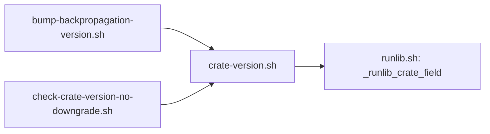

# PR summary — issue #177

## Summary

Closes #177.

The version-bump scripts parsed `Cargo.toml` with three copies of one `sed`
rule that took the first `version =` line anywhere in the file. They now read
the crate version via `runlib.sh`'s `_runlib_crate_field` (scoped to
`[package]`), through one new sourced helper, `scripts/crate-version.sh`
(`read_version`, `read_version_at_ref`).

- `scripts/bump-backpropagation-version.sh` — the `read_version` function and
  the inline base-ref `sed` are replaced by the shared helpers.
- `scripts/check-crate-version-no-downgrade.sh` — `read_version_from_text` is
  replaced by the shared helpers.
- `.github/workflows/version-increment.yml` — its "bump machinery" paths now
  include `scripts/crate-version.sh` and `scripts/runlib.sh`.

No crate version bump: nothing under `scripts/` is on the build-affecting path
list.

## Evidence

This is a CLI and script change, so the evidence is the test output. I added
a regression test to `scripts/test-check-crate-version-no-downgrade.sh`: a
manifest where a `[dependencies.serde] version = "9.9.9"` table comes before
`[package]`, and the head moves from 0.1.10 to 0.1.9.

- **Before the fix** both new cases failed:
  - the checker exited 0, comparing `9.9.9` with `9.9.9`;
  - the bumper reported `WOULD bump 9.9.9 -> 9.9.10`.
- **After the fix** the checker exits 1 and the bumper exits 2.

## Test Plan

- [x] `./scripts/test-check-crate-version-no-downgrade.sh` — 10 passed
- [x] `./scripts/test-bump-backpropagation-version.sh` — 14 passed
- [x] `shellcheck -x` on the touched scripts; `actionlint` on the workflow
- [x] `./scripts/check-version-increment-workflow.sh`, `./scripts/check-canonical-copies.sh`
- [x] `./quality.sh`
