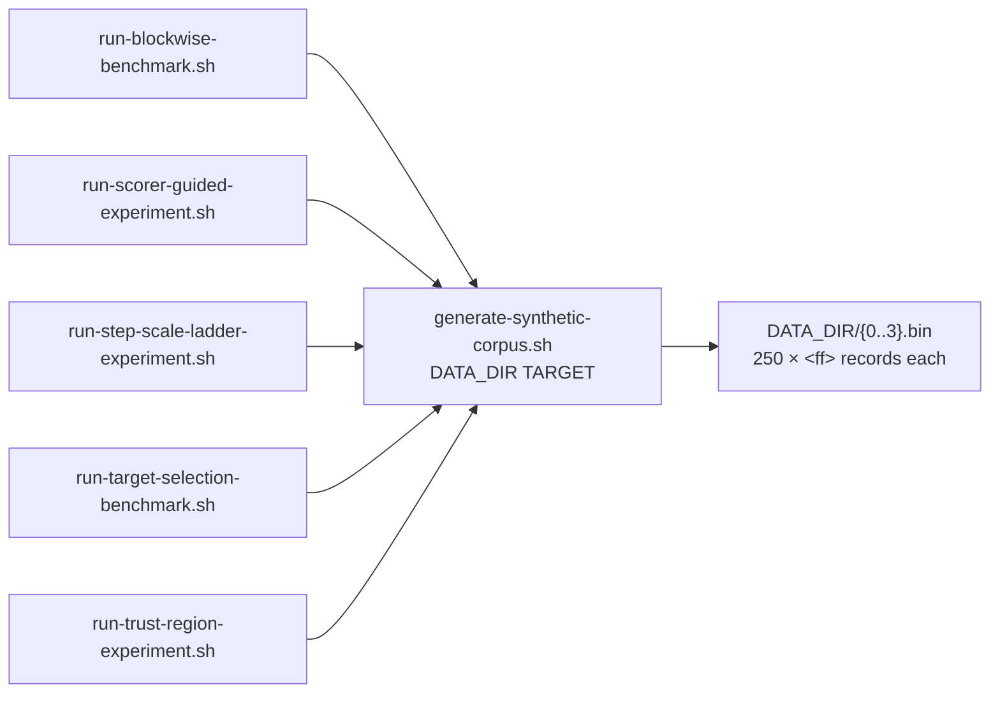

# PR Summary — Issue #178

## Summary

Closes #178.

Five experiment scripts each embedded their own Python heredoc to write the
synthetic corpus. Four were byte-identical and the fifth differed only in its
target. They now call one shared generator,
`scripts/generate-synthetic-corpus.sh DATA_DIR TARGET`. The generator takes a
single parameter: the per-record target formula, an arithmetic expression over
`x` and `i`.

- [x] Failing test first: `scripts/test-generate-synthetic-corpus.sh`. Red at 2/22 before the generator existed.
- [x] Shared generator added. `TARGET` is parsed against an AST allowlist of
      numbers, `x`, `i`, arithmetic, comparisons and `if`/`else`, so calls,
      attributes and other names are refused with exit 2. Every record is
      computed before any file is written, so a failure leaves no partial
      corpus behind to trip a caller's `0.bin` gate.
- [x] All five `run-*` scripts call the generator in place of their heredoc,
      which cuts 89 lines to 10.
- [x] The test is registered in `quality.sh` and in the `ci.yml` job.



## Evidence

This is a CLI-only change, so the evidence is test output. The new corpus was
also diffed against the output of the removed heredocs (taken from `HEAD`).
It is byte-identical for both targets, the contaminated one and
`0.5 * x + 0.25`.

```text
=== generate-synthetic-corpus.sh ===
--- happy path ---
  PASS: contaminated target writes a corpus
  PASS: contaminated corpus decodes to the expected records
  PASS: linear target writes a corpus
  PASS: linear corpus decodes to the expected records
--- edge cases ---
  PASS: an existing empty directory is filled
  PASS: the filled directory decodes correctly
  PASS: a nested, not-yet-created directory is created
  PASS: the nested directory decodes correctly
--- error paths ---
  PASS: no arguments is a usage error
  PASS: a missing target is a usage error
  PASS: an extra argument is a usage error
  PASS: an empty directory argument is a usage error
  PASS: an empty target is a usage error
  PASS: a target naming anything but x and i is refused
  PASS: a target calling a function is refused
  PASS: a target with an attribute access is refused
  PASS: a target that is not an expression is refused
  PASS: a target with a string constant is refused
  PASS: a refused target writes no records
  PASS: a target that fails at evaluation fails loud
  PASS: a failed evaluation leaves no partial corpus
  PASS: a directory path that is a file fails loud

Passed: 22  Failed: 0
```

## Test Plan

- [x] `./scripts/test-generate-synthetic-corpus.sh`: 22/22 pass.
- [x] Old heredoc output compared with `diff -r` against the generator's output: identical.
- [x] `shellcheck -x -s bash scripts/*.sh` passes, and `actionlint` passes on `ci.yml`.
- [x] `./quality.sh < /dev/null` passes: "All quality checks passed!"
- No crate version bump: `scripts/` is not a build-affecting path.
