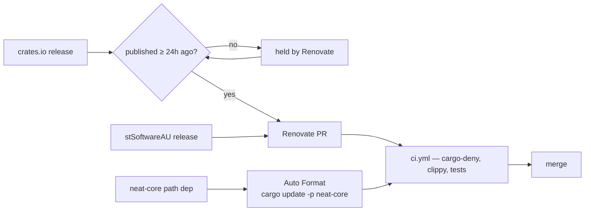

## Summary

External crates.io dependencies (`clap`, `serde`, `serde_json`, `rand`, plus
dev-dependency `tempfile`) had no automated update path — the only automated
bump was `cargo update -p neat-core` in the Auto Format workflow, which covers
the internal sibling path dependency. Added Renovate configuration with a
24-hour quarantine for external crates, plus a validator that gates the policy
locally and in CI. Closes #19.

- `renovate.json` — `config:recommended`, `minimumReleaseAge: "24 hours"`,
  vulnerability alerts on, `neat-core` disabled (path dependency already synced
  by Auto Format), and internal `stSoftwareAU/*` packages exempt from the
  embargo (`minimumReleaseAge: null`, per the Issue #1613 classification). The
  shape mirrors sibling `stSoftwareAU/NEAT-AI`'s `renovate.json`.
- `scripts/check-renovate-config.sh` — fails loud when the quarantine is
  missing, shorter than 24 hours, unparsable, shortened by a rule that is not
  scoped to internal packages, when `neat-core` is left enabled, or when the
  `cargo` manager is switched off.
- Wired into `quality.sh` and the `validation` job of `.github/workflows/ci.yml`
  (`renovate.json` also added to the required-files list).
- Docs: README **Dependency updates** section (with a Mermaid flow), the
  CONTRIBUTING local-gate list, and a CHANGELOG entry.

No version bump: nothing under `backpropagation/src/` changed, so per
CONTRIBUTING this is a docs/CI-config-only change.

## Evidence

Backend/CLI change with no web interface, so no screenshot. Evidence is the
local gate output.

`./quality.sh < /dev/null` passes end to end (shellcheck, workflow validators,
the new Renovate validator and its tests, codespell, cargo-deny, fmt, clippy,
tests, rustdoc):

```text
Validating Renovate dependency-update config...
OK   accepts a 24-hour quarantine with neat-core disabled
OK   accepts a window longer than 24 hours expressed in days
OK   accepts an internal-only exemption from the quarantine
OK   reports a missing config file with exit 2
OK   rejects malformed JSON
OK   rejects a config with no minimumReleaseAge
OK   rejects a quarantine window shorter than 24 hours
OK   rejects an unparsable duration rather than assuming it passes
OK   rejects a package rule that shortens the window for an external crate
OK   rejects an unscoped rule that shortens the window for every crate
OK   rejects a config that leaves the neat-core path dependency enabled
OK   rejects a config where the cargo manager is switched off
OK   rejects a package rule that disables every cargo update
OK   rejects a config with no shared preset in extends
check-renovate-config tests: 14 passed, 0 failed
OK   renovate.json: extends a shared config: preset
OK   renovate.json: minimumReleaseAge '24 hours' meets the 24-hour external quarantine
OK   renovate.json: cargo manager enabled (no enabledManagers allowlist)
OK   renovate.json: no package rule shortens the quarantine for an external crate
OK   renovate.json: no package rule disables the cargo manager
OK   renovate.json: neat-core is disabled (path dependency, synced by Auto Format)
...
All quality checks passed!
```

How an update now reaches `Develop`:



## Test Plan

- Added `scripts/test-check-renovate-config.sh` — 14 cases that run the real
  checker against fixture configs in a temp directory and assert exit codes and
  failure messages:
  - accepts `24 hours`, accepts a longer window in days (`3 days`), accepts an
    internal-only exemption;
  - exit 2 for a missing config; exit 1 for malformed JSON, a missing
    `minimumReleaseAge`, `6 hours`, an unparsable duration (`soon`), a rule
    shortening the window for `clap`, an unscoped rule shortening it for every
    crate, a config leaving `neat-core` enabled, `enabledManagers` without
    `cargo`, a rule disabling the `cargo` manager, and no `config:` preset in
    `extends`.
- The suite runs in `quality.sh` and in the CI `validation` job, immediately
  before the checker runs against the committed `renovate.json`.
- Full `./quality.sh < /dev/null` run passes (existing Rust tests unchanged:
  all crate unit tests green).
