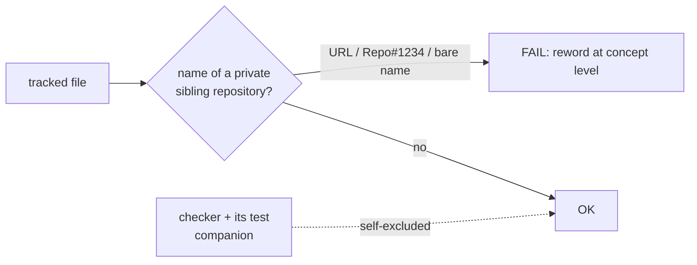

# Extend the private-repo guard to the second private sibling (issue #191)

## Summary

`scripts/check-no-private-repo-references.sh` (added by #189) listed only one
private sibling repository. The second one — the repository whose
version-increment / `runlib.sh` contract this crate mirrors, removed from
`CONTRIBUTING.md` by hand in #190 because the guard did not yet exist on that
branch — was unguarded: nothing stopped the reference being reintroduced.

Two changes close that gap:

1. The second private sibling is added to `PRIVATE_REPOS`.
2. The guard now matches the **repository name itself** rather than only the
   `github.com` URL and `Repo#1234` citation forms. A bare name in a comment
   ("the *X* version-increment contract") is exactly as unfollowable for a
   public reader as a 404 link, and it is the form the remaining references
   actually took. Matching the name subsumes both previous forms, so the
   pattern builder is also one branch simpler.

Four tracked files named the second repository bare and now state the shared
version-marker contract at concept level instead:

| File | Was | Now |
| --- | --- | --- |
| `.github/workflows/version-increment.yml:2` | `(<private repo> version-increment / runlib.sh contract)` | `(the shared runlib.sh version-marker contract)` |
| `quality.sh:39` | `(runlib / <private repo>)` | `(runlib contract)` |
| `scripts/bump-backpropagation-version.sh:10` | `Mirrors <private repo>'s version-increment job` | `Mirrors the shared fleet version-increment job` |
| `scripts/check-version-increment-workflow.sh:2` | `(<private repo> runlib contract)` | `(shared runlib contract)` |

**Archive exclusion: not needed, and deliberately not added.** No file under
`docs/archive/pr-summaries/` names either private repository — `pr-summary-172.md`
already writes "a **private** sibling repository" rather than the name, and this
summary follows the same convention. An archive-path exclusion would be a
permanent hole in the guard bought for a problem that does not exist, so the
guard keeps exactly its two self-excluded script basenames.

No behaviour changes to the crate: the guard, its test companion, four comments
and the changelog entry are all that moved. No build-affecting path is touched.

Closes #191.

## Evidence

Backend/CLI change with no web interface, so there is nothing to screenshot.
The evidence is the checker's own exit codes.

Red before the guard change — the three new cases for the second repository and
the bare-name case all passed vacuously:

```text
FAIL: a full URL to the second private repo is rejected (expected exit 1, got 0)
FAIL: the second private repo's Repo#1234 shorthand is rejected (expected exit 1, got 0)
FAIL: the second private repo named bare in prose is rejected (expected exit 1, got 0)
FAIL: a private repo named bare in prose is rejected (expected exit 1, got 0)
check-no-private-repo-references tests: 12 passed, 4 failed
```

Red after the guard change, before the rewording — the repository-wide case
named every offending file, which is the regression the guard exists to catch:

```text
FAIL .github/workflows/version-increment.yml:2: references a private stSoftware repository
FAIL quality.sh:39: references a private stSoftware repository
FAIL scripts/bump-backpropagation-version.sh:10: references a private stSoftware repository
FAIL scripts/check-version-increment-workflow.sh:2: references a private stSoftware repository
check-no-private-repo-references tests: 15 passed, 1 failed
```

Green after the rewording:

```text
check-no-private-repo-references tests: 16 passed, 0 failed
OK   178 file(s) scanned: no private stSoftware repository references
```

Full gate: `./quality.sh < /dev/null` → `All quality checks passed!` (exit 0),
which includes shellcheck, actionlint, the version-increment workflow validator
and its tests, codespell, `cargo clippy`, and the full Rust test suite.



## Test Plan

`scripts/test-check-no-private-repo-references.sh` — four cases added, all
calling the real checker against a fixture tree and asserting on its exit code
and message:

- `a full URL to the second private repo is rejected` — exit 1
- `the second private repo's Repo#1234 shorthand is rejected` — exit 1
- `the second private repo named bare in prose is rejected` — exit 1
- `concept-level wording for the second private repo passes` — exit 0
- `a private repo named bare in prose is rejected` — exit 1, covering the newly
  matched bare form for the repository the guard already listed

No existing test was removed, weakened or commented out. The pre-existing case
`this repository references no private stSoftware repository` runs the checker
over the real tree and is the regression test for the four reworded comments.

`scripts/test-check-version-increment-workflow.sh` and
`scripts/check-version-increment-workflow.sh` were re-run because the reworded
comments live in the files they validate; both pass unchanged.
