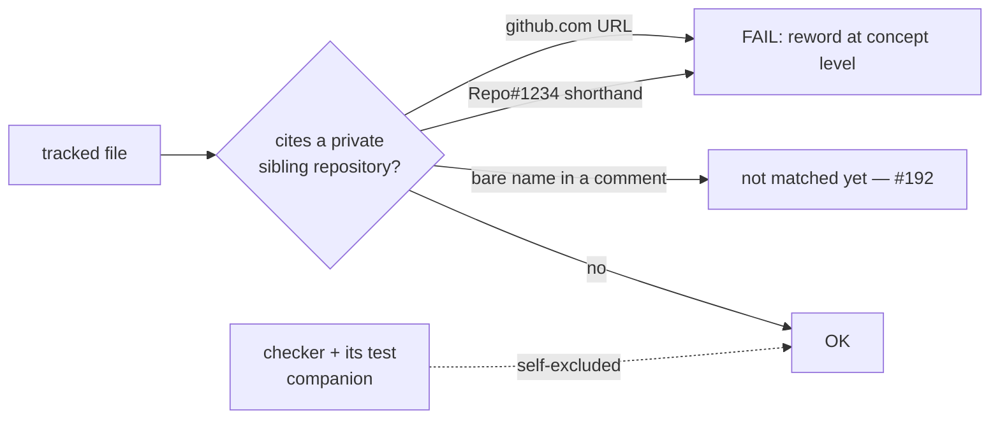

# Extend the private-repo guard to the second private sibling (issue #191)

## Summary

`scripts/check-no-private-repo-references.sh` (added by #189) listed one
private sibling repository. The second one — the repository whose
version-increment / `runlib.sh` contract this crate mirrors, whose URL #190
removed from `CONTRIBUTING.md` by hand because the guard did not yet exist on
that branch — was unguarded: nothing stopped the reference being reintroduced.

This PR:

1. Adds the second private sibling to `PRIVATE_REPOS`, so both its
   `github.com` URL form and its `Repo#1234` shorthand now fail CI. The URL
   form is exactly what the #172 audit found, so the gap that motivated #190 is
   now closed by a gate rather than by hand.
2. Adds five checker cases covering the newly listed name.
3. Rewords the three runlib-contract comments that named it in prose
   (`quality.sh:39`, `scripts/bump-backpropagation-version.sh:10`,
   `scripts/check-version-increment-workflow.sh:2`) to state the shared
   version-marker contract at concept level.

**Archive exclusion: not needed, and deliberately not added.** The issue asked
for a decision between rewording the archived PR summaries and excluding
`docs/archive/pr-summaries/` in the guard. Neither is required: no archived
summary names either private repository — `pr-summary-172.md` already writes
"a **private** sibling repository" rather than the name, and this summary keeps
that convention. An archive-path exclusion would be a permanent hole in the
guard bought for a problem that does not exist, so the guard keeps exactly its
two self-excluded script basenames.

No behaviour change to the crate: the guard, its test companion, three comments
and the changelog entry are all that moved. No build-affecting path is touched.

Closes #191.

### Not in this PR — `.github/workflows/version-increment.yml` (follow-up #192)

One tracked file still names the second private repository bare, with no URL
and no issue number: the version-increment workflow header. It is **not**
matched by the guard, because the guard matches the two citation forms and not
a bare name.

The stronger fix — match the repository name itself, which subsumes both
citation forms — was implemented and verified locally during this run (16/16
checker tests green, `./quality.sh` green) and then **reverted**, because it
cannot be pushed from this environment. Rewording that header is a prerequisite
for it, and this run's `gh` OAuth token carries `repo` but not `workflow`
scope, so both routes to a file under `.github/workflows/` are refused:

```text
! [remote rejected]  refusing to allow an OAuth App to create or update
  workflow `.github/workflows/version-increment.yml` without `workflow` scope
```

```text
gh api -X PUT .../contents/.github/workflows/version-increment.yml
→ HTTP 404 (GitHub's masked 403 for the same missing scope)
```

Landing the bare-name match without that reword would have left CI permanently
red, and adding a path exclusion for the workflow file would have been a
standing hole in the guard. So the pushable half ships here and the remainder
is **stSoftwareAU/NEAT-AI-Backpropagation#192**, which carries the verified
diff, the exact refusals above, and the note that it needs an actor with
`workflow` scope. The guard's header comment names #192 in place, so the
limitation is stated where a reader of the guard will see it rather than only
in a tracker.

## Evidence

Backend/CLI change with no web interface, so there is nothing to screenshot.
The evidence is the checker's own exit codes.

Red — with the second repository removed from `PRIVATE_REPOS` and the new cases
in place, every new case passes vacuously:

```text
FAIL: a full URL to the second private repo is rejected (expected exit 1, got 0)
FAIL: the second private repo's Repo#1234 shorthand is rejected (expected exit 1, got 0)
FAIL: the second private repo's owner/repo shorthand is rejected (expected exit 1, got 0)
FAIL: both private repos are matched by the one pattern (output missing 'CONTRIBUTING.md:1')
check-no-private-repo-references tests: 12 passed, 4 failed
```

Green — with the name listed:

```text
check-no-private-repo-references tests: 16 passed, 0 failed
OK   178 file(s) scanned: no private stSoftware repository references
```

Full gate: `./quality.sh < /dev/null` → `All quality checks passed!` (exit 0),
covering shellcheck, actionlint, the version-increment workflow validator and
its tests, codespell, `cargo clippy` and the full Rust test suite. The
version-increment validators were re-run specifically because the reworded
comments live in files they read; both pass unchanged.



## Test Plan

`scripts/test-check-no-private-repo-references.sh` — five cases added, each
calling the real checker against a fixture tree and asserting on its exit code
and reported `file:line`:

- `a full URL to the second private repo is rejected` — exit 1
- `the second private repo's Repo#1234 shorthand is rejected` — exit 1
- `the second private repo's owner/repo shorthand is rejected` — exit 1
- `concept-level wording for the second private repo passes` — exit 0
- `both private repos are matched by the one pattern` — exit 1, a two-file
  fixture proving the generated alternation covers every entry rather than
  only the first

No existing test was removed, weakened or commented out. The pre-existing case
`this repository references no private stSoftware repository` runs the checker
over the real tree and keeps the whole repository honest.
