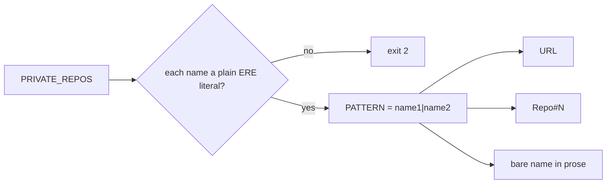

# PR Summary — Issue #192

## Summary

`scripts/check-no-private-repo-references.sh` now builds its pattern from the
bare private repository names. A github.com URL, the `Repo#N` shorthand and a
bare mention in prose all contain the name, so one alternation catches all
three. Before this change the checker matched only the first two. Closes #192.

- `PATTERN` is the `|`-joined list of names, so the loop that built the
  alternation is gone. Each name must be a plain ERE literal
  (`[A-Za-z0-9_-]+`), and any other name makes the checker exit 2 instead of
  scanning with a wider pattern.
- The header comment now lists all three citation forms and drops the
  "not yet caught" note.
- The tests read `PRIVATE_REPOS` from the checker. Each listed repository gets
  a red case for a bare name in prose. There is also a green concept-level
  case and an error-path case for a name that is not an ERE literal.
- `docs/archive/pr-summaries/pr-summary-193.md` had one line that named a
  private sibling repository bare. It now uses concept-level wording, so the
  archive needs no exclusion.
- Item 1 of the issue (the concept-level wording in
  `.github/workflows/version-increment.yml:2`) already landed on `Develop` in
  #193, so this PR does not touch any workflow file.

## Evidence

This is a CLI-only change, so there is no UI to screenshot.

- Red (new tests against the old pattern): `17 passed, 2 failed`. Both
  bare-name-in-prose cases failed with `expected exit 1, got 0`.
- Green: `check-no-private-repo-references tests: 20 passed, 0 failed`.
- Repository scan: `OK   187 file(s) scanned: no private stSoftware repository
  references`.
- `./quality.sh < /dev/null`: `All quality checks passed!`

## Acceptance Criteria

<!-- vibe-spec-review inputs="diff+issue-body" -->

- [x] Reword `.github/workflows/version-increment.yml:2` to concept level.
      Already done on `Develop` by #193 (4c73f29); line 2 reads "shared fleet
      version-increment job / runlib.sh contract". reviewer: met (by the
      earlier commit)
- [x] Build `PATTERN` from the bare names and update the header comment.
      `scripts/check-no-private-repo-references.sh`. reviewer: met
- [x] Add red/green bare-name-in-prose cases for each listed repository.
      `scripts/test-check-no-private-repo-references.sh`. reviewer: met
- [x] Add no archive exclusion. reviewer: met
- [x] unrequested: reword the bare name in `pr-summary-193.md`. Without it, the
      new pattern would fail CI. reviewer: justified
- [x] unrequested: add #192 to the test file's header issue list. reviewer:
      justified
- [x] unrequested: require each name to be an ERE literal (exit 2 otherwise),
      with a test. This came from the standards reviewer's nit. reviewer:
      raised by the standards review

## Standards Review

<!-- vibe-standards-review inputs="diff+CODING-STANDARDS.md" -->

The repository has no `CODING-STANDARDS.md`, so the review used the fleet
standards. It found no blockers and nothing to fix.

- Fixed: the "plain ERE literal" assumption had been stated only in a comment.
  The checker now enforces it and fails loudly.
- Not changed: matching is case-sensitive. The existing citation forms are
  case-sensitive too; a case-insensitive match is separate work.
- Not changed: `mapfile` needs bash 4. `check-cross-repo-defect-record.sh` and
  `check-lockfile-integrity.sh` already use it.
- Not changed: the test requires at least two parsed names. That fails loudly
  if the list ever stops parsing.

## Test Plan

- [x] `bash scripts/test-check-no-private-repo-references.sh < /dev/null`:
      20 passed, 0 failed.
- [x] `scripts/check-no-private-repo-references.sh`: exit 0, 187 files.
- [x] `./quality.sh < /dev/null`: passes.
