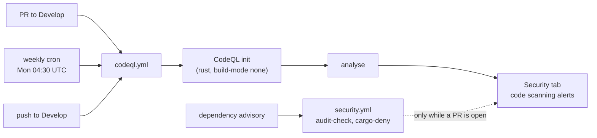

## Summary

The four committed workflows analysed *dependencies* only — `rustsec/audit-check`
and `cargo-deny` catch known-vulnerable crates, but nothing scanned this crate's
own Rust, and both gates run only while a pull request happens to be open. Added
CodeQL code scanning plus a validator that gates its shape locally and in CI.
Closes #20.

- `.github/workflows/codeql.yml` — CodeQL `security-and-quality` analysis of
  `rust` (`build-mode: none`), triggered on pull requests to `Develop` /
  `milestone/**`, on pushes to `Develop` (refreshes the baseline PR alerts are
  diffed against), on a weekly cron (Mondays 04:30 UTC), and on
  `workflow_dispatch`. `security-events: write` is scoped to the one job;
  actions are pinned to commit SHAs (`github/codeql-action` at
  `c16c0f3f…`, `codeql-bundle-v2.26.3`, published 2026-08-12 — clear of the
  repo's 24-hour supply-chain quarantine). The existing
  `setup-neat-core` composite runs first so the `neat-core` path dependency
  resolves during extraction.
- `scripts/check-codeql-workflow.sh` — fails loud when the workflow is missing
  (exit 2), does not cover `Develop`, has no schedule or one slower than weekly,
  lacks `security-events: write`, never analyses Rust, is missing either the
  `init` or `analyze` step, or pins a third-party action to a movable tag.
- Wired into `quality.sh` and the `validation` job of `.github/workflows/ci.yml`
  (`.github/workflows/codeql.yml` also added to the required-files list).
- Docs: README **Code scanning** section (with a Mermaid flow), a SECURITY.md
  **Automated scanning** table, the CONTRIBUTING local-gate list, and a
  CHANGELOG entry.

**Deliberately out of scope.** Secret scanning / gitleaks (#42), Semgrep SAST
(#43) and re-enabling `dependency-review-action` (#28) are each tracked by their
own open issue and are untouched here.

**Dependabot half handed off.** Dependabot alerts and security updates are a
repository *setting*, not a committed file — `.github/dependabot.yml` configures
version updates, which Renovate already owns (#19), so committing one would
duplicate that ownership without enabling security updates. The worker account
has no admin on this repo (`PUT /vulnerability-alerts` and
`PUT /automated-security-fixes` both return 404), so it is tracked as follow-up
issue #58 for a human administrator, and the current state is documented in
SECURITY.md.

No version bump: nothing under `backpropagation/src/` changed, so per
CONTRIBUTING this is a docs/CI-config-only change.

## Evidence

Backend/CI change with no web interface, so no screenshot. Evidence is the local
gate output.

`./quality.sh < /dev/null` passes end to end, including the new validator and its
tests:

```text
Validating CodeQL code-scanning workflow...
OK   accepts a weekly Rust analysis on PRs to Develop
OK   accepts a cadence more frequent than weekly
OK   accepts Rust declared through a build matrix
OK   reports a missing workflow with exit 2
OK   rejects a workflow with no pull_request trigger
OK   rejects a pull_request trigger that skips the default branch
OK   rejects a workflow that only runs when a PR is open
OK   rejects a monthly schedule as slower than weekly
OK   rejects a cron expression that is not five fields
OK   rejects a workflow that cannot upload its results
OK   rejects a workflow that never analyses Rust
OK   rejects an init step with no matching analyze step
OK   rejects an action pinned to a movable tag
check-codeql-workflow tests: 13 passed, 0 failed
OK   .github/workflows/codeql.yml: pull_request trigger covers the Develop default branch
OK   .github/workflows/codeql.yml: scheduled analysis runs at least weekly, independent of PR activity
OK   .github/workflows/codeql.yml: security-events: write present (results reach the Security tab)
OK   .github/workflows/codeql.yml: rust is analysed
OK   .github/workflows/codeql.yml: github/codeql-action/init step present
OK   .github/workflows/codeql.yml: github/codeql-action/analyze step present
OK   .github/workflows/codeql.yml: every third-party action is pinned to a commit SHA
...
All quality checks passed!
```

Rust unit and integration tests are unchanged and green (`cargo test --workspace
--all-features`), as are clippy, fmt and rustdoc.

When the repository's own code is now analysed:



## Test Plan

- Added `scripts/test-check-codeql-workflow.sh` — 13 cases that run the real
  checker against fixture workflows in a temp directory and assert exit codes and
  failure messages:
  - accepts the weekly Rust-on-`Develop` shape, a more frequent (daily) cadence,
    and Rust declared through a build matrix;
  - exit 2 for a missing workflow; exit 1 for no `pull_request` trigger, a
    `pull_request` trigger that skips `Develop`, no `schedule`, a monthly cron
    (`30 4 1 * *`), a cron that is not five fields, a missing
    `security-events: write`, a workflow analysing only JavaScript, an `init`
    with no `analyze`, and an action pinned to `@v4` instead of a SHA.
- The suite runs in `quality.sh` and in the CI `validation` job, immediately
  before the checker runs against the committed `.github/workflows/codeql.yml`.
- Full `./quality.sh < /dev/null` run passes (existing Rust tests unchanged: all
  crate unit and integration tests green).
