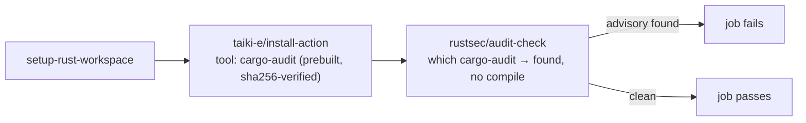

# PR Summary — Issue #204: prebuilt `cargo-audit` in `security.yml`

## Summary

Closes #204

`rustsec/audit-check` was compiling `cargo-audit` from source on every run
(median ~186s, ~34 runs/week). Its `findOrInstall` only runs `cargo install`
when `which cargo-audit` fails, so `security.yml` now installs the prebuilt
binary first with `taiki-e/install-action` (the action `ci.yml` already uses for
`cargo-deny`), SHA-pinned to v2.81.10. The audit step — SHA, `token:` and
failure behaviour — is unchanged.



- [x] Install prebuilt `cargo-audit` before `rustsec/audit-check`
- [x] Add `scripts/check-cargo-audit-workflow.sh` and its fixture tests
- [x] Wire the check into `quality.sh` and `ci.yml`
- [x] Document it in `README.md` and `CHANGELOG.md`
- [x] Re-verify the audit still fails on a vulnerable `Cargo.lock`

## Evidence

CI-only change; no UI.

**Gate still fails on a vulnerable lockfile.** `taiki-e/install-action` at
`7a79fe8c` pins `cargo-audit` 0.22.2 with a sha256 per target. The x86_64
prebuilt cannot run on this aarch64 container, so the same 0.22.2 was built
locally (`cargo install cargo-audit --version 0.22.2 --locked`) and run the way
audit-check runs it (`--json`, then `vulnerabilities.found`):

| Lockfile | Exit | `vulnerabilities.found` |
| -------- | ---- | ----------------------- |
| synthetic, `time 0.1.43` | 1 | `true` — `RUSTSEC-2020-0071` |
| this repo's `Cargo.lock` | 0 | `false` |

audit-check parses that JSON and calls `core.setFailed` on any vulnerability;
supplying the binary on `PATH` changes only where the binary comes from.

**Regression guard** — `scripts/test-check-cargo-audit-workflow.sh` (written
first; failed before the checker existed, then failed on the committed
workflows until `security.yml` was fixed):

```text
check-cargo-audit-workflow tests: 12 passed, 0 failed
```

The checker fails if the audit step disappears, is unpinned or loses `token:`,
or if the SHA-pinned `cargo-audit` install is missing or runs after the audit.

## Test Plan

- [x] `./scripts/test-check-cargo-audit-workflow.sh` — 12 passed
- [x] `./scripts/check-cargo-audit-workflow.sh` — OK on committed workflows
- [x] `actionlint` on `ci.yml` and `security.yml` — clean
- [x] `./quality.sh < /dev/null`
- [ ] CI `security` job duration drops by ~3 minutes on this PR
