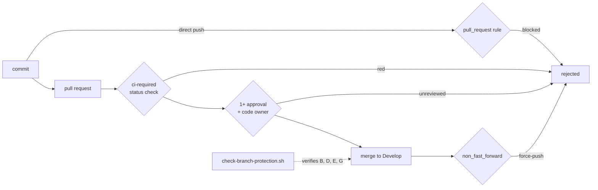

## Summary

`.github/CODEOWNERS` and the `ci-required` aggregator in `ci.yml` only have
teeth if the `Develop` ruleset asks for them, but nothing in the checkout said
what that ruleset must contain — so drift was invisible. Recorded the policy and
added a checker that verifies it against the live GitHub API. Closes #21.

- `scripts/check-branch-protection.sh` — compares the rules returned by
  `gh api repos/OWNER/REPO/rules/branches/BRANCH` (or a saved payload passed as
  an argument) with the policy: a `pull_request` rule, at least one approving
  review, `require_code_owner_review`, `CI Required Checks` registered as a
  required status check, and `non_fast_forward`. Exit 0 satisfied, 1 broken,
  2 rules unreadable — never a silent pass.
- Wired into `quality.sh` and the `validation` job of `.github/workflows/ci.yml`.
  The unit tests are a **hard** gate; the live check is **advisory** (a loud
  `FAIL` block plus a `::warning::` annotation) because a ruleset is a
  repository setting only an administrator can repair — the same treatment
  SECURITY.md already gives Dependabot settings. Blocking every merge behind a
  setting contributors cannot change would wedge the repo.
- Docs: a **Branch protection** section in `CONTRIBUTING.md` (rule table, why
  each rule exists, how to verify, how an admin repairs drift), a cross-linked
  section in `SECURITY.md`, the local-gate checklist, and a CHANGELOG entry.

**Signed commits deliberately excluded.** The issue floated them as optional.
Auto Format (`auto-format.yml:80-105`) and Version Increment
(`version-increment.yml:68-98`) push unsigned bot commits back to PR branches,
so requiring signatures would block the repository's own automation. That
decision is recorded in CONTRIBUTING.md rather than left implicit.

**Half of this needs an administrator — handed off, not suggested.** Three of
the five rules are not set on ruleset `20769028` today
(`required_approving_review_count: 0`, `require_code_owner_review: false`, no
`non_fast_forward`). The worker account has `admin: false`; a read-modify-write
`PUT /repos/stSoftwareAU/NEAT-AI-Backpropagation/rulesets/20769028` was
attempted and returned 404. Tracked as
[#60](https://github.com/stSoftwareAU/NEAT-AI-Backpropagation/issues/60)
(`needs-human`) with the exact command an admin runs; the checker exits 0 once
it is applied.

No version bump: nothing under `backpropagation/src/` changed, so per
CONTRIBUTING this is a docs/CI-config-only change.

## Evidence

Backend/CI change with no web interface, so no screenshot. Evidence is the local
gate output.

The checker against the live ruleset — the drift it exists to surface:

```text
Validating default-branch protection policy...
…
check-branch-protection tests: 12 passed, 0 failed
FAIL stSoftwareAU/NEAT-AI-Backpropagation@Develop: required_approving_review_count is 0 — a single account can merge its own change; require at least 1
FAIL stSoftwareAU/NEAT-AI-Backpropagation@Develop: require_code_owner_review is off — .github/CODEOWNERS is advisory, so a workflow edit can merge without an owner's review
FAIL stSoftwareAU/NEAT-AI-Backpropagation@Develop: no non_fast_forward rule — merged history can be rewritten by a force-push
OK   stSoftwareAU/NEAT-AI-Backpropagation@Develop: pull_request rule present — every change arrives through a PR
OK   stSoftwareAU/NEAT-AI-Backpropagation@Develop: 'CI Required Checks' is a required status check
WARNING: Develop branch protection does not satisfy the committed policy
         — a repository administrator must apply it (CONTRIBUTING.md)
```

`./quality.sh < /dev/null` passes end to end (`All quality checks passed!`),
including the 12 new fixture tests; Rust fmt, clippy, tests and rustdoc are
unchanged and green.

What each policy rule blocks on the path to `Develop`:



## Test Plan

- Added `scripts/test-check-branch-protection.sh` — 12 cases that run the real
  checker against fixture `rules/branches` payloads in a temp directory and
  assert exit codes and failure messages. No network or `gh` auth needed:
  - accepts the compliant ruleset, and a stricter one (two approvals, deletion
    blocked) — the check is a floor, not an equality test;
  - exit 1 for zero required approvals, `require_code_owner_review: false`, a
    missing `pull_request` rule, a status-check rule without
    `CI Required Checks`, no `required_status_checks` rule at all, a missing
    `non_fast_forward` rule, and an empty (unprotected) rules array;
  - exit 2 for a missing payload, a payload that is not a JSON array, and
    malformed JSON.
- The suite runs in `quality.sh` and in the CI `validation` job, immediately
  before the checker runs against the live ruleset.
- Full `./quality.sh < /dev/null` run passes (existing Rust unit and
  integration tests unchanged: all green).
