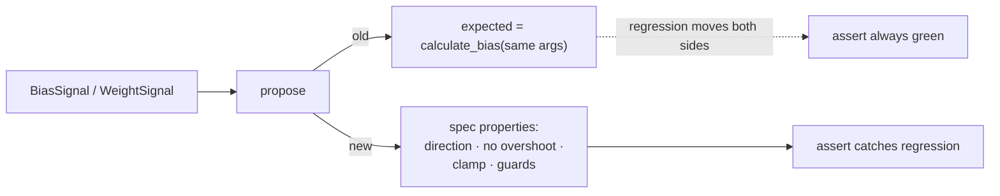

# Behaviour-based assertions for `BiasSignal::propose` / `WeightSignal::propose`

## Summary

`bias_propose_uses_neat_core_calculate_bias` and
`weight_propose_uses_neat_core_calculate_weight` computed their expected value
by calling the very neat-core function `propose` delegates to, with mirrored
arguments. Both sides of the assertion moved together, so the tests could never
catch a wrong proposed value — what they pinned was *which* internal function
`propose` calls and in what argument order (a HOW assertion).

Both tests are replaced with behaviour-based ones that assert observable
properties of the proposed value against the spec. Coverage went from 2 tests
to 6, and the `disable_bias_adjustment` / `disable_weight_adjustment` guards
(`backpropagation/src/backprop.rs:172`, `:224`) now have tests — previously
neither did. No production code changed. Closes #22.

## Evidence

The tautology is demonstrable. Sign-flipping `calculate_bias` in the sibling
`neat-core` working copy (`adjusted_bias = -total_bias / samples`) and running
the bias tests:

| Test | Regressed neat-core |
| ---- | ------------------- |
| `bias_propose_uses_neat_core_calculate_bias` (old, mirrored) | **passed** |
| `bias_propose_steps_towards_accumulated_mean_without_overshooting` (new) | FAILED |
| `bias_propose_step_never_exceeds_maximum_bias_adjustment_scale` (new) | FAILED |

The neat-core edit was reverted immediately after the check (`git checkout --`,
`git status` clean); it is not part of this PR.

Backend-only change — no web interface to screenshot. Verified with
`./quality.sh < /dev/null` (fmt, clippy `-D warnings`, cargo-deny, full test
suite, rustdoc): all checks passed.

## Test Plan

Removed (replaced, not deleted outright — behaviour is now covered by the six
tests below):

- `backprop::tests::bias_propose_uses_neat_core_calculate_bias`
- `backprop::tests::weight_propose_uses_neat_core_calculate_weight`

Added in `backpropagation/src/backprop.rs`:

- `bias_propose_steps_towards_accumulated_mean_without_overshooting` — a
  positive accumulation moves the bias positive, a negative one negative, the
  proposal never passes the accumulated mean, and a larger learning rate takes
  a larger step.
- `bias_propose_step_never_exceeds_maximum_bias_adjustment_scale` — an enormous
  signal still moves the bias, but by no more than the configured clamp.
- `bias_propose_returns_current_bias_when_adjustment_disabled` —
  `disable_bias_adjustment: true` returns `current_bias` exactly.
- `bias_propose_returns_current_bias_without_usable_signal` — an empty
  accumulator and a `no_change` accumulator both leave the bias untouched.
- `weight_propose_steps_towards_accumulated_target_without_overshooting` — the
  proposal moves towards the accumulated adjusted-value-per-activation target
  from either side without passing it; a larger learning rate steps further.
- `weight_propose_step_never_exceeds_maximum_weight_adjustment_scale` — as
  above for the weight clamp.
- `weight_propose_returns_current_weight_when_adjustment_disabled` and
  `weight_propose_returns_current_weight_without_usable_signal` — the disabled,
  empty, and no-activation-mass guards return `current_weight` unchanged.
