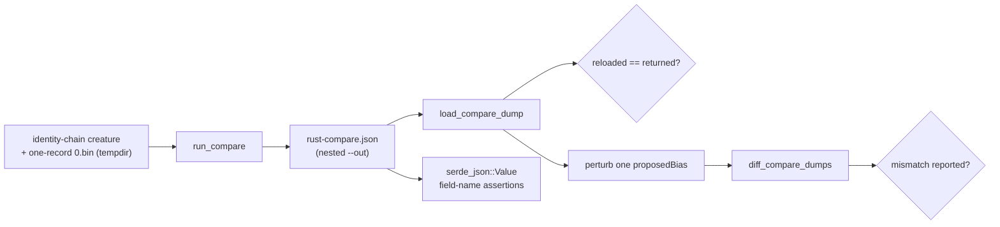

# Parity dump round-trip coverage for `run_compare` / `load_compare_dump`

## Summary

`backpropagation/src/compare.rs` is the Rust side of the Rust ↔ TypeScript
parity protocol, but the dump's **file** round-trip had no coverage:
`load_compare_dump` was never called by a test, and the module's only
round-trip test (`dump_round_trip_nearly_equal`) diffs an in-memory dump against
itself — so it never serialises to disk, never parses one back, and, being a
self-diff, can never exercise the mismatch side of `diff_compare_dumps`. That
left the serde wire contract (`camelCase` plus the explicit `fromUUID` /
`toUUID` renames at `backpropagation/src/compare.rs:36-40`) unguarded: a field
rename on either side would silently break production parity while the suite
stayed green.

This adds four behaviour-based tests over the real functions — no source-text
inspection — plus a patch version bump (`0.1.8` → `0.1.9`) and a CHANGELOG
entry. No production code changed. Closes #23.

## Evidence

Backend/CLI change with no web interface, so there is no screenshot; the
evidence is the test run and a mutation check.

`./quality.sh < /dev/null` passes end to end (shellcheck, workflow validators,
codespell, cargo-deny, fmt, clippy `-D warnings`, tests, rustdoc):

```text
running 6 tests
test compare::tests::diff_reports_a_perturbed_proposed_bias ... ok
test compare::tests::compare_dump_survives_the_file_round_trip ... ok
test compare::tests::dump_round_trip_nearly_equal ... ok
test compare::tests::load_compare_dump_fails_loudly_on_bad_input ... ok
test compare::tests::dump_file_keeps_the_typescript_wire_field_names ... ok
test compare::tests::run_compare_mse_matches_pre_delegation_baseline ... ok

test result: ok. 6 passed; 0 failed
...
All quality checks passed!
```

**Mutation check** — the guard actually catches the drift it exists for.
Deleting `#[serde(rename = "fromUUID")]` from `SynapseCompare` (the exact
rename-drift the issue describes) fails the new test, while the symmetric
in-memory tests stay green:

```text
test compare::tests::dump_file_keeps_the_typescript_wire_field_names ... FAILED
panicked at backpropagation/src/compare.rs:518:13:
synapse row is missing `fromUUID`
```

The rename was restored immediately after the check.

Covered path:



## Test Plan

Added to `backpropagation/src/compare.rs` (`mod tests`), all using the existing
`tempfile` fixture style:

- `compare_dump_survives_the_file_round_trip` — writes a three-record `0.bin`
  and an identity-chain creature, calls `run_compare` with a **nested** `--out`
  path (so parent-directory creation is exercised too), then
  `load_compare_dump` on that path. Asserts the reloaded dump equals the
  returned one, that `records`, `mse`, the neuron UUID keys and the synapse
  `(from, to)` UUID keys survive, that the fixture actually accumulated
  (a vacuous round-trip fails loud), and that a `strict` self-diff is clean.
- `dump_file_keeps_the_typescript_wire_field_names` — parses the written file as
  `serde_json::Value` and asserts every top-level, neuron and synapse key the
  Deno harness reads, including `fromUUID` / `toUUID`.
- `diff_reports_a_perturbed_proposed_bias` — perturbs one reloaded
  `proposed_bias` by `1.0` and asserts `diff_compare_dumps` reports
  `neuron[<uuid>].proposedBias` with the right left/right values and a non-zero
  overlap. This is the diff's first failure-detecting coverage.
- `load_compare_dump_fails_loudly_on_bad_input` — a missing file, truncated
  JSON, and a dump using `snake_case` synapse UUID keys must each return `Err`
  rather than a silently defaulted dump a later diff would read as parity.

No existing test was modified or removed.
