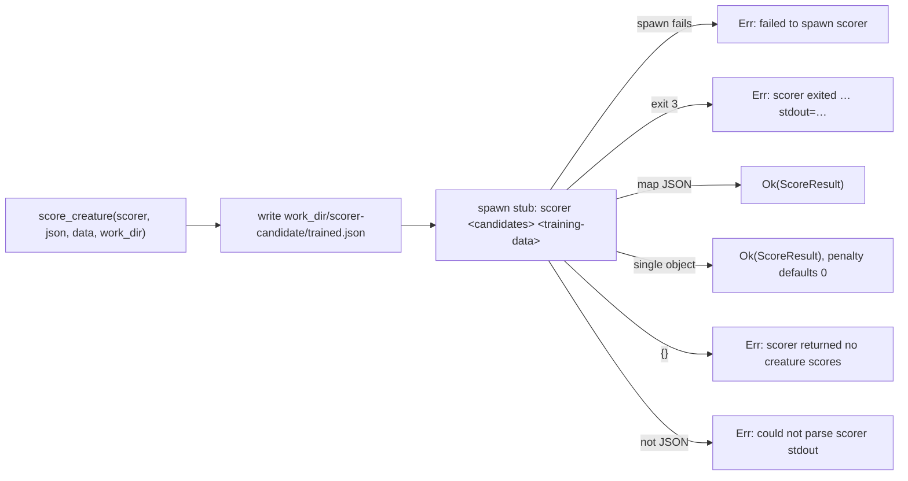

# Cover `score_creature` at the process boundary (issue #24)

## Summary

`score_creature` (`backpropagation/src/scorer.rs:24`) is the authoritative
accept gate in the production win protocol — `run_train` calls it for the
baseline and best creatures whenever `--scorer` is set
(`backpropagation/src/train.rs:207-221`) — but no test referenced the symbol.
The module's only test covered the happy map-form path of the *private* stdout
parser, so the candidate-directory layout, the non-zero-exit error, the
single-object stdout fallback and the "no creature scores" error could all be
broken by a refactor with the suite still green.

This PR adds `backpropagation/tests/scorer_boundary.rs`, a behaviour (WHAT)
test file that fakes the one legitimate boundary — the external `rust_scorer`
binary — with tiny `/bin/sh` stubs written into a `tempfile` directory, and
asserts on the `ScoreResult` values and error strings `score_creature` returns.
No production code changed, so no version bump is required (the version
contract in CONTRIBUTING.md applies to `backpropagation/src/` changes).

Closes #24.

## Evidence

Test-only change to a CLI crate — there is no web interface to screenshot.

Full local gate is green (`./quality.sh < /dev/null`): shellcheck, workflow and
Renovate validators, codespell, `cargo deny check`, `cargo fmt --check`,
clippy with `-D warnings`, the whole test suite, and rustdoc.

```text
running 8 tests
test hands_the_creature_to_the_scorer_as_trained_json_in_a_candidate_directory ... ok
test falls_back_to_a_single_result_object_without_a_stem_key ... ok
test ignores_scorer_log_lines_printed_before_the_result ... ok
test reports_a_scorer_binary_that_cannot_be_spawned ... ok
test reports_a_non_zero_exit_with_its_status_and_stdout ... ok
test reports_an_empty_score_map_as_no_creature_scores ... ok
test reports_unparsable_stdout ... ok
test returns_the_scored_creature_from_map_stdout ... ok

test result: ok. 8 passed; 0 failed; 0 ignored; 0 measured; 0 filtered out
```

The net was checked against deliberate regressions rather than assumed: with
the exit-status guard replaced by `if false` **and** the candidate directory
renamed `scorer-candidate` → `scorer-cands`, the suite failed exactly the two
tests that own those contracts (`reports_a_non_zero_exit_with_its_status_and_stdout`,
`hands_the_creature_to_the_scorer_as_trained_json_in_a_candidate_directory`) —
`6 passed; 2 failed`. `scorer.rs` was restored immediately; the diff contains
no production change.

What each stub drives:



## Test Plan

Added `backpropagation/tests/scorer_boundary.rs` (unix-gated — the stubs need
executable-bit semantics):

- `returns_the_scored_creature_from_map_stdout` — map form
  (`{"trained":{…}}`) returns the full `ScoreResult`, `complexityPenalty`
  included.
- `falls_back_to_a_single_result_object_without_a_stem_key` — a bare result
  object still scores; the optional penalty defaults to `0.0`.
- `ignores_scorer_log_lines_printed_before_the_result` — log noise ahead of the
  final JSON line does not defeat parsing.
- `hands_the_creature_to_the_scorer_as_trained_json_in_a_candidate_directory` —
  the stub reads back `argv[1]/trained.json` and `argv[2]`, pinning the layout
  the real `rust_scorer` depends on.
- `reports_a_non_zero_exit_with_its_status_and_stdout` — exit 3 fails loud, and
  the error names the status and carries the scorer's stdout.
- `reports_an_empty_score_map_as_no_creature_scores` — `{}` yields exactly
  `scorer returned no creature scores`.
- `reports_unparsable_stdout` — non-JSON stdout yields
  `could not parse scorer stdout: …`.
- `reports_a_scorer_binary_that_cannot_be_spawned` — a missing binary yields
  `failed to spawn scorer …` rather than a silent pass.

No existing test was modified or removed. `CHANGELOG.md` gains one `Added`
entry under `[Unreleased]`.
