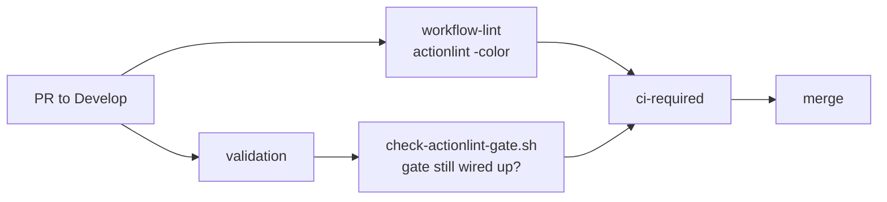

# Missing CI lint gate for `github-actions` (Issue #26)

## Summary

No workflow invoked `actionlint`, so workflow YAML was the one part of this
repository no gate read — clippy, shellcheck and codespell all stop at the
repository's own sources, and an invalid expression or an unknown `runs-on`
only surfaced the next time the workflow ran.

- **`.github/workflows/ci.yml`** — new `workflow-lint` job installs a
  version-pinned `actionlint` (v1.7.12), verifies its SHA-256 before running
  it, and lints `.github/workflows`. It is listed in the `ci-required`
  aggregator's `needs:` and checked in its result table, so a lint failure
  blocks the merge rather than reporting beside it.
- **`scripts/check-actionlint-gate.sh`** — gates the policy itself: the gate
  must exist, keep its exit code, run under strict bash, be waited on by
  another job, and pull the linter from a pinned, checksum-verified source.
  Wired into the `validation` CI job and `quality.sh`.
- **`quality.sh`** — runs `actionlint` locally and then the gate checker, so
  the local gate mirrors CI (actionlint is now a documented prerequisite).

Closes #26.

## Evidence

Backend/CI change — no web interface to screenshot.

`actionlint` caught a real defect during this change: an indentation slip put
`WORKFLOW_LINT_RESULT` at step level instead of inside the aggregator's `env:`
map, which GitHub would have accepted as a silently-unset variable at runtime:

```text
.github/workflows/ci.yml:295:9: unexpected key "WORKFLOW_LINT_RESULT" for step
to run shell command. expected one of "continue-on-error", "env", "id", "if",
"name", "run", "shell", "timeout-minutes", "working-directory" [syntax-check]
```

After the fix, `actionlint` is clean and the gate checker passes against the
real workflow:

```text
$ actionlint -no-color; echo "exit=$?"
exit=0

$ ./scripts/check-actionlint-gate.sh
OK   .github/workflows/ci.yml: job 'workflow-lint' invokes actionlint
OK   .github/workflows/ci.yml: job 'workflow-lint' runs under strict bash (set -euo pipefail)
OK   .github/workflows/ci.yml: job 'workflow-lint' is listed in another job's needs: (it gates the merge)
OK   .github/workflows/ci.yml: job 'workflow-lint' verifies the downloaded linter's checksum
```

Removing the `workflow-lint` job from a copy of the real `ci.yml` fails the
gate, so the lint cannot be dropped without CI noticing:

```text
$ ./scripts/check-actionlint-gate.sh /tmp/ci-no-lint.yml; echo "exit=$?"
FAIL /tmp/ci-no-lint.yml: no actionlint invocation — workflow YAML regressions would not fail the build
exit=1
```

`./quality.sh < /dev/null` → `All quality checks passed!`



## Test Plan

`scripts/test-check-actionlint-gate.sh` — 11 cases, each writing a fixture
workflow and asserting the real checker's exit code and message:

- accepts a checksum-verified, merge-gating actionlint job (exit 0)
- accepts a SHA-pinned actionlint action (exit 0)
- reports a missing workflow with exit 2
- rejects a workflow that only mentions actionlint in a comment or step name
- rejects `actionlint … || true` (swallowed exit code)
- rejects a lint job marked `continue-on-error: true`
- rejects a lint job with no `set -euo pipefail`
- rejects a lint job no other job lists in `needs:`
- rejects an actionlint action pinned to a movable tag
- rejects an unverified linter download (no sha256 check)
- rejects a download pinned to the floating `releases/latest`

The suite runs in CI's `validation` job and in `quality.sh`, immediately before
the checker itself runs against the committed `ci.yml`.
