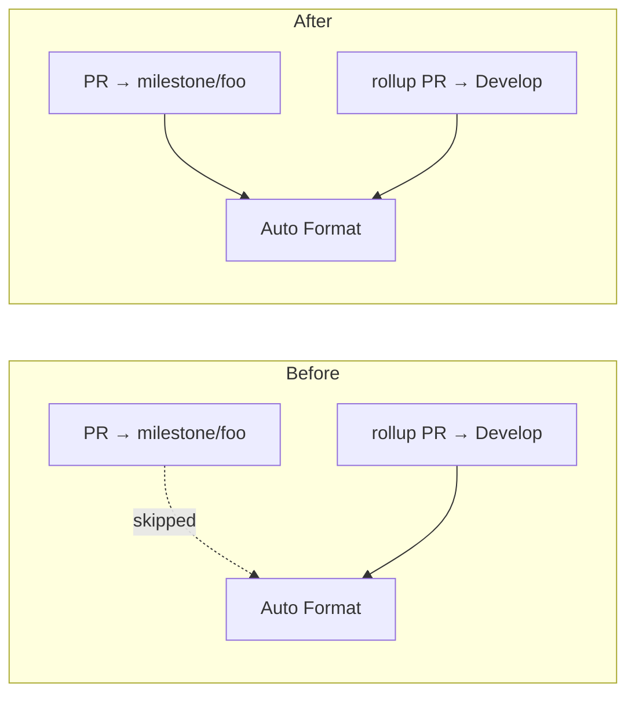

# Gate milestone PRs in the Auto Format workflow (Issue #27)

## Summary

`.github/workflows/auto-format.yml` filtered `pull_request` events to the
`Develop` branch only. Milestone sub-issue PRs target a shared
`milestone/<slug>` branch, so the Auto Format gate never ran on them — every
intermediate PR merged into the milestone branch unformatted and with a
`Cargo.lock` lagging NEAT-AI-core, and the drift only surfaced on the single
rollup PR into `Develop`.

The filter now also matches `milestone/**`, the same pattern `ci.yml` and
`codeql.yml` already use. To stop the gap reappearing,
`scripts/check-auto-format-workflow.sh` gained a ninth rule: the workflow's
`pull_request` branch filter must either be absent (every PR gated) or include a
wildcard rooted at `milestone/`. A single literal `milestone/<name>` entry covers
only that one branch, so it does not satisfy the rule.

Closes #27.

## Evidence

Backend/CI change with no web interface, so no screenshot applies. Verified by
running the validator and the full local gate.

Which PRs the workflow gates, before and after:



New rule failing against the unfixed workflow, then passing after the fix:

```text
FAIL .github/workflows/auto-format.yml: pull_request branch filter (Develop)
     matches no milestone/<slug> branch — milestone sub-issue PRs would merge
     ungated (Issue #27)

OK   .github/workflows/auto-format.yml: pull_request branch filter covers
     milestone/* branches
```

```text
$ ./scripts/test-check-auto-format-workflow.sh
OK   accepts a block-style filter covering milestone branches
OK   accepts a flow-style filter covering milestone branches
OK   accepts no branch filter at all (every PR is gated)
OK   rejects a filter that skips milestone branches
OK   rejects a single literal milestone branch as coverage
OK   reports a missing workflow with exit 2
check-auto-format-workflow tests: 6 passed, 0 failed

$ ./quality.sh
All quality checks passed!
```

The test script also passes under bash 3.2 (macOS), matching the project's
cross-platform requirement.

## Test Plan

- Added `scripts/test-check-auto-format-workflow.sh` — runs the real checker
  against fixture workflows and asserts exit codes:
  - accepts a block-style `branches:` list containing `milestone/**`
  - accepts a flow-style `branches: [Develop, "milestone/*"]` list
  - accepts a workflow with no branch filter (every PR already gated)
  - rejects a `Develop`-only filter, naming `milestone` in the failure
    (regression test for the reported gap)
  - rejects a literal `milestone/only-this-one` entry as coverage
  - reports a missing workflow file with exit 2
- Wired that script into `quality.sh` ahead of the checker it tests, mirroring
  the existing `test-check-codeql-workflow.sh` pattern.
- No existing tests were modified or removed.
