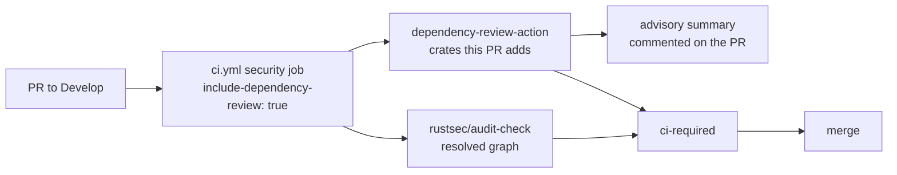

# Enable dependency review on every pull request (Issue #28)

## Summary

`security.yml` committed an `actions/dependency-review-action` step, but the
sole caller — the `security` job in `ci.yml` — passed
`include-dependency-review: false`, so the step never ran on any event. A PR
adding a crate with a published high-severity advisory merged with no advisory
gate on the diff. Closes #28.

- `.github/workflows/ci.yml` — the `security` job now passes
  `include-dependency-review: true`, with the rationale recorded next to the
  flag (`audit-check` scans the resolved graph; dependency review is the only
  gate on the crates *this PR* adds).
- `scripts/check-dependency-review.sh` — new gate that keeps the step
  reachable. It fails if the step is missing or pinned to a movable tag, if the
  `include-dependency-review` input stops defaulting to `true`, if any caller
  passes `include-dependency-review: false`, or if no caller reaches the
  reusable workflow on a `pull_request` event.
- The gate is wired into `quality.sh` and the `validation` job in `ci.yml`,
  alongside the existing CodeQL / actionlint / Renovate checks, and documented
  in `README.md` and `SECURITY.md`.

## Evidence

Backend/CI change only — no web interface to screenshot. Verified by running
the new tests and the full local gate.



Before the fix, `scripts/check-dependency-review.sh` failed against the
committed workflows — the regression test for this issue:

```text
FAIL dependency review: include-dependency-review is switched off at
     .github/workflows/ci.yml:104:      include-dependency-review: false
     — the committed step never runs
check-dependency-review tests: 11 passed, 2 failed
```

After the fix:

```text
OK   dependency review: security.yml runs actions/dependency-review-action@a1d282b3…
OK   dependency review: include-dependency-review defaults to true
OK   dependency review: no caller passes include-dependency-review: false
OK   dependency review: security.yml is called on pull_request by 1 workflow(s)
check-dependency-review tests: 13 passed, 0 failed
```

`./quality.sh < /dev/null` passes end to end (`All quality checks passed!`),
including `actionlint`, `shellcheck`, `cargo deny`, clippy and the full test
suite.

## Test Plan

`scripts/test-check-dependency-review.sh` — 13 cases, each running the real
checker against a fixture workflow directory and asserting exit code and
message:

- accepts a caller that inherits the enabled default, and one that opts in
  explicitly;
- **accepts this repository's committed workflows** (the regression test: fails
  against the unfixed `ci.yml`, passes after the flip);
- rejects a caller passing `include-dependency-review: false`, bare or quoted;
- rejects an input defaulting to `false`, or declaring no default;
- rejects a `security.yml` with no dependency-review step, or one pinned to a
  movable tag;
- rejects a reusable workflow nothing calls, and a caller that only runs on a
  schedule;
- exits 2 for a missing workflow directory or a missing `security.yml`.
