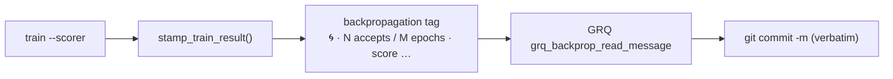

## Summary

The `backpropagation` creature tag is used verbatim by GRQ
`worker/Backprop/run.sh` as the check-in commit subject, so its marker is now
🌀 instead of 🔁 and the redundant word "Backprop" is dropped. Closes #31.

Before: `🔁 Backprop · 2 accepts / 4 epochs · score: 0.35 improved by 0.01`
After: `🌀 · 2 accepts / 4 epochs · score: 0.35 improved by 0.01`

Summary content is unchanged — accepts/epochs plus score and delta. Only the
`backpropagation` tag is touched; `lamarck` and `intelligentDesign` belong to
other programs and stay untouched (GRQ #3952).

### GRQ companion change — already done, no PR needed

The issue's scope included switching GRQ `worker/Backprop/run.sh` to 🌀. That
side is **already complete** on `stSoftwareAU/GRQ` `Develop`, so this run made
no GRQ change:

- Every backprop marker in `worker/Backprop/run.sh` is already 🌀 — the log
  lines (`run.sh:49,90,98,118,124,168,184,217`) and the fallback commit message
  (`run.sh:147`).
- The prefix guard is gone entirely: `run.sh:139` reads the tag via
  `grq_backprop_read_message` and `run.sh:190` commits it verbatim, with
  `run.sh:144-145` documenting "use it verbatim, never re-prefix it"
  (GRQ commits `c5693cfb7` #4002 and `184cdc286` #4003).
- GRQ's own suite already asserts a legacy 🔁 tag is used verbatim with no
  double marker (`worker/shared/test_backprop.sh:409-415`), so the transitional
  period where old creatures still carry 🔁 is covered.



## Evidence

Backend/CLI change with no web interface, so no screenshot applies. Verified by
the crate's own tests and the full quality gate:

```text
$ ./quality.sh < /dev/null
...
test result: ok. 28 passed; 0 failed; 0 ignored; 0 measured; 0 filtered out
...
All quality checks passed!
```

The three tests below were written first and failed against the unfixed code
with `left: "🔁 Backprop · 1 accept / 1 epoch · score: 0.5 improved by 0.1"`
versus the expected `🌀 · …`, then passed after the one-line change to
`backprop_progress_message`.

`backpropagation/Cargo.toml` bumps 0.1.4 → 0.1.5 (binary-affecting change, per
CONTRIBUTING.md), with `Cargo.lock` in sync.

## Test Plan

- `backpropagation/src/tags.rs::tests::progress_message_is_spiral_prefixed_with_singular_wording`
  — new; asserts the exact subject for the 1-accept / 1-epoch improved case.
- `backpropagation/src/tags.rs::tests::progress_message_reports_a_decline`
  — new; asserts the exact subject for the 0-accept / 3-epoch declined case.
- `backpropagation/src/tags.rs::tests::stamp_updates_score_and_backpropagation_without_touching_lamarck`
  — updated; the stamped tag now must start `🌀 · ` and contain neither 🔁 nor
  "Backprop", while `lamarck` stays untouched. No test was removed or disabled.
