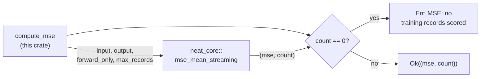

## Summary

`backpropagation/src/mse.rs::compute_mse` re-implemented MSE that `neat-core`
already owns. It is now a thin wrapper over `neat_core::mse_mean_streaming`
(NEAT-AI-core #538, on `Develop` as `13f4213`), so this crate holds no loss
maths on the eval path. Closes #32.

- The local per-record squared-error loop and the `TrainingDataIterator`
  plumbing are gone; the body is the creature-shape mapping, the delegation,
  and the zero-records error.
- The fail-loud contract stays here verbatim: core reports an empty corpus as
  `Ok((0.0, 0))`, so `compute_mse` still returns
  `Err("MSE: no training records scored")` — `train`/`sweep` would otherwise
  read an empty training directory as a perfect score.
- `forward_only` is taken from `creature.forward_only` (`CreatureExport`
  exposes it), so only a genuinely forward-only creature reaches core's fused
  no-reset path. For a recurrent creature this is a deliberate behaviour
  change: core resets state between records instead of letting the previous
  record's activations leak in, which is the stateless semantics NEAT-AI
  intends. Forward-only creatures — every production path here — are
  unaffected.
- Public signature, return tuple, and error string are unchanged;
  `train.rs`, `sweep.rs`, and `gradient_check.rs` compile untouched.
- Patch version bumped to `0.1.6` (binary-affecting, per CONTRIBUTING.md).



## Evidence

Backend/CLI change with no web interface to screenshot. Evidence is the test
suite and the local gate.

Parity was captured against the **pre-change** implementation before the
delegation was written: the ten-record fixture scored `0.2265625`
(`Some(4)` cap: `0.0234375`), and both values are asserted with
`backprop::nearly_equal` after the change. Every fixture value is exactly
representable in `f32`, so summation-order drift from core's SIMD batching
cannot mask a semantic difference here.

```text
running 3 tests
test mse::tests::identity_mse_is_zero_on_perfect_pair ... ok
test mse::tests::ten_record_mse_matches_pre_change_value ... ok
test mse::tests::zero_records_is_an_error ... ok
```

`./quality.sh < /dev/null` passes end to end (shellcheck, workflow
validators, codespell, cargo-deny, fmt, clippy `-D warnings`, 30 tests,
rustdoc): `All quality checks passed!`

## Test Plan

- `backpropagation/src/mse.rs::identity_mse_is_zero_on_perfect_pair` —
  existing test, unchanged, passes against the delegation (catches a broken
  `creature.input`/`creature.output` shape mapping).
- `backpropagation/src/mse.rs::zero_records_is_an_error` — new; an empty
  directory returns `Err("MSE: no training records scored")` rather than
  leaking core's silent `Ok((0.0, 0))`.
- `backpropagation/src/mse.rs::ten_record_mse_matches_pre_change_value` —
  new; >8 records (past core's SIMD batching threshold) match the pre-change
  value within `nearly_equal`, and `max_records = Some(4)` still caps the
  scan.
