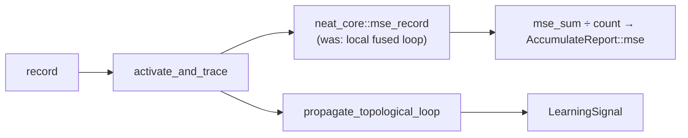

# Convert the accumulate-pass fused MSE to core's `mse_record`

## Summary

The accumulate pass in `backpropagation/src/propagate_layout.rs` carried its own
fused per-record squared-error reduction — the second local copy of maths
`neat-core` owns. It now calls `neat_core::mse_record` (added by
NEAT-AI-core#538), so this crate holds **no** loss arithmetic. Closes #33.

- `accumulate_creature_learning_report` reduces each record with
  `mse_record(&record.outputs, &traced[..creature.output])`.
- `output_n` and the local `.max(1)` guard are gone. `activate_and_trace`
  returns `[outputs…, activations…, hints…, trace…]`, so the prediction is the
  leading `creature.output` slice; `mse_record` divides by that slice's length
  and returns core's documented `0.0` for a zero-output creature — the same
  contribution the old `max(1)` guard produced.
- The record loop stays: the same traced forward pass feeds the propagate step,
  so this cannot move to a fused batch path.
- `AccumulateReport`'s shape (`learning`, `mse`, `records`) is unchanged, the
  `count == 0` → `"no training records read"` error is untouched, and
  `compare.rs` / `train.rs` compile unmodified.
- Patch version bumped `0.1.6` → `0.1.7`.



## Evidence

Backend/CLI change — no web interface to screenshot. Evidence is the parity
test plus the full quality gate.

**Observed `mse` delta: exactly zero.** The new test asserts both
`nearly_equal(dump.mse, 5.75)` and `dump.mse - 5.75 == 0.0`; it passes against
the pre-change code and against the delegated reduction, so the value is
bit-identical, not merely within tolerance. That holds because both paths widen
the same `f32` difference to `f64` and, for `outputs.len()` a power of two
(1 here in production, 2 in the fixture), core's `× (1/n)` reciprocal is exact
against the old `/ n`.

Tripwire check — temporarily mis-slicing the prediction to `&traced[..1]` fails
the new test, confirming it detects a wrong slice or a lost `/ num_outputs`
division:

```text
failures:
    compare::tests::run_compare_mse_matches_pre_delegation_baseline
test result: FAILED. 0 passed; 1 failed
```

`./quality.sh < /dev/null` → `All quality checks passed!` (fmt, clippy `-D
warnings`, codespell, cargo-deny, rustdoc, 34 lib + 6 bin tests).

## Test Plan

- **Added** `compare::tests::run_compare_mse_matches_pre_delegation_baseline` —
  drives `run_compare` end to end on a two-output identity fixture over two
  records `(1 → 2, 5)` and `(2 → 0, 1)`; the hand-computed baseline is
  `(1+9)/2 = 5.0` and `(4+9)/2 = 6.5`, mean `5.75`. Asserts `records == 2`,
  `nearly_equal`, and a delta of exactly `0.0`.
- **Unchanged and passing**: `propagate_layout` MIN/MAX/IF blame-routing tests,
  the `"no training records read"` error path, and
  `compare::tests::dump_round_trip_nearly_equal`.
