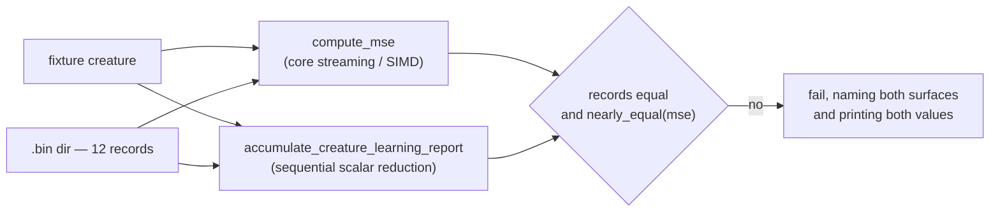

## Summary

Adds `backpropagation/tests/mse_surface_agreement.rs`, tying this crate's two
MSE surfaces together so they cannot silently diverge. Closes #34.

The eval path (`mse::compute_mse`, now delegating to core's streaming/SIMD
helper) and the fused accumulate pass (`AccumulateReport::mse`, a strictly
sequential scalar reduction over the traced forward pass) are supposed to
report the same quantity — the per-record mean over outputs, averaged over
records (NEAT-AI `Costs.MSE`). Nothing asserted that, which is exactly how they
drifted into two implementations in the first place.

Test-only change: no `backpropagation/src/` modification, so per CONTRIBUTING.md
no version bump is required and the Version Increment workflow correctly does
not fire.

## Evidence

No web interface to screenshot — this is a Rust test-only change. The evidence
is the test run plus a mutation check.



`./quality.sh < /dev/null` passes (shellcheck, workflow validators, codespell,
cargo-deny, fmt, clippy `-D warnings`, tests, rustdoc):

```text
running 5 tests
test fixture_corpus_exceeds_the_simd_batch_tier ... ok
test feed_forward_creature_agrees_across_both_mse_surfaces ... ok
test if_aggregate_creature_agrees_across_both_mse_surfaces ... ok
test maximum_aggregate_creature_agrees_across_both_mse_surfaces ... ok
test minimum_aggregate_creature_agrees_across_both_mse_surfaces ... ok
All quality checks passed!
```

The assertions were mutation-checked — temporarily scaling the accumulate MSE
by `1.001` in `propagate_layout.rs` failed all four agreement tests with a
message naming both surfaces, e.g.:

```text
aggregate MINIMUM (max_records None): MSE surfaces disagree —
compute_mse = 4.10970052083333315e-1,
accumulate_creature_learning_report.mse = 4.11381022135416607e-1,
difference = 4.10970052083292625e-4
```

The mutation was reverted; no production code is changed by this PR.

## Test Plan

New integration test `backpropagation/tests/mse_surface_agreement.rs`, over a
temp `.bin` directory of **12 records** (more than eight, so the corpus spans
core's 8-way SIMD batch tier plus a scalar tail):

- `feed_forward_creature_agrees_across_both_mse_surfaces` — all-standard
  squashes (`TANH` hidden, `LOGISTIC` output).
- `minimum_aggregate_creature_agrees_across_both_mse_surfaces`,
  `maximum_aggregate_creature_agrees_across_both_mse_surfaces`,
  `if_aggregate_creature_agrees_across_both_mse_surfaces` — aggregate squashes,
  which route differently inside core's batch dispatch. The `IF` fixture's
  condition crosses zero mid-corpus, so both branches are exercised.
- Each fixture is asserted twice: uncapped, and with `max_records = Some(5)`,
  since both surfaces implement the cap independently. Record counts must match
  each other *and* the expected cap.
- `fixture_corpus_exceeds_the_simd_batch_tier` — asserts `records > 8` so a
  future edit that shrinks a fixture fails immediately rather than silently
  losing SIMD-tier coverage.

Agreement uses `backprop::nearly_equal` (abs `1e-9` / rel `1e-6`), not bit
equality: the SIMD-batched summation order differs from the sequential
reduction by design (issue #30). Failure messages name both surfaces and print
both values plus the difference, so a divergence is diagnosable from the CI log
alone.
