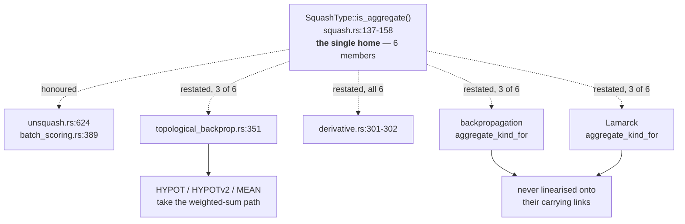

# PR summary — Issue #35

## Summary

Audited every `backpropagation/src/*.rs` module against `neat-core/src/**` for
logic this crate restates rather than delegates, and filed the findings. Closes
#35.

This is an **audit-and-file** issue: the only file added is the audit itself,
`docs/audit/issue-35-neat-ai-core-duplication.md`. No source changes.

The audit found duplication **beyond** MSE — six findings, one rejected — so
this is not a clean-result close:

| # | Finding | Home | Severity |
| - | ------- | ---- | -------- |
| 1 | `aggregate_kind_for` (`propagate_layout.rs:76-83`) restates core's aggregate-squash list, 3 of 6 | `neat-core` + here | high |
| 2 | `backprop.rs` config / signals / apply surface is a verbatim twin of Lamarck's, already diverged | `neat-core` | high |
| 3 | `CreatureExport` drops `uuid`/`tags`, so `tags.rs` re-implements the round trip (twinned in Lamarck) | `neat-core` | medium |
| 4 | `rust_scorer` stdout contract restated by both consumers | `NEAT-AI-scorer` | medium |
| 5 | scorer `stream_score.rs` → `mse_mean_streaming` convergence | — | **rejected** |
| 6 | packed-record framing loop duplicated between core and the scorer | `neat-core` | medium |

Highest-value finding: core documents `SquashType::is_aggregate()` as *"the
single home"* of the aggregate-squash membership rule, warning that a site
restating the list *"would silently route it down the weighted-sum path"*. Four
sites restate it anyway — two inside core, plus this crate and Lamarck — and all
of the three-arm ones miss `HYPOT`, `HYPOTv2` and `MEAN`.

Finding 5 is rejected because `mse_mean_streaming` is MSE-only, single-threaded
and unsampled, while the scorer's loop is generic over `CostKind`, samples via
`SampleSpec`, and runs Rayon parallel activation and file reads. Converging it
would be a regression, not a de-duplication. The genuine duplication underneath
it — the record **framing** loop — is finding 6.

### Partially blocked — `needs-human` on #35

Only the finding this repo owns could be filed: **#52**. Cross-repo issue
creation is refused by the run's write allowlist —

```text
[SECURITY] [WRITE_REPO_BLOCKED] Refused issue-create to stSoftwareAU/NEAT-AI-core
from the agent subprocess — not on run allowlist [stsoftwareau/neat-ai-backpropagation]
```

— so findings 1 (core half), 2, 3, 4 and 6 could not be filed in `neat-core` /
`NEAT-AI-scorer`. Cross-repo *reads* are permitted, which is how the audit was
carried out, so the findings are evidence-backed and only the filing is blocked.
Rather than file `neat-core` work onto this repo's backlog, each finding's
section in the audit document is written to be pasted into `gh issue create`
as-is, #35 carries `needs-human`, and its paired comment gives the exact repo,
title and labels for each. Per Issue #1471 the label and that explanation
comment were posted together.

## Evidence

Backend/CLI audit with no web interface, so no screenshot. The evidence is the
cited code, read at `cdd652f` plus the sibling `neat-core` / `NEAT-AI-Lamarck`
clones and `NEAT-AI-scorer` `stream_score.rs` fetched via the GitHub API.

Load-bearing citations:

- `neat-core/src/squash.rs:137-158` — `is_aggregate()` and its "single home" doc.
- `neat-core/src/topological_backprop.rs:348-357` — restates 3 of 6; the other
  three fall into the generic weighted-sum path below.
- `neat-core/src/derivative.rs:301-302` — a fourth restatement.
- `backpropagation/src/propagate_layout.rs:76-83` — the local 3-of-6 copy.
- `diff backpropagation/src/backprop.rs lamarck/src/backprop.rs` — ~300
  byte-identical lines; the divergence is `merge` (Lamarck only) versus
  `ApplyOptions` / `count_apply_deltas` (here only).

Corroboration from the existing suite: `tests/mse_surface_agreement.rs` covers
`IF`, `MINIMUM` and `MAXIMUM` aggregates and **not** `MEAN` / `HYPOT` — the same
three-of-six blind spot finding 1 describes, independently arrived at.



Quality gate: `./quality.sh < /dev/null` → **All quality checks passed!**
(fmt, clippy, shellcheck, codespell, the neat-core version gate, workflow
validation, and the full test suite — 5/5 `mse_surface_agreement`, 6/6 unit).

## Test Plan

No tests added or modified — #35 forbids code changes, and the deliverable is
the audit table plus the filed issues. The findings are static, cited
`file:line` claims, not runtime assertions; each was verified by reading the
cited source in both repos rather than by executing it.

Verification for a reviewer:

- The audit table in `docs/audit/issue-35-neat-ai-core-duplication.md` covers
  every `backpropagation/src/*.rs` module — all 11, rejections included with
  reasons, as the acceptance criteria require.
- `grep -rn "SquashType::Minimum" neat-core/src backpropagation/src` reproduces
  the four restatement sites of finding 1.
- `diff -u backpropagation/src/backprop.rs ../NEAT-AI-Lamarck/lamarck/src/backprop.rs`
  reproduces finding 2's divergence table.
- `./quality.sh < /dev/null` still passes, confirming the docs-only change
  breaks nothing.
