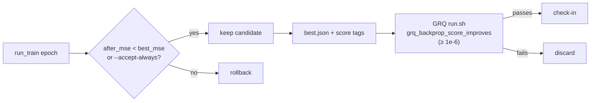

## Summary

Deleted the unused `pub const MIN_SCORE_IMPROVEMENT` from
`backpropagation/src/train.rs`. Closes #36.

The constant's doc comment claimed "minimum score improvement treated as a
production accept (`rust_scorer`)", but `run_train` decides purely on
`req.accept_always || after_mse < best_mse` and never applied a score
threshold — the constant documented behaviour that was never wired in. Because
it was `pub`, the workspace-wide `dead_code` lint could not flag it.

Deleted rather than wired in: the 1e-6 production margin is genuinely enforced,
but by the **consumer**, not this crate. GRQ's `grq_backprop_score_improves`
(`worker/shared/backprop.sh`) applies its own `1e-6` default after the trainer
returns, so adding a score gate inside `run_train` would duplicate an existing
check and change trainer behaviour — out of scope for a dead-code issue.

Consumer check before removal:

- No Rust reference anywhere in this repo (only the definition line matched).
- Not re-exported from `lib.rs` — the `train` re-export list carries
  `DEFAULT_STEP_SCALE`, `TrainJournalHeader`, `TrainResult`, `run_train`.
- Sibling repos (`NEAT-AI-core`, `NEAT-AI`, `NEAT-AI-scorer`, `GRQ`) mention
  the name only inside shell **comments** and one `echo` string describing the
  mirrored margin — no `neat_ai_backpropagation::train::MIN_SCORE_IMPROVEMENT`
  import exists, so nothing breaks.

Also bumped the patch version `0.1.10` → `0.1.11` (CONTRIBUTING's version
contract: `backpropagation/src/` changed) with `Cargo.lock` in sync, and
recorded the removal under **[Unreleased] → Removed** in `CHANGELOG.md`.

## Evidence

Backend/CLI change with no web interface, so no screenshot applies. The
evidence is the compiler plus the existing suite: a `pub const` with no
consumers cannot be removed without a build error if any reference existed, and
the accept-path tests confirm the trainer's decision is unchanged.

`./quality.sh < /dev/null` — passes clean (shellcheck, actionlint, workflow and
Renovate validators, codespell, cargo-deny, `cargo fmt --check`, clippy with
`-D warnings`, the full test suite, rustdoc):

```text
running 8 tests   (tests/scorer_boundary.rs)
test result: ok. 8 passed; 0 failed; 0 ignored
...
Documenting neat_ai_backpropagation v0.1.11
All quality checks passed!
```

Where the 1e-6 margin actually lives — unchanged by this PR:



## Test Plan

No new test: this is the removal of a constant no code path reads, so there is
no behaviour to assert that the existing tests do not already cover. Writing a
test that greps the source for the removed name would verify nothing and is
explicitly not a real test.

Existing tests re-run and passing, which cover the accept decision this
constant claimed to influence:

- `backpropagation/src/train.rs::tests::one_epoch_identity_chain_can_accept` —
  an epoch that lowers MSE is accepted.
- `backpropagation/src/train.rs::tests::rejected_deterministic_epoch_stops_early`
  — an epoch that cannot lower MSE is rejected.
- `backpropagation/src/train.rs::tests::journal_header_carries_crate_version` —
  journal header still stamps the (now bumped) crate version.
- `backpropagation/tests/scorer_boundary.rs` (8 tests) — the `score_creature`
  process boundary is untouched.
