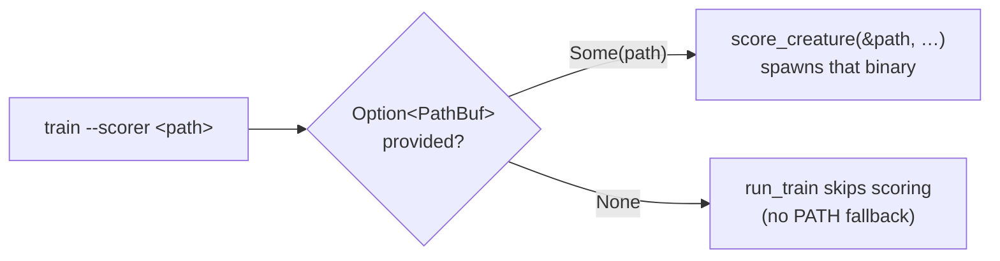

## Summary

Deleted the unused `pub fn default_scorer_path()` from
`backpropagation/src/scorer.rs`. Closes #37.

The helper returned `PathBuf::from("rust_scorer")` — a bare PATH lookup for a
default the CLI never adopted. `main.rs` declares `scorer: Option<PathBuf>`
with no default, and `run_train` simply skips scoring when `--scorer` is
omitted, so nothing ever fell back to a PATH binary. Because it was `pub`, the
workspace-wide `dead_code` lint could not flag it.

Removing the function also stranded the `PathBuf` import — it was the module's
only user, since `score_creature` takes `&Path` for all three of its path
arguments. The import narrows to `use std::path::Path;` (the issue's note that
`PathBuf` "remains used" was incorrect; leaving it would have failed clippy's
`-D warnings`).

Consumer check before removal:

- Repo-wide grep matched only the definition line.
- Not re-exported from `lib.rs` — the `scorer` re-export list carries only
  `ScoreResult` and `score_creature`.
- `gh search code "default_scorer_path" --owner stSoftwareAU` returns exactly
  one hit: this definition. No downstream repo imports
  `neat_ai_backpropagation::scorer::default_scorer_path`.

Also bumped the patch version `0.1.11` → `0.1.12` (CONTRIBUTING's version
contract: `backpropagation/src/` changed) with `Cargo.lock` in sync, and
recorded the removal under **[Unreleased] → Removed** in `CHANGELOG.md`.

## Evidence

Backend/CLI change with no web interface, so no screenshot applies. The
evidence is the compiler plus the existing suite: a `pub fn` with any live
caller cannot be deleted without a build error, and the scorer boundary tests
confirm the module's behaviour is unchanged.

`./quality.sh < /dev/null` — passes clean (shellcheck, actionlint, workflow and
Renovate validators, codespell, cargo-deny, `cargo fmt --check`, clippy with
`-D warnings`, the full test suite, rustdoc):

```text
running 8 tests   (tests/scorer_boundary.rs)
test result: ok. 8 passed; 0 failed; 0 ignored
...
Documenting neat_ai_backpropagation v0.1.12
All quality checks passed!
```

How `--scorer` is actually resolved — unchanged by this PR, and why no default
was ever needed:



## Test Plan

No new test: this removes a function no code path calls, so there is no
behaviour to assert that the existing tests do not already cover. A test that
greps the source for the removed name would verify nothing and is explicitly
not a real test.

Existing tests re-run and passing, which cover the scorer module the function
lived in:

- `backpropagation/tests/scorer_boundary.rs` (8 tests) — the `score_creature`
  process boundary: spawn failure, non-zero exit, unparsable stdout, empty
  score map, map and single-object stdout, and the candidate-directory
  contract.
- `backpropagation/src/scorer.rs::tests::parse_map_stdout` — stdout parsing of
  a stem-keyed result map.
