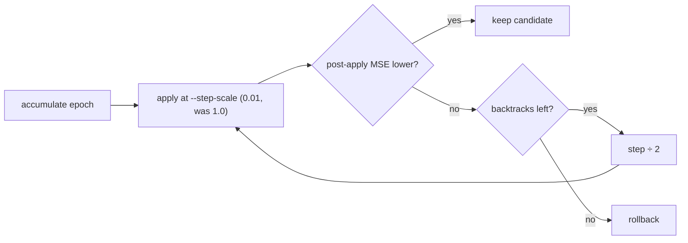

## Summary

`train` defaulted `--step-scale` to `1.0` — a full coordinated jump that moves
every gene to a value proposed as if the others held still. On the GRQ creature
(~16.6k parameters) that overshot: train-slice MSE 0.6515 → 0.7505, while a
0.01 step improved it. `sweep`'s own grid already stops at `0.01`, so the
trainer was defaulting 100× above the evidence-based ceiling.

Changed in this PR:

- `train --step-scale` now defaults to `0.01` (`train::DEFAULT_STEP_SCALE`, the
  top of sweep's grid). The #38 backtracking line search still halves from
  there on a rejected apply.
- `train` resolves the learning rate **per epoch** from the configured strategy
  and journals it as `learningRate`. Previously `calculate_learning_rate` was
  called once at iteration 0, so decay / warm-restart / adaptive could never
  take effect.
- New `train` flags exposing config the library already supported:
  `--learning-rate-strategy` (`fixed`, `decay`, `adaptive`, `warm-restart`),
  `--learning-rate-decay`, and `--normalise-gradients` (NEAT-AI #1872).
- The ±10 per-gene clamps: the trainer CLI already caps at ±1 and a test now
  pins that. `BackpropConfig::default()` deliberately keeps ±10 because
  `compare` must mirror `scripts/ts-compare.ts` byte for byte — lowering it
  would break the TypeScript parity contract.
- Added `.markdownlint-cli2.yaml` (mirrors sibling NEAT-AI-core; YAML because
  `.gitignore` only un-ignores that filename) so the
  docs gate stops failing on pre-existing table/line-length noise, and quoted
  the bare email in `SECURITY.md` that the gate flagged.

Closes #39.

## Evidence

CLI-only change, so no screenshots. Reproduced the overshoot on a 1,021-gene
dense fixture (two 30-wide identity layers into one output, 256 records,
`y = 0.5x + 0.25`), single epoch, `--max-backtracks 0 --accept-always` so the
raw post-apply MSE of each step is visible:

| learning rate | step scale | before MSE | after MSE |
| --- | --- | --- | --- |
| 0.5 | 1.0 (old default) | 0.072066407919 | 49.409256038372 |
| 0.5 | 0.01 (new default) | 0.072066407919 | 0.057188637439 |
| 0.1 | 1.0 (old default) | 0.072066407919 | 0.615662124657 |
| 0.1 | 0.01 (new default) | 0.072066407919 | 0.067609020516 |

Per-epoch schedule, `--learning-rate-strategy decay --learning-rate 0.1
--learning-rate-decay 0.5`, 3 epochs — `journal.jsonl` epoch records:

```text
"learningRate":0.1
"learningRate":0.05
"learningRate":0.025
```

Honest caveat: at a small learning rate on shallow fixtures the full step does
not overshoot and converges faster per epoch (0.0721 → 0.0332 at step 1.0 vs
0.0716 at 0.01, `lr = 0.01`). The default is chosen for the large production
creature the issue measured; `--step-scale 1.0` remains available.



`./quality.sh < /dev/null` passes (fmt, clippy `-D warnings`, 37 tests,
rustdoc), as does `markdownlint-cli2`.

## Test Plan

Added in `backpropagation/src/train.rs`:

- `default_step_scale_improves_where_the_full_step_overshoots` — builds a dense
  multi-path creature and asserts the full step raises MSE above baseline while
  `DEFAULT_STEP_SCALE` lowers it. Fails against the old `1.0` default.
- `decay_strategy_lowers_the_learning_rate_each_epoch` — 3 epochs at decay 0.5
  journal `0.1 / 0.05 / 0.025`. Fails against the old single iteration-0 call.
- `fixed_strategy_journals_a_constant_learning_rate` — the default strategy is
  unchanged epoch to epoch.

Added in `backpropagation/src/main.rs`:

- `train_step_scale_defaults_within_sweep_grid` — the parsed default is at or
  below the top of sweep's default grid.
- `train_clamps_default_to_one_not_ten` — trainer clamps default to ±1 while
  `BackpropConfig::default()` stays at ±10 for TypeScript parity.
- `train_learning_rate_defaults_to_fixed_schedule`,
  `train_accepts_schedule_and_normalisation_flags`,
  `train_config_carries_schedule_and_normalisation` — new flags parse and reach
  `BackpropConfig`.
- `invalid_step_scales_are_rejected` — existing `parse_step_scales` guard.

No existing tests were removed or modified.
