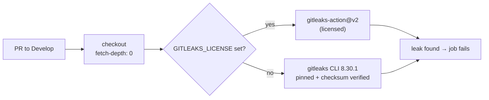

## Summary

Added a Gitleaks secrets-detection workflow so a committed credential is caught
in the pull request rather than after it reaches `Develop` — a leaked secret
cannot be undone by a revert, it has to be rotated. Closes #42.

- `.github/workflows/gitleaks.yml` — scans the PR commit range. When the
  organisation licence (`GITLEAKS_LICENSE`) is present it uses
  `gitleaks/gitleaks-action@v2`; when it is absent — bot-authored PRs
  (Renovate, Dependabot) receive no Actions secrets, so the action would exit
  with a licence error — it falls back to the free open-source `gitleaks` CLI.
  Without that fallback the job would report green while scanning nothing.
- `scripts/check-gitleaks-workflow.sh` — validator wired into `quality.sh` and
  the CI `validation` job, following the repo's existing
  `check-codeql-workflow.sh` pattern. `.github/workflows/gitleaks.yml` was also
  added to CI's required-files list.
- Supply chain: both actions pinned to 40-character commit SHAs (verified
  against the upstream tags via `gh api`), the CLI pinned to `8.30.1` with its
  SHA-256 (`551f6fc8…70eb`) checked against the published
  `gitleaks_8.30.1_checksums.txt`, and the install step under
  `set -euo pipefail` so a failed download cannot be read as a clean scan.
- Docs: README **Secrets detection** section (with diagram), CONTRIBUTING gate
  list, CHANGELOG entry.

## Evidence

Backend/CI change — no web interface to screenshot. Evidence is the validator
tests plus the real workflow passing every rule.



`./quality.sh < /dev/null` passes, including the new gate:

```text
Validating Gitleaks secrets-detection workflow...
check-gitleaks-workflow tests: 15 passed, 0 failed
OK   .github/workflows/gitleaks.yml: pull_request trigger covers the Develop default branch
OK   .github/workflows/gitleaks.yml: a gitleaks scan is invoked (action or CLI)
OK   .github/workflows/gitleaks.yml: licensed and licence-less paths both scan (Dependabot PRs are covered)
OK   .github/workflows/gitleaks.yml: every third-party action is pinned to a commit SHA
OK   .github/workflows/gitleaks.yml: the downloaded gitleaks release has its checksum verified
OK   .github/workflows/gitleaks.yml: the fallback runs under strict bash (set -euo pipefail)
OK   .github/workflows/gitleaks.yml: checkout uses fetch-depth: 0 (the base..head range resolves)
...
All quality checks passed!
```

`actionlint -no-color` is clean over the new workflow.

**Note for the administrator:** the workflow reports on every PR, but branch
protection currently requires only the `CI Required Checks` context, so a
Gitleaks failure annotates the PR without blocking the merge until
`Secrets Detection` is added to the required contexts (a repository setting,
outside the checkout — same constraint as the branch-protection policy in
CONTRIBUTING.md).

## Test Plan

`scripts/test-check-gitleaks-workflow.sh` — 15 cases, each writing a fixture
workflow and asserting the checker's exit code and the rule it names:

- accepts the licensed action plus a licence-less CLI fallback
- accepts a `branches: ["*"]` wildcard covering every base branch
- exit 2 when the workflow file is missing
- rejects: no `pull_request` trigger; a trigger that skips `Develop`
- rejects a step named after gitleaks that never scans
- rejects a licensed-only scan (licence-less PRs would go unscanned)
- rejects a swallowed verdict: `|| true`, `--exit-code 0`,
  `continue-on-error: true`
- rejects an unverified download, a `releases/latest` download, and a fallback
  without `set -euo pipefail`
- rejects a shallow checkout (`fetch-depth` missing) and an action pinned to a
  movable tag

The validator itself and its tests run in `quality.sh` and in the CI
`validation` job, so a later edit that neuters the scan fails the build.
