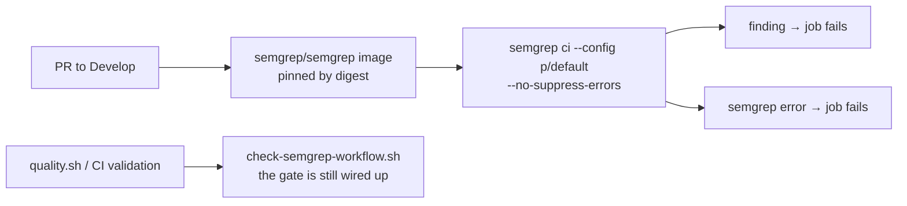

## Summary

Adds the Semgrep SAST scanning workflow the repository was missing, wired into
the same validate-the-gate pattern the CodeQL and Gitleaks workflows already
use. Closes #43.

- **`.github/workflows/semgrep.yml`** — runs `semgrep ci --config p/default` on
  every pull request to `Develop` / `milestone/**`, inside the official
  `semgrep/semgrep` image pinned to a `@sha256:` digest (v1.173.0). Semgrep is a
  second, independently maintained rule set alongside CodeQL, and unlike the
  Rust-only CodeQL analysis it also reads the repository's shell scripts and
  workflow YAML.
- **Fail loud** — `semgrep ci` defaults to `--suppress-errors`, exiting **0**
  when Semgrep itself errors, so a crashed scan would read as a clean one. The
  job passes `--no-suppress-errors`, and the step runs under `set -euo
  pipefail`.
- **No token required** — `SEMGREP_APP_TOKEN` is optional; with no Semgrep Cloud
  account the secret is empty and the scan runs unauthenticated against the
  explicit rule set, so bot-authored PRs (Renovate, Dependabot), which receive
  no Actions secrets, are scanned identically rather than silently skipped.
- **`scripts/check-semgrep-workflow.sh`** — gates the policy in `quality.sh` and
  the CI `validation` job: it fails if the workflow is missing, does not run on
  pull requests to `Develop`, never invokes a scan, configures no rule set,
  neuters the verdict (`|| true`, `continue-on-error: true`,
  `--suppress-errors`), drops `--no-suppress-errors`, runs the scan outside
  strict bash, or pulls the action, container image, or CLI from an unpinned
  source.
- Docs updated in the same change: README (new **Static analysis (Semgrep)**
  section), CONTRIBUTING (local gate list + "changing semgrep.yml must keep the
  checker green"), CHANGELOG, and `semgrep.yml` added to the CI required-files
  list.

**One `p/default` rule is excluded, named and justified in the workflow.**
`renovate-missing-minimum-release-age` demands a ≥ 7-day embargo on every
`packageRules` entry; this repository runs a deliberate 24-hour quarantine for
external crates and none for internal `stSoftwareAU` code (`renovate.json`,
gated by `check-renovate-config.sh`), so the rule contradicts a committed policy
rather than finding a defect. JSON has no comment syntax, so an inline
`nosemgrep` is unavailable. Verified below that the exclusion is the *only* one
needed — the rest of the tree scans clean.

## Evidence

Backend/CI change with no web interface to screenshot. Evidence is the local
scan output and the gate runs.

**A real Semgrep scan of this tree** (`semgrep 1.173.0`, the pinned image
version), before the exclusion — one blocking finding, the policy conflict
described above:

```text
┌────────────────┐
│ 1 Code Finding │
└────────────────┘
    renovate.json
    ❯❱ package_managers.renovate.renovate-missing-minimum-release-age…
          ❰❰ Blocking ❱❱
          This Renovate configuration does not set a minimum release age…
          Add `"minimumReleaseAge": "7 days"` within a `packageRules` entry…
```

Re-run with the rule excluded — clean, exit **0**, so the new gate does not fail
the PR that introduces it:

```text
$ semgrep scan --config p/default --metrics=off --error --quiet \
    --exclude-rule=package_managers.renovate.renovate-missing-minimum-release-age… .
exit=0
```

Setting `"minimumReleaseAge": "24 hours"` on the flagged `packageRules` entry
was tested and does **not** clear the finding — the rule insists on ≥ 7 days —
confirming the conflict is with the repository's dependency policy, not a
missing setting.

**Checker against the committed workflow:**

```text
OK   .github/workflows/semgrep.yml: pull_request trigger covers the Develop default branch
OK   .github/workflows/semgrep.yml: a semgrep scan is invoked (action or CLI)
OK   .github/workflows/semgrep.yml: a ruleset is configured (--config)
OK   .github/workflows/semgrep.yml: 'semgrep ci' runs with --no-suppress-errors (an internal error fails the job)
OK   .github/workflows/semgrep.yml: the scan step runs under strict bash (set -euo pipefail)
OK   .github/workflows/semgrep.yml: every third-party action is pinned to a commit SHA
OK   .github/workflows/semgrep.yml: every container image is pinned to a digest
```

`./quality.sh < /dev/null` passes end to end (shellcheck, actionlint, all
workflow validators including the new one, codespell, cargo-deny, fmt, clippy,
tests, rustdoc): **All quality checks passed!**



## Test Plan

- Added `scripts/test-check-semgrep-workflow.sh` — 15 cases, each writing a
  fixture workflow and running the real checker against it, asserting the exit
  code and the rule named in the failure:
  - accepts a digest-pinned container running `semgrep ci`
  - accepts a version-pinned `pip install` running `semgrep scan` with wildcard
    base branches (a different shape, so the checker enforces the policy rather
    than one hard-coded file)
  - missing workflow → exit 2
  - rejects: no `pull_request` trigger; a trigger skipping `Develop`; no scan
    invoked; no `--config` rule set; `|| true`; `continue-on-error: true`;
    `--suppress-errors`; `semgrep ci` without `--no-suppress-errors`; a scan
    step outside `set -euo pipefail`; an action on a movable tag; a container
    image on a movable tag; an unpinned `pip install semgrep`
- Both the tests and the checker run in `quality.sh` and in the CI `validation`
  job, so the gate cannot be quietly removed.
- Verified the checker fails with exit 2 *before* `semgrep.yml` existed and
  passes after — the test-first order the fix was built in.
