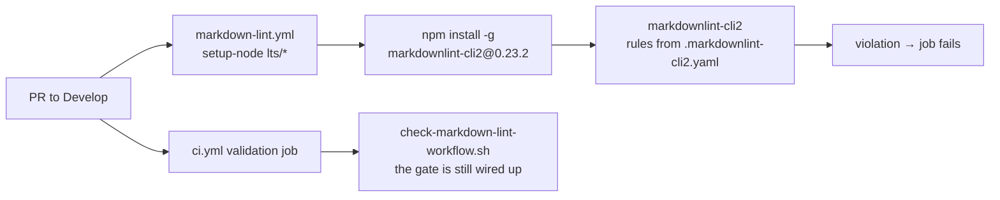

## Summary

Adds the **Markdown Lint** workflow the repository was missing. Closes #44.

`.markdownlint-cli2.yaml` has been committed since issue #39, but nothing in CI
ever read it — the structural rules it keeps on (heading hierarchy, list
indentation, fencing) were advisory, so every hand-written README, CHANGELOG and
audit note drifted on its own. `.github/workflows/markdown-lint.yml` now runs
`markdownlint-cli2` against that config on every pull request to `Develop`, and
a violation blocks the merge.

Three policy decisions, all enforced by the checker rather than left to review:

- **Report, never rewrite.** `--fix` (and the upstream action's `fix: true`)
  edits the runner's throwaway checkout and exits 0, so a fixable violation
  would merge unfixed while the job read green. The run is plain
  `markdownlint-cli2` and its non-zero exit is the verdict.
- **Fail loud.** The lint step runs under `set -euo pipefail`, so a failed
  install cannot be reported as a clean lint. No `|| true`, no
  `continue-on-error: true`.
- **Pinned supply chain.** Both actions are pinned to 40-character commit SHAs
  (verified against the upstream repositories), and `markdownlint-cli2` is
  installed at an exact version — `0.23.2`, published 2026-07-27, well clear of
  the 24-hour external quarantine.

The issue's template used `branches: ["*"]` and `push: [main, master]`; this
repository's default branch is `Develop`, so the triggers follow the shape the
sibling `semgrep.yml` / `codeql.yml` workflows already use. The template's
optional Deno `check-mermaid` step was dropped: this is a Rust repository with
no `worker/deno/mod.ts`, so the step would never have fired.

Running the new lint over the existing tree surfaced two real MD018 violations
in `docs/audit/issue-35-neat-ai-core-duplication.md`, where a paragraph opening
`#35 …` parses as an ATX heading. Both are fixed (`Issue #35 …`) so the workflow
is green on the tree it lands in — the gate is not merged pre-broken.

## Evidence

Backend/CI change only — no web interface to screenshot.



Command output on this branch:

```text
$ ./scripts/test-check-markdown-lint-workflow.sh < /dev/null
OK   accepts a pinned global install running markdownlint-cli2
OK   accepts the upstream markdownlint-cli2 action
OK   accepts a version-pinned npx invocation
OK   reports a missing workflow with exit 2
OK   rejects a workflow with no pull_request trigger
OK   rejects a pull_request trigger that skips the default branch
OK   rejects a workflow that never runs a lint
OK   rejects a workflow that installs the linter but never runs it
OK   rejects '--fix', which rewrites the runner's copy and exits clean
OK   rejects the upstream action's 'fix: true' input
OK   rejects a lint whose exit code is swallowed by '|| true'
OK   rejects continue-on-error, which lets a violation merge
OK   rejects a lint step that does not run under strict bash
OK   rejects an action pinned to a movable tag
OK   rejects an unpinned 'npm install markdownlint-cli2'
OK   rejects an unpinned 'npx markdownlint-cli2'
OK   the committed markdown-lint workflow satisfies the policy
check-markdown-lint-workflow tests: 17 passed, 0 failed

$ npx --yes markdownlint-cli2@0.23.2 < /dev/null
markdownlint-cli2 v0.23.2 (markdownlint v0.41.1)
Linting: 5 files
Summary: 0 issues in 0 files

$ ./quality.sh < /dev/null
All quality checks passed!
```

The `--fix` and `|| true` cases are the ones worth reading: each proves the
checker rejects a workflow that would have reported green while a violation
merged.

### Security self-check

- **Secrets** — none staged; the workflow needs no secret and declares
  `permissions: contents: read`.
- **Supply chain** — `actions/checkout@de0fac2…` (v6.0.2) and
  `actions/setup-node@48b55a0…` (v6.4.0) verified against the upstream repos via
  `gh api`; `markdownlint-cli2@0.23.2` pinned, published 2026-07-27.
- **Injection surface** — the lint step runs two fixed commands with no
  interpolated input; `checkout` uses `persist-credentials: false`.
- **Error handling** — a violation or a failed install exits non-zero and blocks
  the merge; nothing is swallowed.

## Test Plan

- Added `scripts/test-check-markdown-lint-workflow.sh` — 17 cases that write
  fixture workflows and run the real checker against them: three accepted
  shapes (pinned global install, upstream action, pinned `npx`), a missing file
  (exit 2), and eleven rejected policy breaches (no `pull_request` trigger,
  wrong base branch, no lint invoked, install with no invocation, `--fix`,
  `fix: true`, `|| true`, `continue-on-error`, lax bash, tag-pinned action,
  unpinned `npm install` / `npx`). The final case runs the checker against the
  committed workflow.
- Added `scripts/check-markdown-lint-workflow.sh` — the gate under test, wired
  into `quality.sh` and the `validation` job in `ci.yml` alongside the existing
  CodeQL / Gitleaks / Semgrep validators.
- Fixed two MD018 violations in
  `docs/audit/issue-35-neat-ai-core-duplication.md`; `markdownlint-cli2` now
  reports 0 issues across the tree.
- `./quality.sh < /dev/null` passes end to end.
