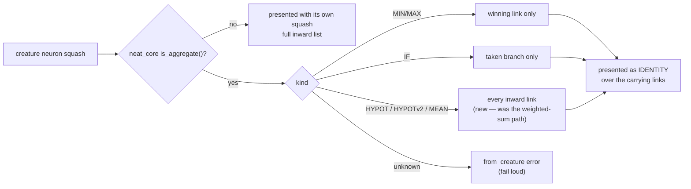

# PR Summary — Issue #52

## Summary

`aggregate_kind_for` restated neat-core's aggregate-squash membership list with
three arms where core's `SquashType::is_aggregate()` has six, so `HYPOT`,
`HYPOTv2` and `MEAN` neurons were never recognised as aggregates. They reached
the propagate loop with their raw squash discriminant and their full inward
list, and were never linearised onto their carrying links — and once core routes
all six to `PropagateOutcome::Special`, they would be dropped entirely (only
`Standard` folds into `LearningSignal`). Closes #52.

The membership test is now core's `is_aggregate()`; only the *kind* mapping
stays local, so the list has one home again:

- `MINIMUM` / `MAXIMUM` — unchanged, keep the single winning link.
- `IF` — unchanged, keeps the taken branch.
- `HYPOT` / `HYPOTv2` / `MEAN` — new `AggregateKind::AllInward`: they reduce the
  whole link set rather than selecting from it, so every inward link carries.
- Any squash core reports as an aggregate that this crate has no rule for is a
  loud `PropagateLayout::from_creature` error, not a silent fall-through onto
  the weighted-sum path.

The issue's preferred fix — consuming a core `SquashType::aggregate_kind()`
accessor — is **not** taken here: core (0.9.2) exposes only the boolean, and
this crate must not depend on an unreleased core API (release gating). This is
the issue's own documented fallback, and it removes the restatement that
actually caused the miss. The core-side half stays as written up in
`docs/audit/issue-35-neat-ai-core-duplication.md` (finding 1).

## Evidence

Backend crate — no web interface to screenshot. Evidence is the test suite.

Before the fix (same tests, unchanged implementation):

```text
---- propagate_layout::tests::every_core_aggregate_squash_has_a_linearisation_rule stdout ----
assertion `left == right` failed: Hypotenuse (code 35) disagrees with neat-core's
aggregate membership
  left: false
 right: true

---- propagate_layout::tests::deprecated_aggregates_carry_every_inward_link stdout ----
assertion `left == right` failed: HYPOT must be presented to the propagate loop as IDENTITY
  left: 35
 right: 0

---- propagate_layout::tests::mean_output_propagates_blame_to_every_branch stdout ----
assertion failed: bias_count(&creature, &learning, "h1") > 0.0

---- propagate_layout::tests::hypotenuse_output_propagates_blame_to_every_branch stdout ----
assertion failed: bias_count(&creature, &learning, "h1") > 0.0

test result: FAILED. 48 passed; 4 failed
```

After the fix: `./quality.sh < /dev/null` → `All quality checks passed!`
(52 lib tests, 0 failed).



## Test Plan

Added to `backpropagation/src/propagate_layout.rs`:

- `every_core_aggregate_squash_has_a_linearisation_rule` — for every `u8`
  discriminant, `aggregate_kind_for(...).is_some()` must equal
  `SquashType::is_aggregate()`. This is the regression guard: it fails the
  moment either side of the membership rule drifts.
- `deprecated_aggregates_carry_every_inward_link` — `HYPOT`, `HYPOTv2` and
  `MEAN` outputs are presented as `IDENTITY` and keep both inward links after
  `linearise_aggregates`.
- `minimum_keeps_only_the_winning_inward_link` — the winner-take-all contrast
  case, so the new arm cannot quietly swallow `MINIMUM`.
- `mean_output_propagates_blame_to_every_branch` and
  `hypotenuse_output_propagates_blame_to_every_branch` — end-to-end accumulate:
  both hidden branches and the aggregate's own bias receive learning signal
  (before the fix, neither hidden branch did).

Unchanged and passing: the existing MIN / MAX / IF blame-routing tests, the
identity-chain propagation and apply tests, and every other suite in the
workspace.
