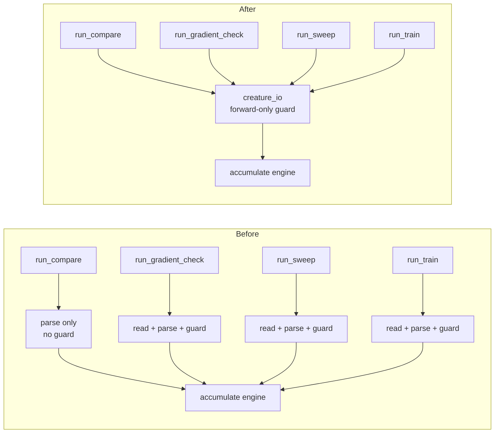

# Share the forward-only creature guard (Issue #54)

## Summary

The creature-loading preamble — read the JSON, parse it, reject non-forward-only
graphs — was copy-pasted across `gradient_check.rs`, `sweep.rs`, and `train.rs`,
with the identical error string in all three. `compare.rs` was the fourth site
and had already diverged: it parsed the creature and fed the same
`accumulate_creature_learning_report` engine with no guard, so a recurrent
creature produced a parity dump instead of failing loudly.

Extracted the sequence into a new `backpropagation/src/creature_io.rs`:

- `load_forward_only_creature(path)` — read → parse → guard, used by
  `run_compare`, `run_gradient_check`, and `run_sweep`.
- `parse_forward_only_creature(text)` — parse → guard, used by `run_train`,
  which already holds the file text for `CreatureMeta` tag mining and would
  otherwise read the file twice.
- `FORWARD_ONLY_REQUIRED` — the single owner of the error wording.

This restores the guard on the diverged `compare` path. No behaviour changed for
the other three subcommands beyond the guard now running before
`create_dir_all`, so a rejected run no longer leaves an empty output directory
behind.

Closes #54.

## Evidence

Backend/CLI change with no web interface, so no screenshot applies. Evidence is
the regression test plus the quality gate.

The new integration test was verified to fail against the unfixed `compare` —
with the guard reverted, `compare_rejects_a_recurrent_creature` panicked with the
dump it should never have produced:

```text
compare must reject a recurrent creature: CompareDump { version: "0.1.12",
records: 1, mse: 1.0, learning_rate: 0.01, neurons: [...] }
test result: FAILED. 0 passed; 1 failed
```

With the fix in place the whole gate is green:

```text
running 47 tests   ... ok   (lib unit tests, incl. creature_io)
running 6 tests    ... ok   (forward_only_guard — 4 subcommands + loader)
running 5 tests    ... ok   (mse_surface_agreement)
running 8 tests    ... ok   (scorer_boundary)
All quality checks passed!
```

Load path before and after:



## Test Plan

Added `backpropagation/tests/forward_only_guard.rs`:

- `compare_rejects_a_recurrent_creature` — the regression test for the diverged
  site; asserts the shared error and that no parity dump is written.
- `gradient_check_rejects_a_recurrent_creature`,
  `sweep_rejects_a_recurrent_creature`, `train_rejects_a_recurrent_creature` —
  lock the identical error on the three sites that already had the guard.
- `loader_accepts_a_forward_only_creature`, `loader_reports_a_missing_file`,
  `loader_reports_malformed_json` — happy path and the two non-guard failure
  modes, each failing loudly with a distinct message.

Added unit tests in `backpropagation/src/creature_io.rs` covering
`parse_forward_only_creature` on a recurrent creature, a forward-only creature,
and malformed JSON.

No existing tests were removed or modified, other than adding a
`use neat_core::parse_creature_json;` import to `compare.rs`'s test module now
that the production code no longer imports it.
