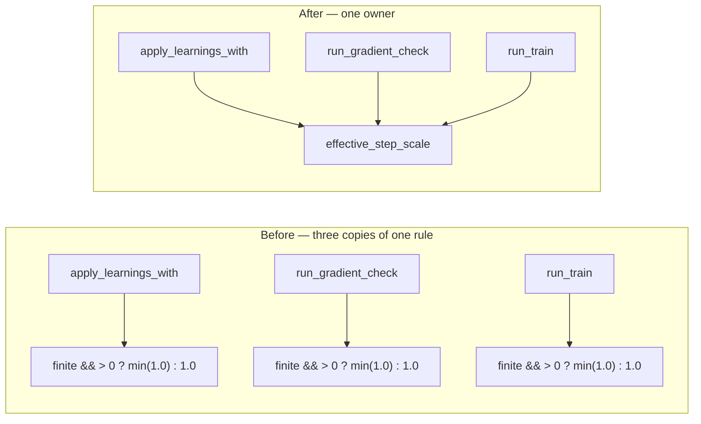

# Unify the step-scale clamp rule

## Summary

The step-scale sanitising rule — use the raw value when it is finite and
positive, capped at `1.0`, otherwise `1.0` — was copy-pasted across
`apply_learnings_with` (`backprop.rs`), `run_gradient_check`
(`gradient_check.rs`) and `run_train` (`train.rs`). A policy change had to land
identically on all three or the step the journal reports and the step
backtracking halves would silently disagree with the step
`apply_learnings_with` actually applies.

Extracted the rule into `pub(crate) fn effective_step_scale(raw: f64) -> f64`
in `backpropagation/src/backprop.rs` and called it from all three sites.
Behaviour is unchanged — this is a single-owner refactor. Patch version bumped
to `0.1.15` per the CONTRIBUTING version policy (`backpropagation/src/`
changed). Closes #55.

## Evidence

Backend/CLI-only change with no web interface, so no screenshot applies. The
evidence is the test suite: `./quality.sh` passes cleanly (fmt, clippy with
`-D warnings`, `cargo deny`, codespell, workflow validators, and
`cargo test --workspace --all-features` — 56 lib tests plus the integration
suites).

## Test Plan

Added to `backpropagation/src/backprop.rs` (`mod tests`), written before the
helper existed and confirmed failing to compile against the unfixed code:

- `effective_step_scale_passes_through_a_finite_positive_value` — happy path
  (`0.25`, `0.01`, `1.0`) plus the subnormal edge `f64::MIN_POSITIVE`.
- `effective_step_scale_caps_at_one` — `1.5` and `f64::MAX` clamp to `1.0`.
- `effective_step_scale_defaults_to_one_for_unusable_values` — `0.0`, `-0.0`,
  `-0.5`, `NaN`, `+inf`, `-inf` all resolve to `1.0`.
- `apply_learnings_with_resolves_its_step_through_the_shared_rule` — behavioural
  cover on the authoritative caller: an over-cap, non-finite or non-positive
  `step_scale` applies the same bias delta as `1.0`, while `0.5` applies half
  of it.

Existing coverage of the other two callers is unchanged and still passes —
notably `train::tests::backtracking_accepts_when_full_step_overshoots`,
`train::tests::default_step_scale_improves_where_the_full_step_overshoots` and
`gradient_check::tests::identity_chain_output_genes_agree_with_fd`. No test was
removed or modified.
