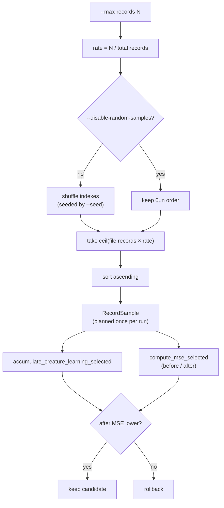

# train: seeded random record sampling for `--max-records` (Issue #77)

## Summary

`train --max-records N` meant "the first *N* records in directory scan order" —
core's `mse_mean_streaming` truncated the file list and the accumulate loop
broke after *N*. A capped epoch therefore over-fitted the earliest files of a
corpus and never looked at the later years, which is exactly what NEAT-AI's
memetic `trainDir` embedders rely on `--max-records` *not* doing.

This ports NEAT-AI's TypeScript `selectFileSampleIndexes` selection into the
Rust trainer. `--max-records N` is now honoured as a **rate** of
`N / total_records`: every `.bin` file contributes `ceil(file_records × rate)`
record indexes, shuffled with a `--seed`-derived RNG and then sorted ascending
so disk reads stay sequential. Closes #77.

The documented contract, matching NEAT-AI:

| Flag | Effect |
| ---- | ------ |
| `--max-records N` | Sample a rate of `N / total_records` from every file |
| `--seed S` | Reproducible draw — same seed, same records, same MSE |
| `--disable-random-samples` | Skip the shuffle: each file's leading prefix (NEAT-AI `disableRandomSamples`) |

Because the per-file take is ceiled, the realised count can exceed `N` by at
most one record per file — the TypeScript behaviour, kept deliberately rather
than trimmed, so the two trainers sample the same shape.

The sample is planned **once per run**, mirroring the TypeScript `indxMap`
cache that lives for a whole `trainDir` call. Baseline MSE, every epoch's
accumulate and every candidate's post-apply MSE all read the same sample, so an
accept / rollback decision compares like with like, and the deterministic
early-stop from #38 stays valid.

Only `train` samples. `compare`, `sweep` and `gradient-check` keep the prefix
cap — they are parity and diagnostic surfaces where reading the same leading
bytes as the TypeScript harness is the point.

### Design

`backpropagation/src/sampling.rs` is the new owner of the selection. A single
`RecordCursor` type sits behind both record-consuming surfaces, which is the
mechanism that keeps an epoch's two passes on the identical set:



`compute_mse` and `accumulate_creature_learning_report` keep their existing
signatures and delegate to the new `*_selected` variants with
`RecordSelection::Prefix`, so no existing caller changed behaviour. The sampled
MSE path packs its records into `neat_core::mse_sum_batch_packed` in blocks, so
it reports the same quantity as core's streaming route and the loss maths stays
in `neat-core` (issue #33).

## Evidence

This is a CLI/backend change with no web interface to screenshot. Evidence is
the test suite plus a real `neat_ai_backpropagation train` run over a
four-file, 100-record corpus with `--max-records 20` (a rate of `0.2`, so five
records per file):

```text
--seed 1    baseline_mse=2920.500000000000
  {"kind":"runHeader",…,"seed":1,"maxRecords":20,"sampledRecords":20,"totalRecords":100,"disableRandomSamples":false,…}

--seed 99   baseline_mse=3171.750000000000      ← different seed → different records
  {"kind":"runHeader",…,"seed":99,"maxRecords":20,"sampledRecords":20,"totalRecords":100,"disableRandomSamples":false,…}

--seed 1    baseline_mse=2920.500000000000      ← same seed → identical MSE
  {"kind":"runHeader",…,"seed":1,"maxRecords":20,"sampledRecords":20,"totalRecords":100,"disableRandomSamples":false,…}

--seed 1   --disable-random-samples  baseline_mse=2265.500000000000
--seed 777 --disable-random-samples  baseline_mse=2265.500000000000   ← seed cannot move a disabled draw
```

Each acceptance criterion from the issue, and where it is verified:

| Criterion | Verified by |
| --------- | ----------- |
| Different `--seed` → different record set | `different_seeds_select_different_records`, and the CLI run above |
| Same `--seed` → same records and same before/after MSE | `the_same_seed_selects_the_same_records` |
| `--disable-random-samples` → stable non-shuffled selection | `disabling_random_samples_is_a_stable_per_file_prefix` |
| Accumulate and MSE use the identical record set | `accumulate_and_eval_mse_see_the_identical_sample` |
| Docs / `--help` describe the contract; the bridge can pass `--seed` + the disable flag | README "Train record sampling (issue #77)", `record_sampling_is_random_unless_disabled` |

`./quality.sh` passes clean: 98 tests, plus rustfmt, clippy (`-D warnings`),
`cargo-deny`, the workflow gates and `cargo doc`.

## Test Plan

New integration tests — `backpropagation/tests/record_sampling.rs`:

- `different_seeds_select_different_records` — two `run_train` calls over a
  four-file corpus with different seeds score different baseline MSEs.
- `the_same_seed_selects_the_same_records` — the same seed is reproducible.
- `disabling_random_samples_is_a_stable_per_file_prefix` — two different seeds
  produce the identical `[0,1,2,3,4]` take from every file.
- `a_random_sample_spans_every_file_and_stays_ascending` — the default sample
  touches all four files, is ascending and in range, is not the prefix, and
  totals the cap.
- `a_cap_at_or_above_the_corpus_selects_everything` — a cap wider than the
  corpus is a no-op.
- `accumulate_and_eval_mse_see_the_identical_sample` — both surfaces score the
  same 20 records and agree on the MSE within `nearly_equal`.
- `an_empty_corpus_fails_loud` — an empty directory errors rather than
  returning an empty sample.

New unit tests — `backpropagation/src/sampling.rs`:

- `disabled_random_samples_take_the_leading_prefix`
- `shuffled_indexes_are_sorted_ascending`
- `the_take_is_ceiled_and_capped_at_the_file_length` (including a non-finite
  rate and a zero-record file)
- `a_zero_cap_is_rejected`
- `a_corpus_ending_mid_record_fails_loud`
- `the_cursor_reads_exactly_the_selected_records`
- `the_prefix_cursor_honours_its_cap`

New unit tests elsewhere:

- `train.rs::journal_header_records_the_sampled_slice` — the journal header
  carries `sampledRecords` / `totalRecords` / `disableRandomSamples`, and the
  epoch line scores the sampled count.
- `main.rs::record_sampling_is_random_unless_disabled` — sampling is random by
  default and `--disable-random-samples` / `--seed` parse.

Modified (signature only, no test removed or weakened):

- `backpropagation/tests/forward_only_guard.rs` — the new
  `TrainRequest.disable_random_samples` field added to its fixture.
- `backpropagation/src/train.rs` existing tests — same field added.

### Security self-check

- Input validation: `plan_record_sample` rejects a zero cap, clamps the derived
  rate to `0.0..=1.0`, treats a non-finite rate as "select nothing", and bounds
  every index to the file's record count.
- No secrets, no new dependencies, no new SQL / shell / HTTP surface. The only
  new I/O is `SeekingRecordReader` reads of `.bin` files already under the
  caller's `--training-data` path.
- Fail loud: a corpus that is empty, ends mid-record, or cannot be opened
  returns a named error rather than a silently short epoch.
